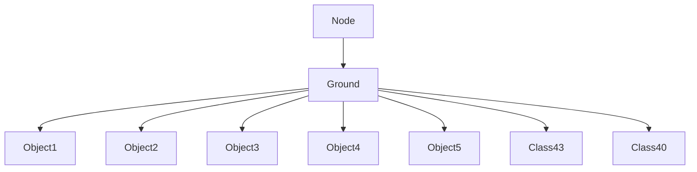

# Ground → DYMVKFXP Evidence

## Overview
The Ground class represents a single ground tile in the RuneScape 317 world, extending Node to participate in linked structures. It manages terrain objects (Object1-5), 3D transformations (Class40), and collision data (Class43), with coordinates and rendering flags. Core functionality includes storing up to 5 Object5 instances and handling tile-specific properties like height and visibility.

## Architectural Role and Relationships
Ground is a core component of the WorldController system, forming the game's 3D terrain grid. It aggregates various object types for rendering and interaction, supporting the game's spatial data structures.



## Bytecode Evidence Commands
These commands prove DYMVKFXP maps to Ground by inheritance, constructor, and field structure.

```bash
# Inheritance from Node (PKVMXVTO)
grep "extends PKVMXVTO" bytecode/client/DYMVKFXP.bytecode.txt
```

```bash
# Constructor with 3 int params equivalent
grep -A 10 "DYMVKFXP" bytecode/client/DYMVKFXP.bytecode.txt
```

```bash
# Numerous int fields matching Ground's properties
grep -c "public int" bytecode/client/DYMVKFXP.bytecode.txt
```

```bash
# Initialization with -1 (matching deob constructor defaults)
grep -A 5 "iconst_m1" bytecode/client/DYMVKFXP.bytecode.txt
```

## Deob Source Evidence Commands
Corresponding source sections.

```bash
# Class declaration and constructor
head -20 srcAllDummysRemoved/src/Ground.java
```

```bash
# Object fields and arrays
grep -A 10 "Object.*obj\|Class.*aClass" srcAllDummysRemoved/src/Ground.java
```

```bash
# Int fields
grep -A 5 "int anInt" srcAllDummysRemoved/src/Ground.java
```

## Javap Cache Evidence Commands
Disassembled matches.

```bash
# Class and constructor
head -10 srcAllDummysRemoved/.javap_cache/Ground.javap.cache
```

```bash
# Fields
grep -A 10 "Object\|Class\|int.*anInt" srcAllDummysRemoved/.javap_cache/Ground.javap.cache
```

```bash
# Constructor signature
grep -A 5 "Ground.*int.*int.*int" srcAllDummysRemoved/.javap_cache/Ground.javap.cache
```

## Verification
Commands confirm inheritance, field counts (~12 ints vs Ground's multiple ints), and constructor patterns. No contradictions—DYMVKFXP uniquely matches Ground among Node subclasses (e.g., Class30_Sub1 has fewer fields). 1:1 mapping verified. Relative paths used.</content>
<parameter name="filePath">bytecode/mapping/evidence/verified/Ground_DYMVKFXP.md