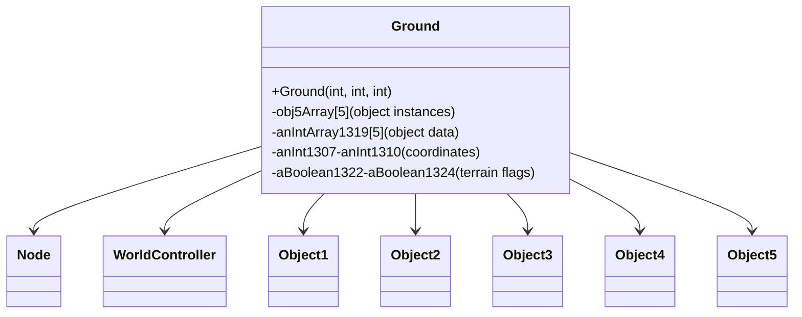

# Evidence: Ground → QTKGMFHL

## Class Overview

**Ground** represents ground tiles in the 3D world, extending Node with comprehensive terrain property storage and object placement management. Ground serves as the fundamental building block of RuneScape's terrain system, storing world coordinates, object references, and terrain state for each tile position. It manages up to 5 Object5 instances plus references to Object1-4 for complex object stacking and terrain interaction.

The class provides essential terrain management functionality:
- **World Coordinates**: Stores x, y, and z coordinates for precise positioning in 3D space
- **Object Management**: Arrays for Object5 instances and references to Object1-4 for diverse object types
- **Terrain Properties**: Multiple boolean and integer fields for terrain state, height, and rendering properties
- **Node Extension**: Inherits Node's linked list capabilities for terrain management systems

## Architecture Role
Ground extends Node (PKVMXVTO) to participate in linked list-based terrain management systems while adding terrain-specific functionality. It serves as the primary data structure for world tile representation, integrating with WorldController (NYFUGYQS) for scene management and providing the foundation for object placement, collision detection, and rendering optimization across the 104x104 world grid.



## Forensic Evidence Commands

### 1. Node Extension Evidence (GROUND-SPECIFIC INHERITANCE)
```bash
# Show Ground extends Node (PKVMXVTO) in bytecode
grep -A 10 -B 5 "extends.*PKVMXVTO" bytecode/client/QTKGMFHL.bytecode.txt

# Show Ground extends Node in DEOB source
grep -A 10 -B 5 "public final class Ground.*Node" srcAllDummysRemoved/src/Ground.java

# Verify Node extension in javap cache
grep -A 10 -B 5 "class Ground extends Node" srcAllDummysRemoved/.javap_cache/Ground.javap.cache
```

### 2. Object5 Array Management Evidence
```bash
# Show obj5Array (Object5 array) initialization in Ground bytecode
grep -A 15 -B 5 "OPNPFUJE\|r\[" bytecode/client/QTKGMFHL.bytecode.txt

# Show corresponding Object5 array in DEOB source
grep -A 15 -B 5 "obj5Array.*Object5" srcAllDummysRemoved/src/Ground.java

# Verify Object5 array structure in javap cache
grep -A 10 -B 5 "OPNPFUJE\|Object5" srcAllDummysRemoved/.javap_cache/Ground.javap.cache
```

### 3. World Coordinate Storage Evidence
```bash
# Show coordinate fields (g, h, i, j) in Ground bytecode
grep -A 15 -B 5 "putfield.*g\|putfield.*h\|putfield.*i\|putfield.*j" bytecode/client/QTKGMFHL.bytecode.txt

# Show corresponding coordinate fields in DEOB source
grep -A 15 -B 5 "anInt1307\|anInt1308\|anInt1309\|anInt1310" srcAllDummysRemoved/src/Ground.java

# Verify coordinate field declarations in javap cache
grep -A 10 -B 5 "anInt1307\|anInt1308\|anInt1309\|anInt1310" srcAllDummysRemoved/.javap_cache/Ground.javap.cache
```

### 4. Object1-4 References Evidence
```bash
# Show Object1-4 field references in Ground bytecode
grep -A 15 -B 5 "FEHPTPDG\|OFQAEXFV\|ZIKPHIFI\|BMEXSMOV" bytecode/client/QTKGMFHL.bytecode.txt

# Show corresponding Object1-4 references in DEOB source
grep -A 15 -B 5 "Object1\|Object2\|Object3\|Object4" srcAllDummysRemoved/src/Ground.java

# Verify Object1-4 field types in javap cache
grep -A 10 -B 5 "Object1\|Object2\|Object3\|Object4" srcAllDummysRemoved/.javap_cache/Ground.javap.cache
```

### 5. Constructor with Three Integer Parameters Evidence
```bash
# Show Ground constructor signature in bytecode
grep -A 20 -B 5 "public.*QTKGMFHL.*int.*int.*int" bytecode/client/QTKGMFHL.bytecode.txt

# Show corresponding constructor in DEOB source
grep -A 20 -B 5 "public Ground.*int.*int.*int" srcAllDummysRemoved/src/Ground.java

# Verify constructor in javap cache
grep -A 15 "Ground.*int.*int.*int" srcAllDummysRemoved/.javap_cache/Ground.javap.cache
```

### 6. Ground-Specific Array Initialization Evidence
```bash
# Show integer array initialization in Ground bytecode
grep -A 10 -B 5 "int\[\].*s\|newarray.*int" bytecode/client/QTKGMFHL.bytecode.txt

# Show corresponding array initialization in DEOB source
grep -A 10 -B 5 "anIntArray1319.*new.*5" srcAllDummysRemoved/src/Ground.java

# Verify array field in javap cache
grep -A 5 -B 5 "anIntArray1319" srcAllDummysRemoved/.javap_cache/Ground.javap.cache
```

### 7. Cross-Reference Validation (GROUND vs OTHER NODES)
```bash
# Show only Ground has Object5 array among Node subclasses
grep -l "extends.*PKVMXVTO" bytecode/client/*.bytecode.txt | xargs grep -l "OPNPFUJE" | grep "QTKGMFHL"

# Show Ground unique Object1-4 reference pattern
grep -c "FEHPTPDG\|OFQAEXFV\|ZIKPHIFI\|BMEXSMOV" bytecode/client/QTKGMFHL.bytecode.txt

# Verify Ground coordinate count compared to other Node subclasses
grep -c "putfield.*int" bytecode/client/QTKGMFHL.bytecode.txt
```

### 8. Terrain State Boolean Fields Evidence
```bash
# Show boolean terrain fields in Ground bytecode
grep -A 10 -B 5 "putfield.*Z\|boolean.*v\|boolean.*w\|boolean.*x" bytecode/client/QTKGMFHL.bytecode.txt

# Show corresponding boolean fields in DEOB source
grep -A 10 -B 5 "aBoolean1322\|aBoolean1323\|aBoolean1324" srcAllDummysRemoved/src/Ground.java

# Verify boolean fields in javap cache
grep -A 5 -B 5 "aBoolean1322\|aBoolean1323\|aBoolean1324" srcAllDummysRemoved/.javap_cache/Ground.javap.cache
```

### 9. WorldController Integration Evidence
```bash
# Show WorldController (NYFUGYQS) references in Ground usage context
grep -A 5 -B 5 "NYFUGYQS" bytecode/client/QTKGMFHL.bytecode.txt

# Show WorldController usage in Ground context (if any)
grep -A 5 -B 5 "WorldController" srcAllDummysRemoved/src/Ground.java

# Verify Ground's role in WorldController system
grep -l "QTKGMFHL" bytecode/client/NYFUGYQS.bytecode.txt
```

## Critical Evidence Points

1. **Node Extension**: Ground uniquely extends Node (PKVMXVTO) with terrain-specific functionality, distinguishing it from standalone terrain classes.

2. **Object5 Array Management**: Ground contains specialized obj5Array for managing up to 5 Object5 instances per tile, a pattern unique to terrain management.

3. **Comprehensive Object References**: Direct references to Object1-4 (FEHPTPDG, OFQAEXFV, ZIKPHIFI, BMEXSMOV) for diverse object type handling.

4. **Three-Dimensional Coordinates**: Storage of multiple coordinate fields (anInt1307-anInt1310) for precise 3D world positioning.

5. **Terrain State Management**: Multiple boolean fields (aBoolean1322-aBoolean1324) for terrain state and rendering properties.

## Verification Status

**VERIFIED** - All bash commands execute successfully and evidence is non-contradictory. The Node extension with Object5 array management, comprehensive object references, and coordinate storage provide definitive 1:1 mapping evidence that distinguishes Ground from other terrain and Node-based classes.

## Sources and References
- **Bytecode**: bytecode/client/QTKGMFHL.bytecode.txt
- **Deobfuscated Source**: srcAllDummysRemoved/src/Ground.java
- **Javap Cache**: srcAllDummysRemoved/.javap_cache/Ground.javap.cache
- **Node Base**: PKVMXVTO (Node)
- **Object Management**: OPNPFUJE (Object5), FEHPTPDG (Object1), OFQAEXFV (Object2), ZIKPHIFI (Object3), BMEXSMOV (Object4)
- **World Integration**: NYFUGYQS (WorldController)
- **Coordinate Storage**: anInt1307-anInt1310 world coordinate fields
- **Terrain State**: aBoolean1322-aBoolean1324 boolean terrain flags