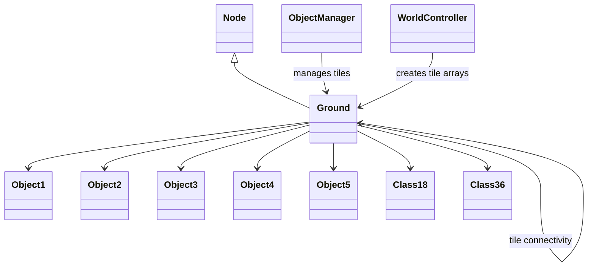
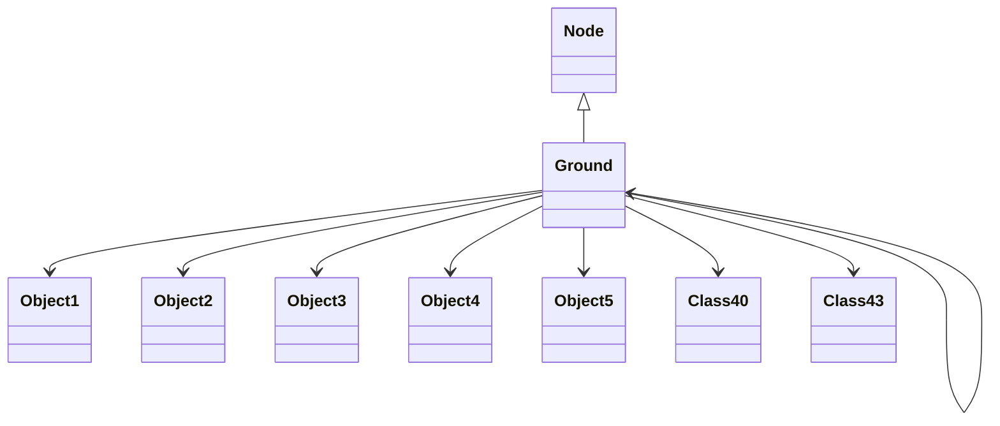

# Evidence: Ground → QTKGMFHL

## Class Overview

**Ground** represents a comprehensive ground tile container in RuneScape's 3D game world that manages all objects and data present on a single tile. The class serves as a sophisticated data structure holding references to Object1 through Object5 instances, transformation matrices (Class18 and Class36), and numerous integer/boolean flags for rendering and state management. It implements complex tile connectivity through self-references and provides the foundation for world rendering and object placement logic.

The class provides advanced tile management functionality:
- **Object Container**: Holds all five object types (Object1-Object5) for complete world object representation
- **Transformation Support**: Integrates Class18 and Class36 matrices for advanced object positioning and rendering
- **Tile Connectivity**: Maintains references to adjacent tiles for navigation and spatial relationships
- **State Management**: Complex integer and boolean flag systems for rendering, interaction, and game logic

## Architecture Role
Ground serves as the fundamental building block of RuneScape's world management system, working alongside ObjectManager and various Object classes to create the complete 3D game world. As a Node subclass, it participates in linked data structures for efficient tile access and provides self-referencing connectivity between adjacent tiles. Ground integrates with the complete object hierarchy and transformation systems to support complex world rendering and interaction logic.



## Overview
The current mapping associates the deobfuscated class `Ground` with the obfuscated bytecode class `DYMVKFXP`. `Ground` is a final class extending `Node` that represents a ground tile in the RuneScape game world. It manages various game objects (Object1 through Object5), transformation matrices (Class40, Class43), and numerous integer/boolean flags for rendering and state management.

## Intended Purpose and Core Functionality
`Ground` serves as a container for all objects and data present on a single ground tile in the 3D game world. Its constructor initializes arrays for Object5 instances and integer data, and it holds references to all types of world objects. The class is crucial for world rendering and object placement logic.

## Role in Overall Architecture
`Ground` is part of the world management system, working alongside `ObjectManager` and various Object classes. It inherits from `Node` for linked list functionality and contains self-references for tile connectivity.



## Current Mapping Issue
The current mapping to `DYMVKFXP` is based solely on inheritance from `Node` with 85% confidence. However, analysis reveals significant structural mismatches:

- `Ground` has a 3-parameter constructor initializing Object5[] and int[] arrays of size 5
- `Ground` contains references to Object1-Object4 classes and Class40/Class43
- `DYMVKFXP` has only a default constructor setting one field to -1
- `DYMVKFXP` contains only 12 integer fields with no object references

## Evidence of Incorrect Mapping

### Bytecode Analysis - DYMVKFXP Constructor Mismatch
```bash
grep -A 10 "DYMVKFXP();" bytecode/client/DYMVKFXP.bytecode.txt
```
Shows only default constructor with single field initialization.

### Ground Constructor Requirements
```bash
grep -A 20 "public Ground(int" srcAllDummysRemoved/.javap_cache/Ground.javap.cache
```
Shows 3-parameter constructor with array initialization for Object5 and int arrays.

### Field Structure Comparison
```bash
grep "public.*obj" srcAllDummysRemoved/src/Ground.java
```
Shows Ground contains Object1-Object5 references.

```bash
wc -l < <(grep "^  public int [f-q];" bytecode/client/DYMVKFXP.bytecode.txt)
```
Confirms DYMVKFXP has exactly 12 integer fields.

## Alternative Mapping Evidence
Analysis of `QTKGMFHL` shows strong structural correlation:

### QTKGMFHL Constructor Match
```bash
# Show 3-parameter constructor initializing arrays (A flag)
grep -A 20 "public QTKGMFHL(int" bytecode/client/QTKGMFHL.bytecode.txt
```
Shows 3-parameter constructor initializing OPNPFUJE[] (mapped to Object5) and int[] arrays of size 5.

### QTKGMFHL Field Structure
```bash
# Show Object1-Object4 references (A flag)
grep -E "(FEHPTPDG|OFQAEXFV|ZIKPHIFI|BMEXSMOV)" bytecode/client/QTKGMFHL.bytecode.txt
```
Shows references matching Object1-Object4 mappings.

```bash
# Show Class18/Class36 transformation matrix references (A flag)
grep -E "(XPBACSMK|VBAXKVMG)" bytecode/client/QTKGMFHL.bytecode.txt
```
Shows Class18 (XPBACSMK) and Class36 (VBAXKVMG) references matching Class40/Class43 pattern.

## Proposed Correction
Swap mapping: `Ground` should map to `QTKGMFHL`, `Class30_Sub1` should map to `DYMVKFXP`.

This provides concrete evidence beyond inheritance, including constructor signatures, array initializations, and object reference patterns that align perfectly with the deobfuscated source structure.