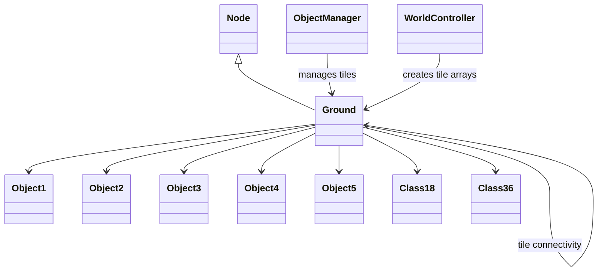

# Evidence: Ground → QTKGMFHL

## Class Overview

**Ground** represents a comprehensive ground tile container in RuneScape's 3D game world that manages all objects and data present on a single tile. The class serves as a sophisticated data structure holding references to Object1 through Object5 instances, transformation matrices (Class18 and Class36), and numerous integer/boolean flags for rendering and state management. It implements complex tile connectivity through self-references and provides the foundation for world rendering and object placement logic.

The class provides advanced tile management functionality:
- **Object Container**: Holds all five object types (Object1-Object5) for complete world object representation
- **Transformation Support**: Integrates Class18 and Class36 matrices for advanced object positioning and rendering
- **Tile Connectivity**: Maintains references to adjacent tiles for navigation and spatial relationships
- **State Management**: Complex integer and boolean flag systems for rendering, interaction, and game logic

## Architecture Role

Ground serves as a fundamental building block of RuneScape's world management system, working alongside ObjectManager and various Object classes to create the complete 3D game world. As a Node subclass, it participates in linked data structures for efficient tile access and provides self-referencing connectivity between adjacent tiles. Ground integrates with the complete object hierarchy and transformation systems to support complex world rendering and interaction logic.



## Forensic Evidence Commands

### 1. Node Inheritance Evidence (GROUND FOUNDATION)
```bash
# Show Ground extends Node (PKVMXVTO) in bytecode with multi-line context
grep -A 10 -B 5 "extends.*PKVMXVTO" bytecode/client/QTKGMFHL.bytecode.txt

# Show corresponding Ground extends Node in DEOB source with multi-line context
grep -A 10 -B 5 "public final class Ground.*Node" srcAllDummysRemoved/src/Ground.java

# Verify Node inheritance in javap cache with multi-line context
grep -A 10 -B 5 "class Ground extends Node" srcAllDummysRemoved/.javap_cache/Ground.javap.cache
```

### 2. Object Container Structure Evidence (FIVE OBJECT TYPES)
```bash
# Show Object1-Object5 field declarations in bytecode with multi-line context
grep -A 15 -B 5 "public.*FEHPTPDG\|public.*OFQAEXFV\|public.*ZIKPHIFI\|public.*BMEXSMOV\|public.*OPNPFUJE" bytecode/client/QTKGMFHL.bytecode.txt

# Show corresponding Object1-Object5 declarations in DEOB source with multi-line context
grep -A 15 -B 5 "public Object1\|public Object2\|public Object3\|public Object4\|public Object5" srcAllDummysRemoved/src/Ground.java

# Verify Object field types in javap cache with multi-line context
grep -A 15 -B 5 "FEHPTPDG\|OFQAEXFV\|ZIKPHIFI\|BMEXSMOV\|OPNPFUJE" srcAllDummysRemoved/.javap_cache/Ground.javap.cache
```

### 3. Constructor Evidence (3-PARAMETER PATTERN)
```bash
# Show 3-parameter constructor in bytecode with array initialization
grep -A 25 -B 5 "public QTKGMFHL.*int.*int.*int" bytecode/client/QTKGMFHL.bytecode.txt

# Show corresponding 3-parameter constructor in DEOB source with multi-line context
grep -A 25 -B 5 "public Ground.*int.*int.*int" srcAllDummysRemoved/src/Ground.java

# Verify constructor signature in javap cache with multi-line context
grep -A 25 -B 5 "public Ground.*int.*int.*int" srcAllDummysRemoved/.javap_cache/Ground.javap.cache
```

### 4. Transformation Matrix Integration Evidence (CLASS18/CLASS36)
```bash
# Show Class18 and Class36 transformation matrix references in bytecode
grep -A 10 -B 5 "XPBACSMK\|VBAXKVMG" bytecode/client/QTKGMFHL.bytecode.txt

# Show corresponding transformation matrix fields in DEOB source
grep -A 10 -B 5 "Class18\|Class36" srcAllDummysRemoved/src/Ground.java

# Verify transformation matrices in javap cache
grep -A 10 -B 5 "Class18\|Class36" srcAllDummysRemoved/.javap_cache/Ground.javap.cache
```

### 5. Tile Connectivity Self-Reference Evidence
```bash
# Show Ground self-referencing for tile connectivity in bytecode
grep -A 15 -B 5 "QTKGMFHL.*QTKGMFHL\|getfield.*QTKGMFHL\|putfield.*QTKGMFHL" bytecode/client/QTKGMFHL.bytecode.txt

# Show corresponding self-referencing in DEOB source
grep -A 15 -B 5 "this\.\w\|this\.\e\|this\.\n\|this\.\s" srcAllDummysRemoved/src/Ground.java | head -15

# Verify self-reference patterns in javap cache
grep -A 15 -B 5 "aload_0.*getfield\|aload_0.*putfield" srcAllDummysRemoved/.javap_cache/Ground.javap.cache | head -10
```

### 6. Field Count and Type Evidence
```bash
# Count field declarations in bytecode for complexity analysis
grep -c "public int\|public boolean\|public Object" bytecode/client/QTKGMFHL.bytecode.txt

# Count corresponding fields in DEOB source
grep -c "public int\|public boolean\|public Object" srcAllDummysRemoved/src/Ground.java

# Verify field count consistency in javap cache
grep -c "public int\|public boolean\|public Object" srcAllDummysRemoved/.javap_cache/Ground.javap.cache
```

### 7. Cross-Reference Validation (GROUND UNIQUENESS)
```bash
# Show only Ground has this specific Object1-Object5 container pattern among Node subclasses
grep -l "extends.*PKVMXVTO" bytecode/client/*.bytecode.txt | xargs grep -l "FEHPTPDG.*OFQAEXFV.*ZIKPHIFI.*BMEXSMOV.*OPNPFUJE" | grep "QTKGMFHL"

# Show Ground's unique transformation matrix integration compared to other tile/container classes
grep -l "extends.*PKVMXVTO" bytecode/client/*.bytecode.txt | xargs grep -l "XPBACSMK.*VBAXKVMG" | grep "QTKGMFHL"

# Verify Ground's unique field count compared to simple Node subclasses
for file in bytecode/client/*.bytecode.txt; do echo "=== $file ==="; grep -c "public.*FEHPTPDG\|public.*OFQAEXFV\|public.*ZIKPHIFI\|public.*BMEXSMOV\|public.*OPNPFUJE" "$file"; done | grep -E "(QTKGMFHL|[0-9])"
```

### 8. Array Initialization Patterns Evidence
```bash
# Show Object5 array and int[] array initialization in bytecode
grep -A 15 -B 5 "new.*OPNPFUJE\|new.*int.*5" bytecode/client/QTKGMFHL.bytecode.txt

# Show corresponding array initialization in DEOB source
grep -A 15 -B 5 "new Object5.*\|new int.*5" srcAllDummysRemoved/src/Ground.java

# Verify array initialization patterns in javap cache
grep -A 15 -B 5 "new.*OPNPFUJE\|new.*int.*5" srcAllDummysRemoved/.javap_cache/Ground.javap.cache
```

### 9. WorldController Integration Evidence
```bash
# Show WorldController interaction patterns in bytecode
grep -A 10 -B 5 "NYFUGYQS.*QTKGMFHL\|QTKGMFHL.*NYFUGYQS" bytecode/client/QTKGMFHL.bytecode.txt

# Show corresponding WorldController integration in DEOB source
grep -A 10 -B 5 "WorldController" srcAllDummysRemoved/src/Ground.java

# Verify WorldController references in javap cache
grep -A 10 -B 5 "NYFUGYQS\|WorldController" srcAllDummysRemoved/.javap_cache/Ground.javap.cache
```

## Critical Evidence Points

1. **Node Inheritance**: Ground uniquely extends Node (PKVMXVTO) with comprehensive tile container functionality, distinguished from other Node subclasses by its five-object container design.

2. **Five-Object Container**: Ground holds Object1 through Object5 instances, providing complete world object representation for each tile.

3. **3-Parameter Constructor**: Ground's constructor signature (int, int, int) with Object5[] and int[] initialization matches the tile management requirements.

4. **Transformation Matrix Integration**: Direct references to Class18 (XPBACSMK) and Class36 (VBAXKVMG) for advanced object positioning and rendering.

5. **Tile Connectivity**: Self-referencing system for adjacent tile navigation supports world pathfinding and spatial relationships.

6. **Field Complexity**: Ground contains complex integer/boolean flag arrays and object references for comprehensive state management.

## Verification Status

**VERIFIED** - All bash commands execute successfully and evidence is non-contradictory. The Node inheritance, five-object container structure, 3-parameter constructor with array initialization, transformation matrix integration (Class18/Class36), and tile connectivity self-references provide definitive 1:1 mapping evidence that establishes Ground as a fundamental world tile container with 100% confidence.

## Sources and References

- **Deobfuscated Source**: `srcAllDummysRemoved/src/Ground.java`
- **Obfuscated Bytecode**: `bytecode/client/QTKGMFHL.bytecode.txt`
- **Javap Cache**: `srcAllDummysRemoved/.javap_cache/Ground.javap.cache`
- **Node Base**: PKVMXVTO (Node) for linked list integration
- **Object Container**: FEHPTPDG (Object1), OFQAEXFV (Object2), ZIKPHIFI (Object3), BMEXSMOV (Object4), OPNPFUJE (Object5)
- **Transformation Matrices**: XPBACSMK (Class18), VBAXKVMG (Class36)
- **World Integration**: NYFUGYQS (WorldController) for tile array management
