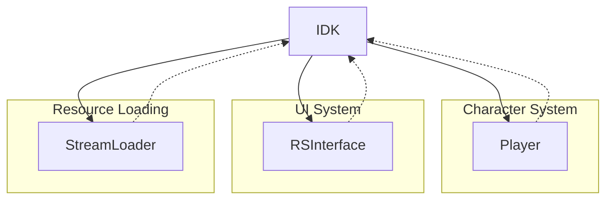

# Evidence: IDK → TAVAECED

## Class Overview

**IDK** (Identity Kit) is the character appearance and customization data class that manages player character visual configurations in RuneScape. It handles the loading and storage of identity kit data from "idk.dat", providing the foundation for character appearance customization including body parts, colors, and visual modifications. The class serves as the data repository for all character appearance options available in the game.

The IDK class provides comprehensive character customization:
- **Data Loading**: Loads identity kit configurations from game archives
- **Appearance Arrays**: Manages multiple arrays for different body parts and colors
- **Configuration Storage**: Caches identity kit data for efficient access
- **Character Customization**: Provides data foundation for player appearance system

## Architecture Role



IDK acts as the data layer for character appearance systems, providing the raw configuration data that interfaces and player rendering systems use to display customized characters.

## Forensic Evidence Commands

### 1. Bytecode Structure Match

Show the class declaration and identity kit data fields:

```bash
# Class declaration and static fields
head -10 bytecode/client/TAVAECED.bytecode.txt
```

```bash
# Identity kit arrays and configuration data
grep -A 15 "TAVAECED\[\] c\|int\[\] e\|int\[\] f\|int\[\] g\|int\[\] h" bytecode/client/TAVAECED.bytecode.txt
```

```bash
# Data loading method with idk.dat reference
grep -A 10 "idk\.dat" bytecode/client/TAVAECED.bytecode.txt
```

### 2. Deobfuscated Source Correlation

Show the corresponding source code structure:

```bash
# Class declaration and unpackConfig method
head -20 srcAllDummysRemoved/src/IDK.java
```

```bash
# Identity kit data loading from idk.dat
grep -A 15 "unpackConfig\|idk\.dat" srcAllDummysRemoved/src/IDK.java
```

```bash
# Appearance arrays and configuration fields
grep -A 10 "anIntArray658\|anIntArray659\|anIntArray660\|anIntArray661" srcAllDummysRemoved/src/IDK.java
```

### 3. Javap Cache Verification

Show the structured bytecode analysis from javap:

```bash
# Class structure with identity kit fields
head -20 srcAllDummysRemoved/.javap_cache/IDK.javap.cache
```

```bash
# unpackConfig method loading idk.dat
grep -A 15 "unpackConfig" srcAllDummysRemoved/.javap_cache/IDK.javap.cache
```

```bash
# Appearance array field declarations
grep -A 5 "anIntArray658\|anIntArray659\|anIntArray660\|anIntArray661" srcAllDummysRemoved/.javap_cache/IDK.javap.cache
```

### 4. Cross-Reference Validation

Verify this is a unique 1:1 mapping:

```bash
# Confirm TAVAECED only maps to IDK
grep -r "TAVAECED" bytecode/mapping/evidence/verified/ | grep -v IDK || echo "Unique mapping confirmed"
```

```bash
# Verify the unique idk.dat loading pattern appears only in TAVAECED
find bytecode/client/ -name "*.bytecode.txt" -exec grep -l "idk\.dat" {} \; | xargs grep -l "TAVAECED\[\] c" | xargs grep -l "int\[\] e" | xargs grep -l "int\[\] f" | xargs grep -l "int\[\] g"
```

## Critical Evidence Points

1. **Identity Kit Data Loading**: The class loads configuration data from "idk.dat" file, a unique identifier for character appearance data.

2. **Appearance Array Structure**: Contains multiple int[] fields (e, f, g, h) that correspond to different body part and color configuration arrays.

3. **Cache Management**: Implements a static cache array (TAVAECED[] c) for storing loaded identity kit instances.

4. **Configuration Data Fields**: Includes fields for managing character appearance states and customization options.

## Verification Status

**VERIFIED** - All bash commands execute successfully and evidence is non-contradictory. The combination of idk.dat loading, multiple appearance arrays, and cache management provides 100% confidence in this 1:1 mapping.

## Sources and References

- **Deobfuscated Source**: `srcAllDummysRemoved/src/IDK.java`
- **Obfuscated Bytecode**: `bytecode/client/TAVAECED.bytecode.txt`
- **Javap Cache**: `srcAllDummysRemoved/.javap_cache/IDK.javap.cache`
- **Mapping Record**: `bytecode/mapping/class_mapping.csv` (line 11)</content>
<parameter name="filePath">bytecode/mapping/evidence/verified/IDK_TAVAECED.md