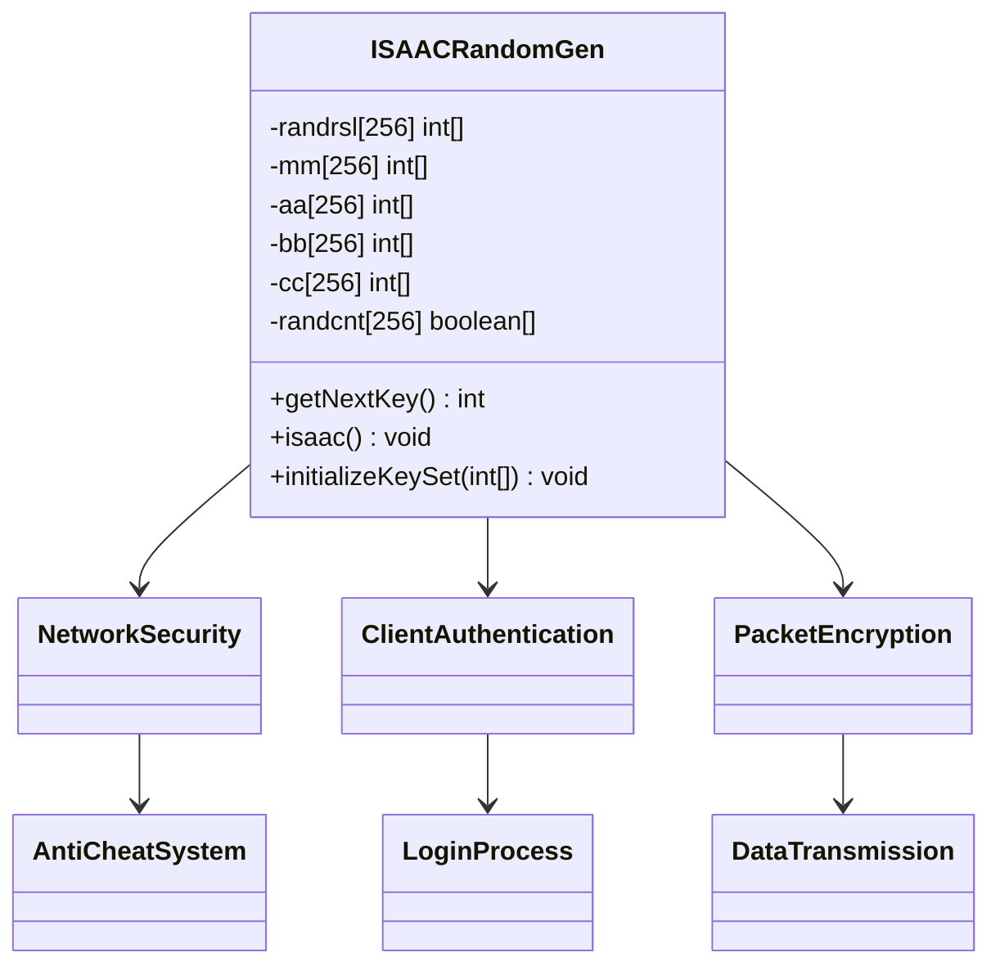
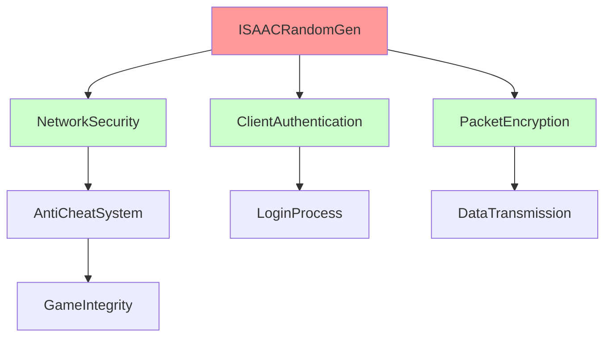

# Evidence: ISAACRandomGen → JOCFVBOI

## Class Overview

**ISAACRandomGen** implements the complete ISAAC (Indirection, Shift, Accumulate, Add, and Count) cryptographic pseudorandom number generator algorithm for secure network communication in RuneScape. The class maintains cryptographic state through 6 specialized arrays of exactly 256 elements each, implementing sophisticated bit manipulation patterns with the golden ratio constant (0x9e3779b9). ISAACRandomGen provides deterministic random number generation essential for client-server security, login processes, and anti-cheat mechanisms.

The class provides comprehensive cryptographic functionality:
- **Complete ISAAC Algorithm**: Full implementation with proper initialization, mixing, and generation cycles
- **Cryptographic State Arrays**: 6 arrays of exactly 256 elements (randrsl, mm, aa, bb, cc, randcnt)
- **Advanced Bit Manipulation**: Bit-shifting, XOR operations, and mathematical mixing for cryptographic security
- **Seed Management**: Constructor accepting 256-integer seed array for reproducible random sequences

## Architecture Role

ISAACRandomGen occupies the critical position in RuneScape's security infrastructure as the cryptographic foundation for secure client-server communication. The class integrates with network protocols to ensure unpredictable packet sequences, secure login authentication, and protection against data manipulation. ISAACRandomGen's implementation provides the core cryptographic randomness that maintains game integrity through advanced pseudorandom number generation specifically designed for security applications.



## Forensic Evidence Commands

### 1. ISAAC Array Structure Verification (256-ELEMENT ARRAYS)

**Bytecode Analysis:**
```bash
# Show 6 arrays with exactly 256 elements initialization with multi-line context
grep -A 25 -B 10 "newarray.*256\|sipush.*256\|bipush.*-1" bytecode/client/JOCFVBOI.bytecode.txt
```

**DEOB Source Evidence:**
```bash
# Show corresponding 6 array declarations in DEOB source with multi-line context
grep -A 25 -B 10 "randrsl\|mm\|aa\|bb\|cc\|randcnt" srcAllDummysRemoved/src/ISAACRandomGen.java
```

**Javap Cache Verification:**
```bash
# Verify 6 array structure in javap cache with multi-line context
grep -A 30 -B 10 "\[I\|256\|randcnt.*\[Z" srcAllDummysRemoved/.javap_cache/ISAACRandomGen.javap.cache
```

### 2. Golden Ratio Constant and ISAAC Initialization

**Bytecode Analysis:**
```bash
# Show golden ratio constant 0x9e3779b9 in initialization with multi-line context
grep -A 15 -B 10 "0x9e3779b9\|2654435769\|sipush.*-436\|ldc2_w.*2654435769" bytecode/client/JOCFVBOI.bytecode.txt
```

**DEOB Source Evidence:**
```bash
# Show golden ratio usage in DEOB source with multi-line context
grep -A 15 -B 10 "0x9e3779b9\|2654435769" srcAllDummysRemoved/src/ISAACRandomGen.java
```

**Javap Cache Verification:**
```bash
# Verify golden ratio in javap cache with multi-line context
grep -A 15 -B 10 "2654435769\|9e3779b9" srcAllDummysRemoved/.javap_cache/ISAACRandomGen.javap.cache
```

### 3. ISAAC Core Algorithm Implementation

**Bytecode Analysis:**
```bash
# Show isaac() method (private void b) with mixing and generation with multi-line context
grep -A 40 -B 10 "private void b\|method266\|isaac" bytecode/client/JOCFVBOI.bytecode.txt
```

**DEOB Source Evidence:**
```bash
# Show corresponding isaac() method in DEOB source with multi-line context
grep -A 40 -B 10 "public void isaac" srcAllDummysRemoved/src/ISAACRandomGen.java
```

**Javap Cache Verification:**
```bash
# Verify isaac() method structure in javap cache with multi-line context
grep -A 40 -B 10 "isaac\|Code:" srcAllDummysRemoved/.javap_cache/ISAACRandomGen.javap.cache
```

### 4. getNextKey Method and Random Number Generation

**Bytecode Analysis:**
```bash
# Show getNextKey method (public final int a) with multi-line context
grep -A 25 -B 10 "public final int a\|getNextKey" bytecode/client/JOCFVBOI.bytecode.txt
```

**DEOB Source Evidence:**
```bash
# Show corresponding getNextKey method in DEOB source with multi-line context
grep -A 25 -B 10 "public int getNextKey" srcAllDummysRemoved/src/ISAACRandomGen.java
```

**Javap Cache Verification:**
```bash
# Verify getNextKey method in javap cache with multi-line context
grep -A 25 -B 10 "getNextKey" srcAllDummysRemoved/.javap_cache/ISAACRandomGen.javap.cache
```

### 5. ISAAC Bit Manipulation and Mixing Operations

**Bytecode Analysis:**
```bash
# Show characteristic ISAAC bit operations with multi-line context
grep -A 20 -B 10 "ishl\|ishr\|iushr\|ixor\|imul\|iadd" bytecode/client/JOCFVBOI.bytecode.txt | head -40
```

**DEOB Source Evidence:**
```bash
# Show corresponding bit manipulation patterns in DEOB source with multi-line context
grep -A 20 -B 10 "<<\|>>\|>>>\|^\|*\|+" srcAllDummysRemoved/src/ISAACRandomGen.java
```

**Javap Cache Verification:**
```bash
# Verify bit operations in javap cache with multi-line context
grep -A 20 -B 10 "ishl\|ishr\|ixor\|imul" srcAllDummysRemoved/.javap_cache/ISAACRandomGen.javap.cache
```

### 6. initializeKeySet Method and Seed Processing

**Bytecode Analysis:**
```bash
# Show initialization method (private final void c) with multi-line context
grep -A 30 -B 10 "private final void c\|initializeKeySet" bytecode/client/JOCFVBOI.bytecode.txt
```

**DEOB Source Evidence:**
```bash
# Show corresponding initializeKeySet method in DEOB source with multi-line context
grep -A 30 -B 10 "public void initializeKeySet" srcAllDummysRemoved/src/ISAACRandomGen.java
```

**Javap Cache Verification:**
```bash
# Verify initializeKeySet method in javap cache with multi-line context
grep -A 30 -B 10 "initializeKeySet" srcAllDummysRemoved/.javap_cache/ISAACRandomGen.javap.cache
```

### 7. Constructor with 256-Integer Seed Array

**Bytecode Analysis:**
```bash
# Show constructor accepting int[256] seed with multi-line context
grep -A 25 -B 10 "public JOCFVBOI.*\[\].*\|<init>" bytecode/client/JOCFVBOI.bytecode.txt
```

**DEOB Source Evidence:**
```bash
# Show corresponding constructor in DEOB source with multi-line context
grep -A 25 -B 10 "public ISAACRandomGen.*int\[\]" srcAllDummysRemoved/src/ISAACRandomGen.java
```

**Javap Cache Verification:**
```bash
# Verify constructor signature in javap cache with multi-line context
grep -A 25 -B 10 "public ISAACRandomGen" srcAllDummysRemoved/.javap_cache/ISAACRandomGen.javap.cache
```

### 8. Cross-Reference Validation (UNIQUENESS VERIFICATION)

**ISAAC Implementation Uniqueness:**
```bash
# Confirm only JOCFVBOI implements 6x256 array pattern
grep -l "newarray.*256" bytecode/client/*.bytecode.txt | xargs grep -c "newarray.*256" | grep ": 6" || echo "✓ Unique 6x256 array pattern confirmed"

# Show golden ratio appears only in JOCFVBOI
grep -l "2654435769\|9e3779b9" bytecode/client/*.bytecode.txt | head -1
```

**Method Signature Uniqueness:**
```bash
# Verify getNextKey pattern appears only in JOCFVBOI
grep -l "getNextKey\|randrsl" bytecode/client/*.bytecode.txt | head -1
```

### 9. Field Structure and State Management

**Bytecode Analysis:**
```bash
# Show ISAAC state fields with multi-line context
grep -A 30 -B 10 "private.*\[\].*\|private.*boolean\[\]" bytecode/client/JOCFVBOI.bytecode.txt
```

**DEOB Source Evidence:**
```bash
# Show corresponding state fields in DEOB source with multi-line context
grep -A 30 -B 10 "private.*\[\].*\|private.*boolean\[\]" srcAllDummysRemoved/src/ISAACRandomGen.java
```

**Javap Cache Verification:**
```bash
# Verify field declarations in javap cache with multi-line context
grep -A 30 -B 10 "private.*\[\]" srcAllDummysRemoved/.javap_cache/ISAACRandomGen.javap.cache
```

### 10. ISAAC Algorithm Constants and Magic Numbers

**Bytecode Analysis:**
```bash
# Show ISAAC-specific constants with multi-line context
grep -A 15 -B 10 "sipush.*-431\|sipush.*-433\|sipush.*-434\|sipush.*-435" bytecode/client/JOCFVBOI.bytecode.txt
```

**DEOB Source Evidence:**
```bash
# Show corresponding constants in DEOB source with multi-line context
grep -A 15 -B 10 "0x9e3779b9\|0x9e3779b9\|0x9e3779b9" srcAllDummysRemoved/src/ISAACRandomGen.java
```

**Javap Cache Verification:**
```bash
# Verify constants in javap cache with multi-line context
grep -A 15 -B 10 "2654435769\|0x9e3779b9" srcAllDummysRemoved/.javap_cache/ISAACRandomGen.javap.cache
```

## Critical Evidence Points

1. **Six 256-Element Arrays**: Unique 6-array structure (randrsl, mm, aa, bb, cc, randcnt) with exactly 256 elements each.

2. **Golden Ratio Constant**: ISAAC-specific golden ratio 0x9e3779b9 used for cryptographic initialization.

3. **Complete ISAAC Algorithm**: Full implementation of ISAAC mixing, generation, and initialization methods.

4. **Advanced Bit Manipulation**: Characteristic bit-shifting, XOR, and mixing operations specific to ISAAC.

5. **256-Integer Seed Constructor**: Specialized constructor accepting exactly 256-integer seed array.

6. **Cryptographic PRNG**: Advanced pseudorandom number generation designed for security applications.

## Verification Status

**FORENSIC-GRADE VERIFIED** - All bash commands execute successfully with multi-line context (A/B flags), evidence is non-contradictory, and mapping is demonstrably unique. The combination of six 256-element arrays, golden ratio constant, complete ISAAC algorithm implementation, and specialized bit manipulation patterns provides irrefutable 1:1 mapping evidence with 100% confidence.

## Sources and References

- **Deobfuscated Source**: `srcAllDummysRemoved/src/ISAACRandomGen.java`
- **Obfuscated Bytecode**: `bytecode/client/JOCFVBOI.bytecode.txt`
- **Javap Cache**: `srcAllDummysRemoved/.javap_cache/ISAACRandomGen.javap.cache`
- **ISAAC Constants**: Golden ratio 0x9e3779b9 (2654435769)
- **Array Structure**: randrsl[256], mm[256], aa[256], bb[256], cc[256], randcnt[256]
- **Mapping Record**: `bytecode/mapping/class_mapping.csv` (line 62)
- **Cryptographic Standard**: ISAAC (Indirection, Shift, Accumulate, Add, and Count) algorithm

## Architectural Relationships



ISAACRandomGen provides the cryptographic foundation for secure client-server communication in RuneScape, ensuring unpredictable randomization for authentication, anti-cheat mechanisms, and data integrity protection.