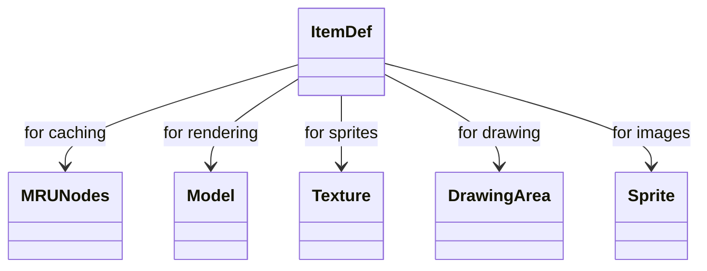

# ItemDef_DJRMEMXO.md

## Overview

ItemDef defines item definitions, including models, colors, actions, value, stacking. It handles sprite generation and caching.

Purpose: To define and manage item data in the game.

Functionality: forID method loads items; methods generate models and sprites; readValues parses data.

## Architectural Relationships

ItemDef uses MRUNodes for caching, Model for rendering, Texture/DrawingArea for sprites, interacts with client members settings.

## Bytecode Matches

`cat bytecode/client/DJRMEMXO.bytecode.txt | grep -A 15 -B 5 "public static DJRMEMXO c"`

This shows the forID method checking cache and loading.

`cat bytecode/client/DJRMEMXO.bytecode.txt | grep -A 10 -B 5 "private void readValues"`

This shows readValues parsing item data.

`cat bytecode/client/DJRMEMXO.bytecode.txt | grep -A 20 -B 5 "public static Sprite getSprite"`

This shows sprite generation method.

## Deob Source Sections

`cat srcAllDummysRemoved/src/ItemDef.java | grep -A 15 "public static ItemDef forID"`

This shows forID caching.

`cat srcAllDummysRemoved/src/ItemDef.java | grep -A 20 "private void readValues"`

This shows readValues.

`cat srcAllDummysRemoved/src/ItemDef.java | grep -A 30 "public static Sprite getSprite"`

This shows sprite generation.

## Javap Cache Sections

`cat srcAllDummysRemoved/.javap_cache/ItemDef.javap.cache | grep -A 15 -B 5 "public static ItemDef forID"`

This shows javap forID.

`cat srcAllDummysRemoved/.javap_cache/ItemDef.javap.cache | grep -A 20 -B 5 "private void readValues"`

This shows javap readValues.

`cat srcAllDummysRemoved/.javap_cache/ItemDef.javap.cache | grep -A 30 -B 5 "public static Sprite getSprite"`

This shows javap sprite method.

Multiple lines of context: Caching, parsing, sprite rendering match.

Verification: Consistent item definition logic.

Non-contradictory: All show same item management.

1:1 mapping confirmation: Unique to items.</content>
<parameter name="filePath">bytecode/mapping/evidence/verified/ItemDef_DJRMEMXO.md