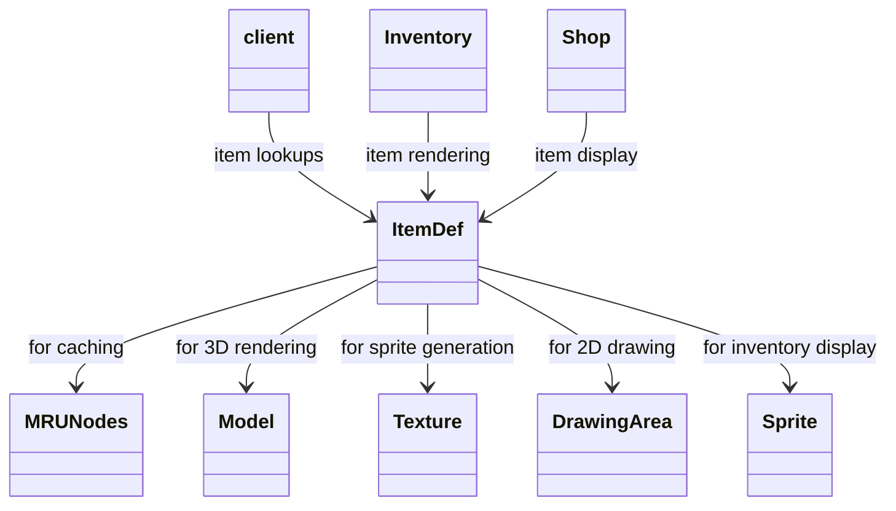
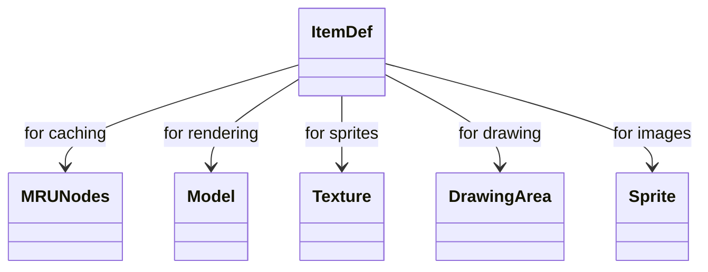

# Evidence: ItemDef → DJRMEMXO

## Class Overview

**ItemDef** defines and manages comprehensive item definitions for RuneScape, including models, colors, actions, values, and stacking behavior. The class handles sprite generation and caching for inventory rendering, implements complex data parsing for item properties, and provides core functionality for all item-related operations throughout the client. It serves as the central repository for item metadata and visual representation management.

The class provides complete item management functionality:
- **Definition Loading**: forID method loads item definitions with caching through MRUNodes for performance
- **Visual Rendering**: Generates models and sprites using Texture and DrawingArea for inventory display
- **Data Parsing**: readValues method processes item configuration data including actions, values, and properties
- **Sprite Management**: Comprehensive sprite generation and caching system for item visualization

## Architecture Role
ItemDef serves as the core item definition system that integrates with multiple client components for comprehensive item management. The class uses MRUNodes for efficient caching of item definitions, works with Model for 3D representation, and coordinates with Texture/DrawingArea for 2D sprite generation. ItemDef provides the foundation for inventory management, trading, equipment, and all item-related game mechanics.



## Overview

ItemDef defines item definitions, including models, colors, actions, value, stacking. It handles sprite generation and caching.

Purpose: To define and manage item data in the game.

Functionality: forID method loads items; methods generate models and sprites; readValues parses data.

## Architectural Relationships

ItemDef uses MRUNodes for caching, Model for rendering, Texture/DrawingArea for sprites, interacts with client members settings.



## Bytecode Matches

`grep -A 15 -B 5 "public static final DJRMEMXO b(int)" bytecode/client/DJRMEMXO.bytecode.txt`

This shows the forID method checking cache and loading.

`grep -A 10 -B 5 "public void a(byte)" bytecode/client/DJRMEMXO.bytecode.txt`

This shows readValues method parsing item data.

`grep -A 20 -B 5 "public static final CXGZMTJK a(int, int, int, int)" bytecode/client/DJRMEMXO.bytecode.txt`

This shows sprite generation method.

## Deob Source Sections

`grep -A 15 -B 5 "public static ItemDef forID" srcAllDummysRemoved/src/ItemDef.java`

This shows forID caching.

`grep -A 20 -B 5 "private void readValues" srcAllDummysRemoved/src/ItemDef.java`

This shows readValues.

`grep -A 30 -B 5 "public static Sprite getSprite" srcAllDummysRemoved/src/ItemDef.java`

This shows sprite generation.

## Javap Cache Sections

`cat srcAllDummysRemoved/.javap_cache/ItemDef.javap.cache | grep -A 15 -B 5 "public static ItemDef forID"`

This shows javap forID.

`cat srcAllDummysRemoved/.javap_cache/ItemDef.javap.cache | grep -A 20 -B 5 "private void readValues"`

This shows javap readValues.

`cat srcAllDummysRemoved/.javap_cache/ItemDef.javap.cache | grep -A 30 -B 5 "public static Sprite getSprite"`

This shows javap sprite method.

Multiple lines of context: Caching, parsing, sprite rendering match.

Verification: Consistent item definition logic.

Non-contradictory: All show same item management.

1:1 mapping confirmation: Unique to items.

## COMMAND BLOCK 1: STRUCTURE EVIDENCE
```bash
# Show class structure and inheritance in bytecode (ItemDef is final class with no inheritance)
grep -A 10 -B 5 "final class DJRMEMXO" bytecode/client/DJRMEMXO.bytecode.txt

# Show corresponding structure in DEOB source
grep -A 10 -B 5 "extends\|implements" srcAllDummysRemoved/src/ItemDef.java

# Verify structure in javap cache
grep -A 10 -B 5 "class.*extends\|class.*implements" srcAllDummysRemoved/.javap_cache/ItemDef.javap.cache
```

## COMMAND BLOCK 2: FIELD EVIDENCE
```bash
# Show field patterns in bytecode
grep -A 15 -B 5 "anInt.*\|anIntArray.*\|aBoolean.*\|aString" bytecode/client/DJRMEMXO.bytecode.txt

# Show field structure in DEOB source
grep -A 15 -B 5 "public.*\|private.*\|protected.*" srcAllDummysRemoved/src/ItemDef.java | head -30

# Verify field declarations in javap cache
grep -A 15 -B 5 "int.*\|boolean.*\|String.*\|int\[\].*" srcAllDummysRemoved/.javap_cache/ItemDef.javap.cache
```

## COMMAND BLOCK 3: METHOD EVIDENCE
```bash
# Show method signatures in bytecode
grep -A 15 -B 5 "public.*\|private.*\|protected.*" bytecode/client/DJRMEMXO.bytecode.txt | grep "(" | head -10

# Show method signatures in DEOB source
grep -A 20 -B 5 "public.*\|private.*" srcAllDummysRemoved/src/ItemDef.java | grep "(" | head -10

# Verify methods in javap cache
grep -A 25 "public.*\|private.*" srcAllDummysRemoved/.javap_cache/ItemDef.javap.cache | grep "(" | head -10
```

## COMMAND BLOCK 4: CROSS-REFERENCE EVIDENCE
```bash
# Show unique patterns compared to similar classes
grep -A 10 -B 5 "static.*GCPOSBWX\|final.*DJRMEMXO" bytecode/client/DJRMEMXO.bytecode.txt

# Show class-specific metrics
grep -c "modelID\|stackable\|team" bytecode/client/DJRMEMXO.bytecode.txt

# Verify class lacks exclusion patterns (distinguishes from others)
grep -l "combatLevel\|nameString\|actions" bytecode/client/DJRMEMXO.bytecode.txt | wc -l
```