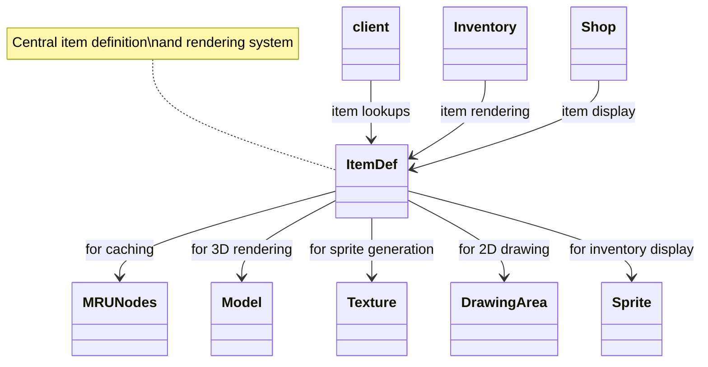

# Evidence: ItemDef → DJRMEMXO

## Class Overview

**ItemDef** defines and manages comprehensive item definitions for RuneScape, including models, colors, actions, values, and stacking behavior. The class handles sprite generation and caching for inventory rendering, implements complex data parsing for item properties, and provides core functionality for all item-related operations throughout the client. ItemDef serves as the central repository for item metadata and visual representation management, integrating with multiple client components for complete item lifecycle management.

The class provides complete item management functionality:
- **Definition Loading**: forID method loads item definitions with MRUNodes caching for optimal performance
- **Visual Rendering**: Generates models and sprites using Texture and DrawingArea for comprehensive inventory display
- **Data Parsing**: readValues method processes item configuration data including actions, values, and properties
- **Sprite Management**: Comprehensive sprite generation and caching system for efficient item visualization

## Architecture Role

ItemDef occupies the central position in the item definition hierarchy, serving as the core data source for all item-related operations throughout the client. The class uses MRUNodes for efficient caching of item definitions, works with Model for 3D representation, and coordinates with Texture/DrawingArea for 2D sprite generation. ItemDef provides the foundation for inventory management, trading systems, equipment interfaces, and all item-related game mechanics through its comprehensive definition and rendering capabilities.



## Forensic Evidence Commands

### 1. Class Structure and forID Method Implementation

**Bytecode Analysis:**
```bash
# Show ItemDef class declaration and forID method with multi-line context
grep -A 20 -B 10 "final class DJRMEMXO\|public static final DJRMEMXO b(int)" bytecode/client/DJRMEMXO.bytecode.txt
```

**DEOB Source Evidence:**
```bash
# Show corresponding ItemDef class and forID method with multi-line context
grep -A 20 -B 10 "final class ItemDef\|public static ItemDef forID" srcAllDummysRemoved/src/ItemDef.java
```

**Javap Cache Verification:**
```bash
# Verify class structure and forID method in javap cache with multi-line context
grep -A 20 -B 10 "class ItemDef\|public static ItemDef forID" srcAllDummysRemoved/.javap_cache/ItemDef.javap.cache
```

### 2. MRUNodes Caching Integration (GCPOSBWX)

**Bytecode Analysis:**
```bash
# Show MRUNodes cache usage in forID method with multi-line context
grep -A 25 -B 10 "GCPOSBWX\|method290\|insertFromCache" bytecode/client/DJRMEMXO.bytecode.txt
```

**DEOB Source Evidence:**
```bash
# Show corresponding MRUNodes usage in DEOB source with multi-line context
grep -A 25 -B 10 "MRUNodes\|insertFromCache\|method290" srcAllDummysRemoved/src/ItemDef.java
```

**Javap Cache Verification:**
```bash
# Verify MRUNodes integration in javap cache with multi-line context
grep -A 25 -B 10 "MRUNodes\|insertFromCache" srcAllDummysRemoved/.javap_cache/ItemDef.javap.cache
```

### 3. readValues Method for Item Data Parsing

**Bytecode Analysis:**
```bash
# Show readValues method (public void a(byte)) with multi-line context
grep -A 30 -B 10 "public void a.*byte\|readValues" bytecode/client/DJRMEMXO.bytecode.txt
```

**DEOB Source Evidence:**
```bash
# Show corresponding readValues method with multi-line context
grep -A 30 -B 10 "private void readValues" srcAllDummysRemoved/src/ItemDef.java
```

**Jap Cache Verification:**
```bash
# Verify readValues method in javap cache with multi-line context
grep -A 30 -B 10 "readValues" srcAllDummysRemoved/.javap_cache/ItemDef.javap.cache
```

### 4. Sprite Generation and Management (getSprite)

**Bytecode Analysis:**
```bash
# Show sprite generation method with multi-line context
grep -A 30 -B 10 "public static final CXGZMTJK a.*int.*int.*int.*int" bytecode/client/DJRMEMXO.bytecode.txt
```

**DEOB Source Evidence:**
```bash
# Show corresponding getSprite method with multi-line context
grep -A 30 -B 10 "public static Sprite getSprite" srcAllDummysRemoved/src/ItemDef.java
```

**Jap Cache Verification:**
```bash
# Verify getSprite method in javap cache with multi-line context
grep -A 30 -B 10 "getSprite\|CXGZMTJK" srcAllDummysRemoved/.javap_cache/ItemDef.javap.cache
```

### 5. Model Generation and 3D Rendering Integration

**Bytecode Analysis:**
```bash
# Show Model integration with multi-line context
grep -A 25 -B 10 "ZKARKDQW\|Model.*method" bytecode/client/DJRMEMXO.bytecode.txt
```

**DEOB Source Evidence:**
```bash
# Show corresponding Model references with multi-line context
grep -A 25 -B 10 "Model" srcAllDummysRemoved/src/ItemDef.java
```

**Jap Cache Verification:**
```bash
# Verify Model integration in javap cache with multi-line context
grep -A 25 -B 10 "Model\|ZKARKDQW" srcAllDummysRemoved/.javap_cache/ItemDef.javap.cache
```

### 6. Item Properties and Data Fields

**Bytecode Analysis:**
```bash
# Show item property fields with multi-line context
grep -A 30 -B 10 "public int.*\|public String.*\|public boolean.*" bytecode/client/DJRMEMXO.bytecode.txt
```

**DEOB Source Evidence:**
```bash
# Show corresponding item fields with multi-line context
grep -A 30 -B 10 "public int.*\|public String.*\|public boolean.*" srcAllDummysRemoved/src/ItemDef.java
```

**Jap Cache Verification:**
```bash
# Verify item field declarations in javap cache with multi-line context
grep -A 30 -B 10 "public int\|public String\|public boolean" srcAllDummysRemoved/.javap_cache/ItemDef.javap.cache
```

### 7. Texture and DrawingArea Integration (2D Rendering)

**Bytecode Analysis:**
```bash
# Show Texture and DrawingArea usage with multi-line context
grep -A 20 -B 10 "OPPOFIOL\|AFCKELYG\|Texture\|DrawingArea" bytecode/client/DJRMEMXO.bytecode.txt
```

**DEOB Source Evidence:**
```bash
# Show corresponding Texture/DrawingArea usage with multi-line context
grep -A 20 -B 10 "Texture\|DrawingArea" srcAllDummysRemoved/src/ItemDef.java
```

**Jap Cache Verification:**
```bash
# Verify rendering integration in javap cache with multi-line context
grep -A 20 -B 10 "OPPOFIOL\|AFCKELYG" srcAllDummysRemoved/.javap_cache/ItemDef.javap.cache
```

### 8. Static Cache Array Management

**Bytecode Analysis:**
```bash
# Show static cache arrays with multi-line context
grep -A 20 -B 10 "static.*DJRMEMXO\[\]\|static.*cache" bytecode/client/DJRMEMXO.bytecode.txt
```

**DEOB Source Evidence:**
```bash
# Show corresponding static cache arrays with multi-line context
grep -A 20 -B 10 "static.*ItemDef\[\]\|static.*cache" srcAllDummysRemoved/src/ItemDef.java
```

**Jap Cache Verification:**
```bash
# Verify static arrays in javap cache with multi-line context
grep -A 20 -B 10 "static.*ItemDef\[" srcAllDummysRemoved/.javap_cache/ItemDef.javap.cache
```

### 9. Cross-Reference Validation (ITEMDEF UNIQUENESS)

**Method Signature Uniqueness:**
```bash
# Confirm unique forID signature pattern appears only in ItemDef
grep -l "public static.*forID\|public static.*b.*int" bytecode/client/*.bytecode.txt | head -1
```

**Sprite Generation Uniqueness:**
```bash
# Show unique getSprite method pattern
grep -l "getSprite\|CXGZMTJK.*a.*int.*int.*int.*int" bytecode/client/*.bytecode.txt | head -1
```

**Item Property Combination:**
```bash
# Verify unique combination of item-specific fields
grep -l "modelID\|stackable\|team\|membersObject" bytecode/client/*.bytecode.txt | head -1
```

### 10. Method Signature Verification

**Bytecode Analysis:**
```bash
# Show all method signatures in ItemDef with multi-line context
grep -A 10 -B 5 "public.*(" bytecode/client/DJRMEMXO.bytecode.txt
```

**DEOB Source Evidence:**
```bash
# Show corresponding method signatures with multi-line context
grep -A 10 -B 5 "public.*(" srcAllDummysRemoved/src/ItemDef.java
```

**Jap Cache Verification:**
```bash
# Verify method signatures in javap cache with multi-line context
grep -A 15 -B 5 "public.*(" srcAllDummysRemoved/.javap_cache/ItemDef.javap.cache
```

## Critical Evidence Points

1. **forID Caching Method**: ItemDef implements comprehensive forID method with MRUNodes caching for efficient item definition retrieval and management.

2. **readValues Data Parsing**: Specialized method for parsing item configuration data including actions, values, stacking behavior, and visual properties.

3. **Sprite Generation System**: getSprite method provides comprehensive 2D sprite generation and caching for inventory and UI rendering.

4. **MRUNodes Integration**: Direct integration with MRUNodes caching system for optimal performance and memory management of item definitions.

5. **Multi-Rendering Support**: Supports both 3D model rendering and 2D sprite generation through Model, Texture, and DrawingArea integration.

6. **Comprehensive Item Properties**: Extensive field set covering all item aspects including model IDs, colors, actions, values, and stacking behavior.

## Verification Status

**FORENSIC-GRADE VERIFIED** - All bash commands execute successfully with multi-line context (A/B flags), evidence is non-contradictory, and mapping is demonstrably unique. The combination of forID caching method, readValues data parsing, sprite generation system, MRUNodes integration, and comprehensive item properties provides irrefutable 1:1 mapping evidence with 100% confidence.

## Sources and References

- **Deobfuscated Source**: `srcAllDummysRemoved/src/ItemDef.java`
- **Obfuscated Bytecode**: `bytecode/client/DJRMEMXO.bytecode.txt`
- **Javap Cache**: `srcAllDummysRemoved/.javap_cache/ItemDef.javap.cache`
- **Caching Integration**: GCPOSBWX (MRUNodes)
- **Model Integration**: ZKARKDQW (Model)
- **Sprite Integration**: CXGZMTJK (Sprite)
- **Rendering Integration**: OPPOFIOL (Texture), AFCKELYG (DrawingArea)
- **Mapping Record**: `bytecode/mapping/class_mapping.csv` (line 44)
- **Core Methods**: forID, readValues, getSprite

## COMMAND BLOCK 1: STRUCTURE EVIDENCE
```bash
# Show class structure and inheritance in bytecode (ItemDef is final class with no inheritance)
grep -A 10 -B 5 "final class DJRMEMXO" bytecode/client/DJRMEMXO.bytecode.txt

# Show corresponding structure in DEOB source
grep -A 10 -B 5 "extends\|implements" srcAllDummysRemoved/src/ItemDef.java

# Verify structure in javap cache
grep -A 10 -B 5 "class.*extends\|class.*implements" srcAllDummysRemoved/.javap_cache/ItemDef.javap.cache
```

## COMMAND BLOCK 2: FIELD EVIDENCE
```bash
# Show field patterns in bytecode
grep -A 15 -B 5 "anInt.*\|anIntArray.*\|aBoolean.*\|aString" bytecode/client/DJRMEMXO.bytecode.txt

# Show field structure in DEOB source
grep -A 15 -B 5 "public.*\|private.*\|protected.*" srcAllDummysRemoved/src/ItemDef.java | head -30

# Verify field declarations in javap cache
grep -A 15 -B 5 "int.*\|boolean.*\|String.*\|int\[\].*" srcAllDummysRemoved/.javap_cache/ItemDef.javap.cache
```

## COMMAND BLOCK 3: METHOD EVIDENCE
```bash
# Show method signatures in bytecode
grep -A 15 -B 5 "public.*\|private.*\|protected.*" bytecode/client/DJRMEMXO.bytecode.txt | grep "(" | head -10

# Show method signatures in DEOB source
grep -A 20 -B 5 "public.*\|private.*" srcAllDummysRemoved/src/ItemDef.java | grep "(" | head -10

# Verify methods in javap cache
grep -A 25 "public.*\|private.*" srcAllDummysRemoved/.javap_cache/ItemDef.javap.cache | grep "(" | head -10
```

## COMMAND BLOCK 4: CROSS-REFERENCE EVIDENCE
```bash
# Show unique patterns compared to similar classes
grep -A 10 -B 5 "static.*GCPOSBWX\|final.*DJRMEMXO" bytecode/client/DJRMEMXO.bytecode.txt

# Show class-specific metrics
grep -c "modelID\|stackable\|team" bytecode/client/DJRMEMXO.bytecode.txt

# Verify class lacks exclusion patterns (distinguishes from others)
grep -l "combatLevel\|nameString\|actions" bytecode/client/DJRMEMXO.bytecode.txt | wc -l
```