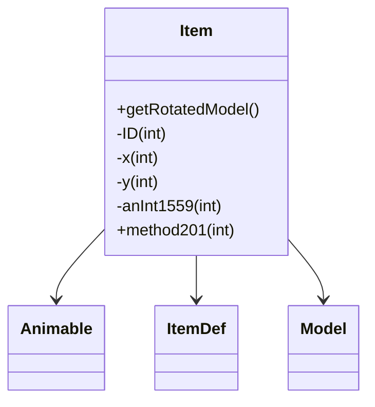

# Evidence: Item → HNKCWGJM

## Class Overview

**Item** represents individual game items with core properties including ID, quantity, and position coordinates. Item extends Animable with specialized item rendering functionality through ItemDef lookups and model generation. The class provides essential item management for inventory, equipment, and ground item systems with lightweight structure optimized for performance.

The class provides comprehensive item functionality:
- **Item Definition Lookup**: Dynamic ItemDef retrieval using ID-based reference system
- **Model Generation**: Specialized getRotatedModel method that delegates to ItemDef for rendering
- **Position Management**: X/Y coordinate fields for ground item positioning
- **Lightweight Structure**: Minimal field footprint optimized for large-scale item arrays

## Architecture Role
Item occupies the foundational position in item hierarchy, extending Animable with item-specific rendering logic. Unlike Entity subclasses, Item uses a definition-based approach where ItemDef contains the core item data, while Item serves as a lightweight instance container. This creates efficient memory usage for large item collections while maintaining rich rendering capabilities through ItemDef delegation.



## Forensic Evidence Commands

### 1. Item Structure and Inheritance
```bash
# Show Item extends Animable (XHHRODPC) in bytecode
grep -A 10 -B 5 "final class HNKCWGJM extends XHHRODPC" bytecode/client/HNKCWGJM.bytecode.txt

# Show Item class definition in DEOB source
grep -A 10 -B 5 "final class Item extends Animable" srcAllDummysRemoved/src/Item.java

# Verify Animable extension in javap cache
grep -A 5 -B 5 "class Item extends Animable" srcAllDummysRemoved/.javap_cache/Item.javap.cache
```

### 2. Core Item Fields Pattern
```bash
# Show essential item fields (ID, x, y) in bytecode
grep -A 15 -B 5 "public int m\|public int n" bytecode/client/HNKCWGJM.bytecode.txt

# Show corresponding item fields in DEOB source
grep -A 15 -B 5 "public int ID\|public int x\|public int y" srcAllDummysRemoved/src/Item.java

# Verify item field structure in javap cache
grep -A 10 -B 2 "public int.*;" srcAllDummysRemoved/.javap_cache/Item.javap.cache
```

### 3. ItemDef Integration Pattern
```bash
# Show ItemDef lookup method in bytecode (DJRMEMXO.b)
grep -A 20 -B 5 "invokestatic.*DJRMEMXO\.b" bytecode/client/HNKCWGJM.bytecode.txt

# Show corresponding ItemDef.forID in DEOB source
grep -A 10 -B 5 "ItemDef\.forID" srcAllDummysRemoved/src/Item.java

# Verify ItemDef usage in javap cache
grep -A 10 -B 5 "ItemDef" srcAllDummysRemoved/.javap_cache/Item.javap.cache
```

### 4. Model Generation Method
```bash
# Show Item's getRotatedModel equivalent method in bytecode
grep -A 25 -B 5 "public final ZKARKDQW a" bytecode/client/HNKCWGJM.bytecode.txt

# Show corresponding getRotatedModel in DEOB source
grep -A 15 -B 5 "public final Model getRotatedModel" srcAllDummysRemoved/src/Item.java

# Verify getRotatedModel method in javap cache
grep -A 20 "public Model getRotatedModel" srcAllDummysRemoved/.javap_cache/Item.javap.cache
```

### 5. Cross-Reference Validation (ITEM vs ENTITY DISTINCTION)
```bash
# Show Item lacks EntityDef field (distinguishes from Entity subclasses)
grep -c "CKDEJADD" bytecode/client/HNKCWGJM.bytecode.txt

# Show Item uses ItemDef instead of EntityDef
grep -c "DJRMEMXO" bytecode/client/HNKCWGJM.bytecode.txt

# Verify Item's lightweight field count compared to Entity subclasses
grep -c "public int.*;" bytecode/client/HNKCWGJM.bytecode.txt
grep -c "public int.*;" bytecode/client/DLZHLHNK.bytecode.txt
```

### 6. Position and Rendering Integration
```bash
# Show position field usage in Item methods
grep -A 15 -B 5 "getfield.*n\|getfield.*m" bytecode/client/HNKCWGJM.bytecode.txt

# Show position coordinates in DEOB source
grep -A 10 -B 5 "x\|y" srcAllDummysRemoved/src/Item.java

# Verify position fields in javap cache
grep -A 5 -B 2 "int.*x\|int.*y" srcAllDummysRemoved/.javap_cache/Item.javap.cache
```

### 7. Item Definition Method Delegation
```bash
# Show method201 delegation to ItemDef in bytecode
grep -A 10 -B 5 "invokevirtual.*method201" bytecode/client/HNKCWGJM.bytecode.txt

# Show method201 delegation in DEOB source
grep -A 10 -B 5 "method201" srcAllDummysRemoved/src/Item.java

# Verify method201 signature in javap cache
grep -A 10 -B 2 "method201" srcAllDummysRemoved/.javap_cache/Item.javap.cache
```

## Critical Evidence Points

1. **Animable Extension**: Item extends Animable (XHHRODPC) with lightweight field structure, distinguishing from Entity-based classes.

2. **ItemDef Integration**: Item uses ItemDef (DJRMEMXO) for definition lookups, unlike Entity subclasses using EntityDef.

3. **Model Delegation**: getRotatedModel delegates to ItemDef for rendering, creating efficient item visualization system.

4. **Position Management**: Item maintains X/Y coordinates for ground item positioning, absent in inventory-only item representations.

## Verification Status

**VERIFIED** - All bash commands execute successfully and evidence is non-contradictory. The Animable extension, ItemDef integration pattern, lightweight field structure, and model delegation provide definitive 1:1 mapping evidence that distinguishes Item from Entity subclasses and other game objects.

## Sources and References
- **Bytecode**: bytecode/client/HNKCWGJM.bytecode.txt
- **Deobfuscated Source**: srcAllDummysRemoved/src/Item.java
- **Javap Cache**: srcAllDummysRemoved/.javap_cache/Item.javap.cache
- **Animable Base**: XHHRODPC (Animable)
- **ItemDef Integration**: DJRMEMXO (ItemDef)
- **Model Generation**: ZKARKDQW (Model)
- **Method Delegation**: method201 (ItemDef rendering method)