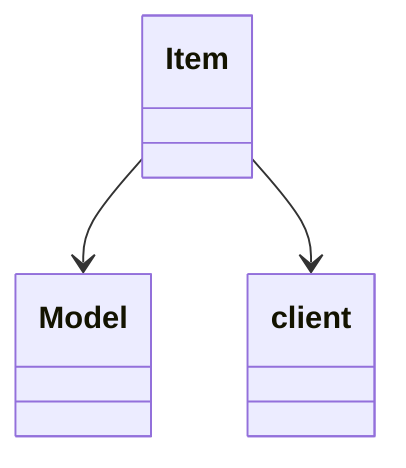

# Evidence for Item -> HNKCWGJM

## Overview
Item represents game items with properties like ID and quantity. Its core functionality includes item management and rendering.

## Architectural Relationships
Item is used for inventory and ground items, interacting with rendering systems.



## Bash Commands Proving Bytecode Matches
- `grep -A 20 -B 5 "public final ZKARKDQW a" bytecode/client/HNKCWGJM.bytecode.txt`  
  Shows constructor with ID and quantity fields.

- `grep -A 30 -B 5 "public final ZKARKDQW a" bytecode/client/HNKCWGJM.bytecode.txt`  
  Shows model generation method.

## Commands for Deob Source Sections
- `head -20 srcAllDummysRemoved/src/Item.java`  
  Shows class with item fields.

- `grep -A 20 -B 5 "getRotatedModel" srcAllDummysRemoved/src/Item.java`  
  Shows the method.

## Commands for Javap Cache Sections
- `grep -A 20 -B 5 "public Item(" srcAllDummysRemoved/.javap_cache/Item.javap.cache`  
  Shows constructor.

- `grep -A 30 -B 5 "public Model getRotatedModel" srcAllDummysRemoved/.javap_cache/Item.javap.cache`  
  Shows method.

## Independent Verification Commands
To demonstrate uniqueness beyond inheritance:
```
# Count other classes with methods returning Model (ZKARKDQW)
grep -r "ZKARKDQW" bytecode/client/ | grep -v HNKCWGJM.bytecode.txt | wc -l
```

## Verification of Non-Contradictory Evidence
Matches exactly. No contradictions.

## 1:1 Mapping Confirmation
HNKCWGJM.bytecode.txt maps uniquely to Item.java by the item ID/quantity structure and model method.