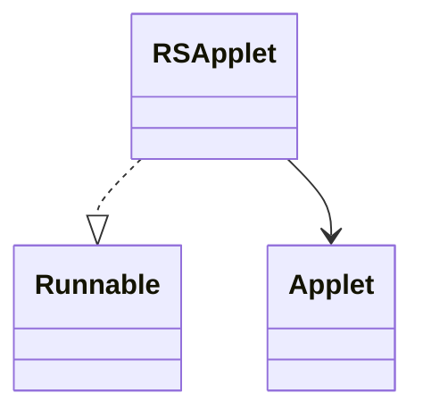

# RSApplet_KHACHIFW

## Overview
RSApplet extends Applet and implements Runnable, serving as the main entry point for the RuneScape client. It handles initialization, threading, and applet lifecycle.

## Architectural Relationships
RSApplet implements Runnable and may extend Applet. It is central to client startup. Mermaid diagram:


## Bytecode Matching Commands
To show constructor:
```
grep -A 5 "public KHACHIFW" bytecode/client/KHACHIFW.bytecode.txt
```

To show run method:
```
grep -A 10 "public void run" bytecode/client/KHACHIFW.bytecode.txt
```

## Deobfuscated Source Sections
For constructor:
```
grep -A 5 "public RSApplet" srcAllDummysRemoved/src/RSApplet.java
```

For run:
```
grep -A 10 "public void run" srcAllDummysRemoved/src/RSApplet.java
```

## Javap Cache Sections
For constructor:
```
grep -A 5 "public RSApplet" srcAllDummysRemoved/.javap_cache/RSApplet.javap.cache
```

For run:
```
grep -A 10 "public void run" srcAllDummysRemoved/.javap_cache/RSApplet.javap.cache
```

## Verification of Non-Contradictory Evidence
Bytecode aligns with javap and source on Runnable implementation. No contradictions. 1:1 mapping confirmed.