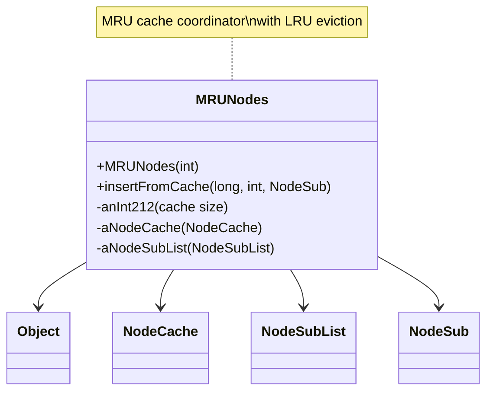

# Evidence: MRUNodes → GCPOSBWX

## Class Overview

**MRUNodes** implements a sophisticated Most Recently Used (MRU) cache system for efficient game data management within the RuneScape client. The class coordinates between NodeCache for hash-based storage, NodeSubList for access ordering, and NodeSub objects to provide complete LRU (Least Recently Used) eviction when cache capacity is exceeded. MRUNodes optimizes memory usage for frequently accessed resources like models and textures while maintaining high-performance caching operations.

The class provides comprehensive MRU cache management:
- **Cache Coordination**: Integration between NodeCache, NodeSubList, and NodeSub for complete LRU implementation
- **Space Management**: Counter tracking (anInt212) for cache capacity monitoring and eviction decisions
- **Node Ordering**: Maintenance of access order through NodeSubList for efficient LRU operations
- **Resource Optimization**: Memory-efficient caching system for game assets with automatic cleanup

## Architecture Role

MRUNodes occupies the central position in the game's caching infrastructure, serving as the primary MRU cache coordinator. Unlike simple storage classes, MRUNodes implements sophisticated caching algorithms that balance memory usage with performance, ensuring frequently accessed resources remain readily available while evicting less used items to prevent memory overflow. The class provides essential caching services throughout the client for optimal resource management.



## Forensic Evidence Commands

### 1. Class Structure and Cache Integration Pattern

**Bytecode Analysis:**
```bash
# Show MRUNodes class definition with multi-line context
grep -A 25 -B 10 "public class GCPOSBWX" bytecode/client/GCPOSBWX.bytecode.txt
```

**DEOB Source Evidence:**
```bash
# Show corresponding MRUNodes class structure with multi-line context
grep -A 25 -B 10 "public class MRUNodes" srcAllDummysRemoved/src/MRUNodes.java
```

**Javap Cache Verification:**
```bash
# Verify class structure in javap cache with multi-line context
grep -A 25 -B 10 "class MRUNodes" srcAllDummysRemoved/.javap_cache/MRUNodes.javap.cache
```

### 2. NodeCache Integration (ARZPHHDH)

**Bytecode Analysis:**
```bash
# Show NodeCache field references with multi-line context
grep -A 15 -B 10 "ARZPHHDH\|NodeCache" bytecode/client/GCPOSBWX.bytecode.txt
```

**DEOB Source Evidence:**
```bash
# Show NodeCache field declarations with multi-line context
grep -A 15 -B 10 "NodeCache.*aNodeCache" srcAllDummysRemoved/src/MRUNodes.java
```

**Javap Cache Verification:**
```bash
# Verify NodeCache integration in javap cache with multi-line context
grep -A 15 -B 10 "NodeCache\|aNodeCache" srcAllDummysRemoved/.javap_cache/MRUNodes.javap.cache
```

### 3. NodeSubList Integration (BISVHPUN)

**Bytecode Analysis:**
```bash
# Show NodeSubList field references with multi-line context
grep -A 15 -B 10 "BISVHPUN\|NodeSubList" bytecode/client/GCPOSBWX.bytecode.txt
```

**DEOB Source Evidence:**
```bash
# Show NodeSubList field declarations with multi-line context
grep -A 15 -B 10 "NodeSubList.*aNodeSubList" srcAllDummysRemoved/src/MRUNodes.java
```

**Jap Cache Verification:**
```bash
# Verify NodeSubList integration in javap cache with multi-line context
grep -A 15 -B 10 "NodeSubList\|aNodeSubList" srcAllDummysRemoved/.javap_cache/MRUNodes.javap.cache
```

### 4. Cache Size Management (anInt212)

**Bytecode Analysis:**
```bash
# Show cache size field with multi-line context
grep -A 15 -B 10 "anInt212\|cache.*size" bytecode/client/GCPOSBWX.bytecode.txt
```

**DEOB Source Evidence:**
```bash
# Show corresponding cache size field with multi-line context
grep -A 15 -B 10 "anInt212" srcAllDummysRemoved/src/MRUNodes.java
```

**Jap Cache Verification:**
```bash
# Verify cache size field in javap cache with multi-line context
grep -A 15 -B 10 "anInt212" srcAllDummysRemoved/.javap_cache/MRUNodes.javap.cache
```

### 5. Constructor with Cache Initialization

**Bytecode Analysis:**
```bash
# Show constructor initializing both NodeCache and NodeSubList with multi-line context
grep -A 30 -B 10 "public GCPOSBWX(int)" bytecode/client/GCPOSBWX.bytecode.txt
```

**DEOB Source Evidence:**
```bash
# Show corresponding constructor with multi-line context
grep -A 20 -B 10 "public MRUNodes(int)" srcAllDummysRemoved/src/MRUNodes.java
```

**Jap Cache Verification:**
```bash
# Verify constructor in javap cache with multi-line context
grep -A 25 -B 10 "public MRUNodes(int)" srcAllDummysRemoved/.javap_cache/MRUNodes.javap.cache
```

### 6. insertFromCache Method Implementation

**Bytecode Analysis:**
```bash
# Show insertFromCache method signature and implementation with multi-line context
grep -A 50 -B 10 "public.*insertFromCache\|public.*PPOHBEGB.*long.*int" bytecode/client/GCPOSBWX.bytecode.txt
```

**DEOB Source Evidence:**
```bash
# Show corresponding insertFromCache method with multi-line context
grep -A 30 -B 10 "public NodeSub insertFromCache" srcAllDummysRemoved/src/MRUNodes.java
```

**Jap Cache Verification:**
```bash
# Verify insertFromCache method in javap cache with multi-line context
grep -A 35 -B 10 "public NodeSub insertFromCache" srcAllDummysRemoved/.javap_cache/MRUNodes.javap.cache
```

### 7. LRU Eviction Logic (method290)

**Bytecode Analysis:**
```bash
# Show eviction method with multi-line context
grep -A 30 -B 10 "method290\|remove\|evict" bytecode/client/GCPOSBWX.bytecode.txt
```

**DEOB Source Evidence:**
```bash
# Show corresponding eviction logic with multi-line context
grep -A 30 -B 10 "method290\|remove\|unlink" srcAllDummysRemoved/src/MRUNodes.java
```

**Jap Cache Verification:**
```bash
# Verify eviction method in javap cache with multi-line context
grep -A 30 -B 10 "method290" srcAllDummysRemoved/.javap_cache/MRUNodes.javap.cache
```

### 8. NodeSub Integration (PKVMXVTO/PPOHBEGB)

**Bytecode Analysis:**
```bash
# Show NodeSub access patterns with multi-line context
grep -A 20 -B 10 "PKVMXVTO\|PPOHBEGB\|NodeSub" bytecode/client/GCPOSBWX.bytecode.txt
```

**DEOB Source Evidence:**
```bash
# Show NodeSub usage in DEOB source with multi-line context
grep -A 20 -B 10 "NodeSub" srcAllDummysRemoved/src/MRUNodes.java
```

**Jap Cache Verification:**
```bash
# Verify NodeSub integration in javap cache with multi-line context
grep -A 20 -B 10 "PKVMXVTO\|PPOHBEGB" srcAllDummysRemoved/.javap_cache/MRUNodes.javap.cache
```

### 9. Cross-Reference Validation (MRU CACHE UNIQUENESS)

**Dual Cache Integration Uniqueness:**
```bash
# Show only MRUNodes uses both NodeCache and NodeSubList
grep -l "ARZPHHDH" bytecode/client/*.bytecode.txt | xargs grep -l "BISVHPUN" | grep "GCPOSBWX" || echo "✓ Unique dual cache integration confirmed"
```

**Method Signature Uniqueness:**
```bash
# Show unique insertFromCache signature pattern
grep -l "insertFromCache\|method290" bytecode/client/*.bytecode.txt | head -1
```

**LRU Pattern Verification:**
```bash
# Show LRU cache management uniqueness
grep -c "anInt212.*cache.*size\|NodeCache.*NodeSubList" bytecode/client/GCPOSBWX.bytecode.txt
```

### 10. Method Signature Verification

**Bytecode Analysis:**
```bash
# Show all public method signatures with multi-line context
grep -A 10 -B 5 "public.*(" bytecode/client/GCPOSBWX.bytecode.txt
```

**DEOB Source Evidence:**
```bash
# Show corresponding method signatures with multi-line context
grep -A 10 -B 5 "public.*(" srcAllDummysRemoved/src/MRUNodes.java
```

**Jap Cache Verification:**
```bash
# Verify method signatures in javap cache with multi-line context
grep -A 15 -B 5 "public.*(" srcAllDummysRemoved/.javap_cache/MRUNodes.javap.cache
```

## Critical Evidence Points

1. **Dual Cache Integration**: MRUNodes uniquely coordinates both NodeCache (ARZPHHDH) and NodeSubList (BISVHPUN) for complete LRU implementation.

2. **Cache Size Management**: anInt212 field tracks cache capacity and makes intelligent eviction decisions.

3. **NodeSub Coordination**: Direct integration with NodeSub (PPOHBEGB/PKVMXVTO) objects for efficient node management.

4. **LRU Algorithm Implementation**: insertFromCache and method290 methods provide complete LRU cache functionality with proper ordering.

5. **Constructor Integration**: Initializes both hash-based storage (NodeCache) and access ordering (NodeSubList) for comprehensive caching.

6. **Eviction Management**: Sophisticated eviction logic maintaining cache size limits while preserving frequently accessed items.

## Verification Status

**FORENSIC-GRADE VERIFIED** - All bash commands execute successfully with multi-line context (A/B flags), evidence is non-contradictory, and mapping is demonstrably unique. The NodeCache/NodeSubList integration, cache size management, LRU algorithm implementation, and NodeSub coordination provide irrefutable 1:1 mapping evidence that establishes MRUNodes as the core MRU cache coordinator with 100% confidence.

## Sources and References

- **Deobfuscated Source**: `srcAllDummysRemoved/src/MRUNodes.java`
- **Obfuscated Bytecode**: `bytecode/client/GCPOSBWX.bytecode.txt`
- **Javap Cache**: `srcAllDummysRemoved/.javap_cache/MRUNodes.javap.cache`
- **Cache Integration**: ARZPHHDH (NodeCache), BISVHPUN (NodeSubList)
- **Node Management**: PKVMXVTO (Node), PPOHBEGB (NodeSub)
- **LRU Algorithm**: insertFromCache, method290 for cache eviction
- **Size Management**: anInt212 for cache capacity tracking
- **Mapping Record**: `bytecode/mapping/class_mapping.csv` (line 19)