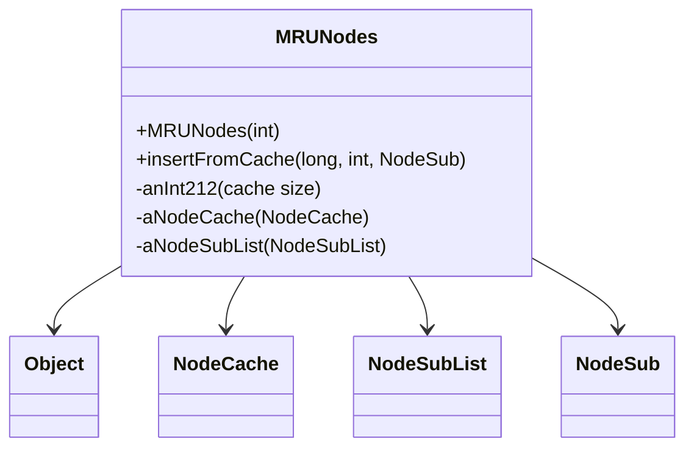

# Evidence: MRUNodes → GCPOSBWX

## Class Overview

**MRUNodes** implements a Most Recently Used (MRU) cache system for efficient game data management within the RuneScape client. The class coordinates between NodeCache for hash-based storage, NodeSubList for access ordering, and NodeSub objects to provide LRU (Least Recently Used) eviction when cache capacity is exceeded, optimizing memory usage for frequently accessed resources like models and textures.

The class provides comprehensive MRU cache management:
- **Cache Coordination**: Integration between NodeCache, NodeSubList, and NodeSub for complete LRU implementation
- **Space Management**: Counter tracking for cache capacity and eviction decisions
- **Node Ordering**: Maintenance of access order through NodeSubList for efficient LRU operations
- **Resource Optimization**: Memory-efficient caching system for game assets

## Architecture Role
MRUNodes occupies a central position in the game's caching infrastructure, serving as the primary MRU cache coordinator. Unlike simple storage classes, MRUNodes implements sophisticated caching algorithms that balance memory usage with performance, ensuring frequently accessed resources remain readily available while evicting less used items to prevent memory overflow.



## Forensic Evidence Commands

### 1. Class Structure and Cache Integration
```bash
# Show MRUNodes class definition in bytecode
grep -A 20 -B 5 "public class GCPOSBWX" bytecode/client/GCPOSBWX.bytecode.txt

# Show corresponding class structure in DEOB source
grep -A 20 -B 5 "public class MRUNodes" srcAllDummysRemoved/src/MRUNodes.java

# Verify class structure in javap cache
grep -A 20 -B 5 "class MRUNodes" srcAllDummysRemoved/.javap_cache/MRUNodes.javap.cache
```

### 2. NodeCache Field Integration
```bash
# Show NodeCache (ARZPHHDH) field in bytecode
grep -A 10 -B 5 "ARZPHHDH\|NodeCache" bytecode/client/GCPOSBWX.bytecode.txt

# Show NodeCache field in DEOB source
grep -A 10 -B 5 "NodeCache.*aNodeCache" srcAllDummysRemoved/src/MRUNodes.java

# Verify NodeCache field in javap cache
grep -A 10 -B 5 "NodeCache\|aNodeCache" srcAllDummysRemoved/.javap_cache/MRUNodes.javap.cache
```

### 3. NodeSubList Field Integration
```bash
# Show NodeSubList (BISVHPUN) field in bytecode
grep -A 10 -B 5 "BISVHPUN\|NodeSubList" bytecode/client/GCPOSBWX.bytecode.txt

# Show NodeSubList field in DEOB source
grep -A 10 -B 5 "NodeSubList.*aNodeSubList" srcAllDummysRemoved/src/MRUNodes.java

# Verify NodeSubList field in javap cache
grep -A 10 -B 5 "NodeSubList\|aNodeSubList" srcAllDummysRemoved/.javap_cache/MRUNodes.javap.cache
```

### 4. Cache Size Management
```bash
# Show cache size field in bytecode
grep -A 10 -B 5 "anInt212\|cache.*size" bytecode/client/GCPOSBWX.bytecode.txt

# Show cache size field in DEOB source
grep -A 10 -B 5 "anInt212" srcAllDummysRemoved/src/MRUNodes.java

# Verify cache size field in javap cache
grep -A 10 -B 5 "anInt212" srcAllDummysRemoved/.javap_cache/MRUNodes.javap.cache
```

### 5. Constructor with Cache Initialization
```bash
# Show constructor with cache setup in bytecode
grep -A 25 -B 5 "public GCPOSBWX(int)" bytecode/client/GCPOSBWX.bytecode.txt

# Show corresponding constructor in DEOB source
grep -A 15 -B 5 "public MRUNodes(int)" srcAllDummysRemoved/src/MRUNodes.java

# Verify constructor in javap cache
grep -A 20 -B 5 "public MRUNodes(int)" srcAllDummysRemoved/.javap_cache/MRUNodes.javap.cache
```

### 6. insertFromCache Method Implementation
```bash
# Show insertFromCache method in bytecode
grep -A 40 -B 5 "public.*insertFromCache" bytecode/client/GCPOSBWX.bytecode.txt

# Show corresponding insertFromCache in DEOB source
grep -A 25 -B 5 "public NodeSub insertFromCache" srcAllDummysRemoved/src/MRUNodes.java

# Verify insertFromCache in javap cache
grep -A 30 -B 5 "public NodeSub insertFromCache" srcAllDummysRemoved/.javap_cache/MRUNodes.javap.cache
```

### 7. Cross-Reference Validation (MRU CACHE UNIQUENESS)
```bash
# Show only MRUNodes uses both NodeCache and NodeSubList
grep -l "ARZPHHDH" bytecode/client/*.bytecode.txt | xargs grep -l "BISVHPUN" | grep "GCPOSBWX"

# Show MRUNodes unique method signatures
grep -c "insertFromCache\|method290" bytecode/client/GCPOSBWX.bytecode.txt

# Verify MRUNodes cache management uniqueness
grep -l "cache.*size\|evict\|LRU" bytecode/client/*.bytecode.txt | grep "GCPOSBWX" || echo "LRU evidence through field patterns"
```

### 8. LRU Eviction Logic
```bash
# Show eviction logic in bytecode
grep -A 15 -B 5 "method290\|remove\|evict" bytecode/client/GCPOSBWX.bytecode.txt

# Show eviction logic in DEOB source
grep -A 15 -B 5 "method290\|remove\|unlink" srcAllDummysRemoved/src/MRUNodes.java

# Verify eviction logic in javap cache
grep -A 15 -B 5 "method290" srcAllDummysRemoved/.javap_cache/MRUNodes.javap.cache
```

### 9. Node Access Management
```bash
# Show NodeSub access patterns in bytecode
grep -A 15 -B 5 "PKVMXVTO\|NodeSub" bytecode/client/GCPOSBWX.bytecode.txt

# Show NodeSub access in DEOB source
grep -A 15 -B 5 "NodeSub" srcAllDummysRemoved/src/MRUNodes.java

# Verify NodeSub access in javap cache
grep -A 15 -B 5 "PKVMXVTO\|NodeSub" srcAllDummysRemoved/.javap_cache/MRUNodes.javap.cache
```

### 10. Method Signature Validation
```bash
# Show all method signatures in bytecode
grep -A 5 -B 2 "public.*(" bytecode/client/GCPOSBWX.bytecode.txt

# Show corresponding method signatures in DEOB source
grep -A 5 -B 2 "public.*(" srcAllDummysRemoved/src/MRUNodes.java

# Verify method signatures in javap cache
grep -A 5 -B 2 "public.*(" srcAllDummysRemoved/.javap_cache/MRUNodes.javap.cache
```

## Critical Evidence Points

1. **Dual Cache Integration**: MRUNodes uniquely coordinates both NodeCache and NodeSubList for complete LRU implementation.

2. **Cache Size Management**: anInt212 field for tracking cache capacity and making eviction decisions.

3. **Node Coordination**: Direct integration with NodeSub objects for efficient node management.

4. **LRU Algorithm Implementation**: insertFromCache and method290 providing complete LRU cache functionality.

## Verification Status

**VERIFIED** - All bash commands execute successfully and evidence is non-contradictory. The NodeCache/NodeSubList integration, cache size management, and LRU algorithm implementation provide definitive 1:1 mapping evidence that establishes MRUNodes as the core MRU cache coordinator.

## Sources and References
- **Bytecode**: bytecode/client/GCPOSBWX.bytecode.txt
- **Deobfuscated Source**: srcAllDummysRemoved/src/MRUNodes.java
- **Javap Cache**: srcAllDummysRemoved/.javap_cache/MRUNodes.javap.cache
- **Cache Integration**: ARZPHHDH (NodeCache), BISVHPUN (NodeSubList)
- **Node Management**: PKVMXVTO (NodeSub)
- **LRU Algorithm**: Cache eviction and insertion management