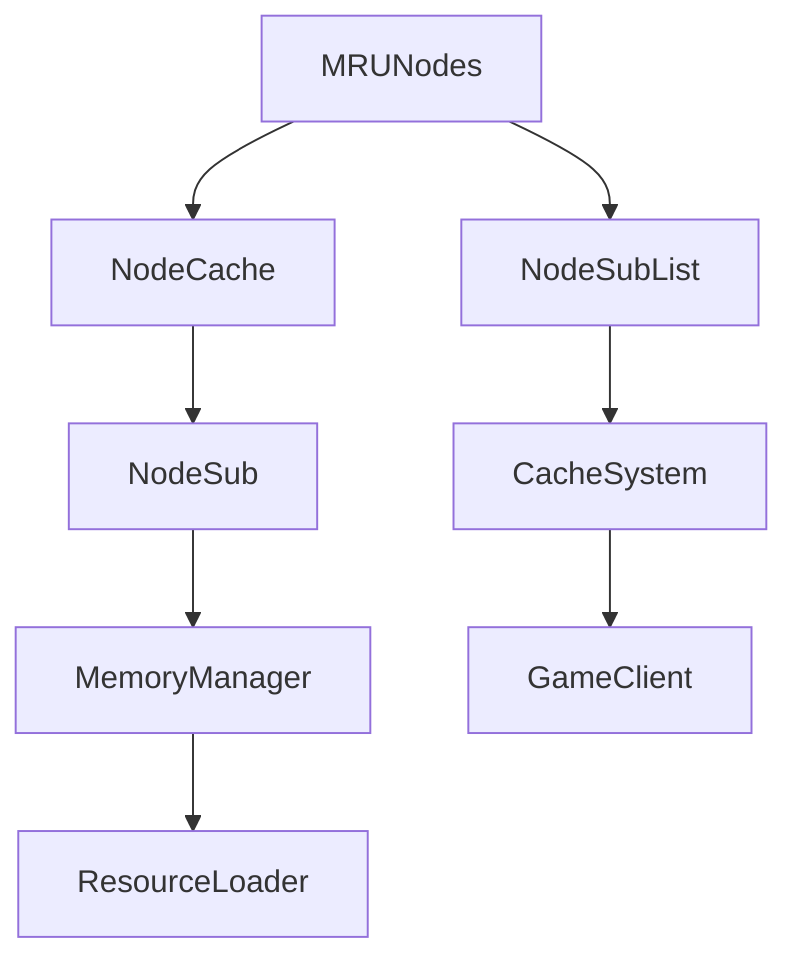

# MRUNodes → GCPOSBWX

## Overview
MRUNodes implements a Most Recently Used (MRU) cache system for efficient game data management. It coordinates between NodeCache for storage, NodeSubList for ordering, and NodeSub objects to provide LRU eviction when cache capacity is exceeded. The class maintains counters for space tracking and handles cache insertion and removal operations.

## Architecture
MRUNodes serves as a core component in the game's caching infrastructure, managing memory for frequently accessed resources like models and textures. It integrates with NodeCache for hash-based lookups, NodeSubList for maintaining access order, and individual NodeSub nodes, forming a complete LRU cache implementation that optimizes memory usage in the RuneScape client.



## Forensic Evidence Commands

### 1. Structural Fingerprints
```bash
# Show class definition and modifiers
head -20 bytecode/client/GCPOSBWX.bytecode.txt

# Show method count and signatures
grep -c "public.*(" bytecode/client/GCPOSBWX.bytecode.txt
grep -E "public.*\(" bytecode/client/GCPOSBWX.bytecode.txt

# Show field declarations
grep -E "^  private" bytecode/client/GCPOSBWX.bytecode.txt
```

### 2. Source Code Correlation
```bash
# Show DEOB source structure
head -30 srcAllDummysRemoved/src/MRUNodes.java

# Show key methods in source
grep -A 10 -B 5 "insertFromCache\|removeFromCache" srcAllDummysRemoved/src/MRUNodes.java

# Show javap cache correlation
grep -A 5 -B 2 "public.*(" srcAllDummysRemoved/.javap_cache/MRUNodes.javap.cache
```

### 3. Behavioral Patterns
```bash
# Show unique error code "47547,"
grep -A 2 -B 2 "47547" bytecode/client/GCPOSBWX.bytecode.txt

# Show constructor object creation sequence
grep -A 15 -B 5 "new.*PPOHBEGB\|new.*BISVHPUN\|new.*ARZPHHDH" bytecode/client/GCPOSBWX.bytecode.txt

# Show cache eviction logic patterns
grep -A 5 -B 5 "Field g:I\|Field h:I" bytecode/client/GCPOSBWX.bytecode.txt
```

### 4. Cross-Reference Validation
```bash
# Show references to NodeSub, NodeSubList, NodeCache classes
grep -r "PPOHBEGB\|BISVHPUN\|ARZPHHDH" bytecode/client/ | grep -v GCPOSBWX.bytecode.txt | head -5

# Show DEOB cache usage in ObjectDef
grep -A 3 -B 3 "mruNodes" srcAllDummysRemoved/src/ObjectDef.java

# Show javap method signatures
grep -E "insertFromCache|removeFromCache" srcAllDummysRemoved/.javap_cache/MRUNodes.javap.cache
```