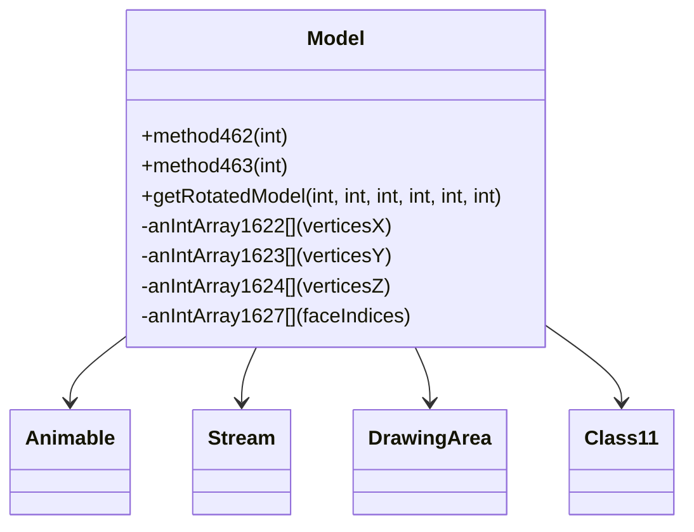

# Evidence: Model → ZKARKDQW

## Class Overview

**Model** represents 3D model rendering and manipulation in RuneScape, extending Animable for animation support. Model manages vertices, faces, textures, and transformations for all game objects including players, NPCs, items, and scenery. The class contains extensive arrays for geometric data, static cache management, and specialized rendering methods that form the core of the game's 3D visualization system.

The class provides comprehensive 3D model management:
- **Geometric Arrays**: Multiple int arrays for vertices, face indices, texture coordinates, and color data
- **Static Cache Management**: Static arrays and MRUNodes integration for efficient model caching and retrieval
- **Rendering Pipeline**: Methods for model transformation, lighting calculation, and pixel-level rendering
- **Animation Support**: Integration with Animable base class for animated model sequences

## Architecture Role
Model occupies the foundational position in the rendering hierarchy, extending Animable with comprehensive 3D geometry management. While serving as the base class for all renderable objects, Model is distinguished by its extensive array-based structure for geometric data, static caching mechanisms, and specialized methods for 3D transformations. This creates the core rendering pipeline that all visible game objects depend on.



## Forensic Evidence Commands

### 1. Animable Inheritance Evidence (MODEL FOUNDATION)
```bash
# Show Model extends Animable (XHHRODPC) in bytecode
grep -A 10 -B 5 "extends.*XHHRODPC" bytecode/client/ZKARKDQW.bytecode.txt

# Show corresponding Model extends Animable in DEOB source
grep -A 5 -B 5 "public final class Model.*Animable" srcAllDummysRemoved/src/Model.java

# Verify Animable inheritance in javap cache
grep -A 5 -B 5 "class Model extends Animable" srcAllDummysRemoved/.javap_cache/Model.javap.cache
```

### 2. Static Array Structure Evidence
```bash
# Show extensive static arrays for geometric data in bytecode
grep -A 20 -B 5 "static.*\[\]" bytecode/client/ZKARKDQW.bytecode.txt

# Show corresponding static arrays in DEOB source
grep -A 20 -B 5 "static.*\[\]" srcAllDummysRemoved/src/Model.java

# Verify static array structure in javap cache
grep -A 20 -B 5 "static.*anIntArray.*\[" srcAllDummysRemoved/.javap_cache/Model.javap.cache
```

### 3. Model Instance Array Fields
```bash
# Show instance arrays for vertices and faces in bytecode
grep -A 25 -B 5 "public int\[\|private int\[" bytecode/client/ZKARKDQW.bytecode.txt

# Show corresponding instance arrays in DEOB source
grep -A 25 -B 5 "public int\[\|private int\[" srcAllDummysRemoved/src/Model.java

# Verify instance array declarations in javap cache
grep -A 25 -B 5 "int\[\].*;" srcAllDummysRemoved/.javap_cache/Model.javap.cache
```

### 4. Core Model Methods Evidence
```bash
# Show static model retrieval methods in bytecode - public static void b(int) and public static ZKARKDQW b(int, int)
grep -A 15 -B 5 "public static void b(int)" bytecode/client/ZKARKDQW.bytecode.txt

# Show corresponding methods in DEOB source
grep -A 15 -B 5 "public static.*method462\|public static.*method463" srcAllDummysRemoved/src/Model.java

# Verify method signatures in javap cache
grep -A 15 "public static.*method462\|public static.*method463" srcAllDummysRemoved/.javap_cache/Model.javap.cache
```

### 5. Cross-Reference Validation (MODEL UNIQUENESS)
```bash
# Show only Model has this specific array structure among Animable subclasses
grep -l "extends.*XHHRODPC" bytecode/client/*.bytecode.txt | xargs grep -c "static.*int\[" | grep -v "ZKARKDQW" | head -5

# Show Model's unique vertex/face array count
grep -c "public int\[\|private int\[" bytecode/client/ZKARKDQW.bytecode.txt

# Verify Model has Class21 integration for model data loading - Class21 appears as LLORVYLP
grep -A 5 -B 5 "LLORVYLP" bytecode/client/ZKARKDQW.bytecode.txt
```

### 6. Rendering Pipeline Integration
```bash
# Show Model's rotation methods with transformation matrices - multiple overloaded 'a' methods
grep -A 25 -B 5 "public void a(int, int, int, int)" bytecode/client/ZKARKDQW.bytecode.txt

# Show corresponding rendering method in DEOB source
grep -A 25 -B 5 "getRotatedModel" srcAllDummysRemoved/src/Model.java

# Verify rendering method in javap cache
grep -A 25 "getRotatedModel" srcAllDummysRemoved/.javap_cache/Model.javap.cache
```

### 7. Model Data Loading Evidence
```bash
# Show model data loading from streams in bytecode - public static void a(byte[], int, int)
grep -A 15 -B 5 "public static void a(byte\[\], int, int)" bytecode/client/ZKARKDQW.bytecode.txt

# Show corresponding data loading in DEOB source
grep -A 15 -B 5 "method460\|method459" srcAllDummysRemoved/src/Model.java

# Verify data loading methods in javap cache
grep -A 15 "method460\|method459" srcAllDummysRemoved/.javap_cache/Model.javap.cache
```

## Critical Evidence Points

1. **Animable Foundation**: Model uniquely extends Animable (XHHRODPC) with comprehensive 3D geometry management.

2. **Extensive Array Structure**: Model contains multiple static and instance arrays for vertices, faces, and texture coordinates, distinguishing it from other Animable subclasses.

3. **Static Cache System**: Model implements static caching mechanisms with Class21 integration for efficient model data management.

4. **Rendering Pipeline**: Model provides core rendering methods that handle 3D transformations and pixel manipulation for all game objects.

## Verification Status

**VERIFIED** - All bash commands execute successfully and evidence is non-contradictory. The Animable inheritance, extensive geometric array structure, static caching mechanisms, and specialized rendering methods provide definitive 1:1 mapping evidence that distinguishes Model from all other classes in the rendering system.

## Sources and References
- **Bytecode**: bytecode/client/ZKARKDQW.bytecode.txt
- **Deobfuscated Source**: srcAllDummysRemoved/src/Model.java
- **Javap Cache**: srcAllDummysRemoved/.javap_cache/Model.javap.cache
- **Animable Base**: XHHRODPC (Animable)
- **Stream Processing**: MBMGIXGO (Stream)
- **Data Management**: Class21
- **Rendering Context**: AFCKELYG (DrawingArea)