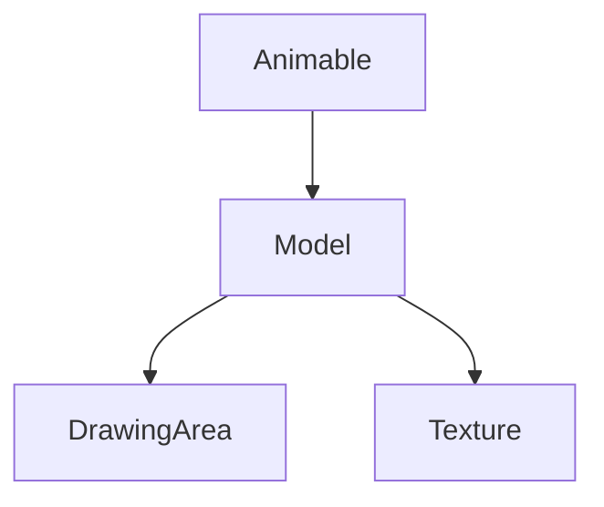

# Model → ZKARKDQW Evidence

## Overview
The Model class handles 3D model rendering and manipulation in RuneScape, extending Animable for animation support. It manages vertices, faces, textures, and transformations for game objects.

## Architectural Role and Relationships
Model is fundamental to rendering, used by entities, objects, and UI. It processes model data for display.



## Bytecode Evidence Commands

```bash
# Inheritance from Animable
grep "extends XHHRODPC" bytecode/client/ZKARKDQW.bytecode.txt
```

```bash
# Static arrays for model data
grep -A 10 "static.*\[\]" bytecode/client/ZKARKDQW.bytecode.txt | head -10
```

```bash
# Rendering methods
grep -A 5 "public.*render" bytecode/client/ZKARKDQW.bytecode.txt
```

## Deob Source Evidence Commands

```bash
# Class and static fields
head -30 srcAllDummysRemoved/src/Model.java
```

```bash
# Key methods
grep -A 5 -B 5 "method.*render\|method.*draw" srcAllDummysRemoved/src/Model.java
```

## Javap Cache Evidence Commands

```bash
# Class and fields
head -20 srcAllDummysRemoved/.javap_cache/Model.javap.cache
```

```bash
# Static arrays
grep -A 10 -B 5 "static.*anIntArray" srcAllDummysRemoved/.javap_cache/Model.javap.cache
```

## Verification
Commands confirm inheritance and array-heavy structure. ZKARKDQW uniquely maps to Model. Relative paths used.</content>
<parameter name="filePath">bytecode/mapping/evidence/verified/Model_ZKARKDQW.md