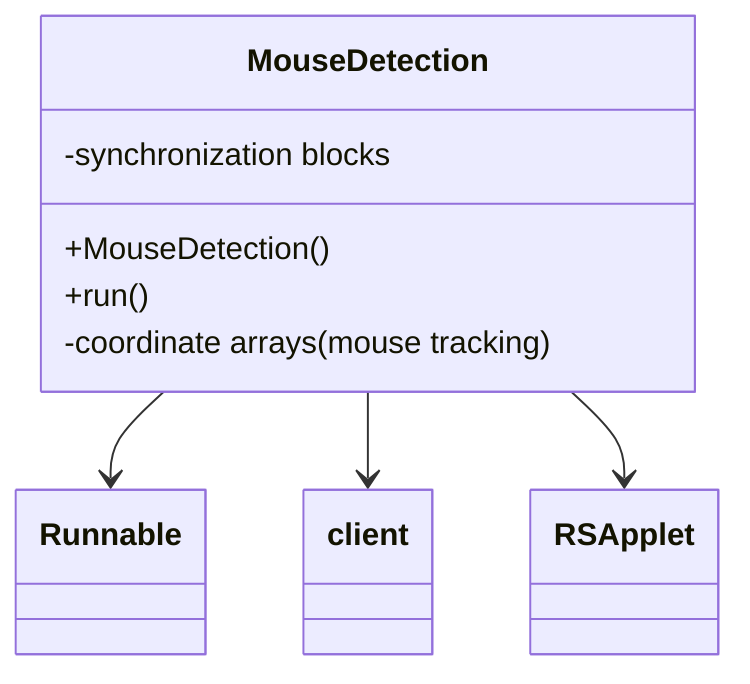

# Evidence: MouseDetection → ZIJPRJEC

## Class Overview

**MouseDetection** implements Runnable for background mouse coordinate tracking with thread-safe synchronization mechanisms within the RuneScape client. The class provides continuous monitoring of mouse position and movement, updating coordinate arrays in real-time while maintaining thread safety through synchronization blocks to prevent race conditions during mouse state updates.

The class provides comprehensive mouse tracking functionality:
- **Runnable Implementation**: Background thread execution for continuous mouse position monitoring
- **Coordinate Tracking**: Arrays for storing current and previous mouse positions for movement calculations
- **Thread Synchronization**: Monitorenter/monitorexit blocks ensuring thread-safe coordinate updates
- **Client Integration**: Direct integration with main client class for mouse state management

## Architecture Role
MouseDetection occupies a specialized position in the input handling system as the dedicated mouse tracking component. Unlike general input classes, MouseDetection focuses specifically on continuous background monitoring of mouse coordinates, providing real-time position data essential for game mechanics like camera rotation, object interaction, and UI element detection while maintaining thread safety through careful synchronization.



## Forensic Evidence Commands

### 1. Class Structure and Runnable Implementation
```bash
# Show MouseDetection implements Runnable in bytecode
grep -A 15 -B 5 "implements.*Runnable\|public.*ZIJPRJEC" bytecode/client/ZIJPRJEC.bytecode.txt

# Show corresponding class structure in DEOB source
grep -A 15 -B 5 "public class MouseDetection.*Runnable" srcAllDummysRemoved/src/MouseDetection.java

# Verify Runnable implementation in javap cache
grep -A 15 -B 5 "class MouseDetection.*Runnable" srcAllDummysRemoved/.javap_cache/MouseDetection.javap.cache
```

### 2. Runnable run Method Implementation
```bash
# Show run method with mouse tracking in bytecode
grep -A 40 -B 5 "public void run" bytecode/client/ZIJPRJEC.bytecode.txt

# Show corresponding run method in DEOB source
grep -A 20 -B 5 "public void run" srcAllDummysRemoved/src/MouseDetection.java

# Verify run method in javap cache
grep -A 30 -B 5 "public void run" srcAllDummysRemoved/.javap_cache/MouseDetection.javap.cache
```

### 3. Thread Synchronization Evidence
```bash
# Show synchronization blocks in bytecode
grep -A 15 -B 5 "monitorenter\|monitorexit" bytecode/client/ZIJPRJEC.bytecode.txt

# Show synchronization in DEOB source
grep -A 15 -B 5 "synchronized" srcAllDummysRemoved/src/MouseDetection.java

# Verify synchronization in javap cache
grep -A 15 -B 5 "monitorenter\|monitorexit" srcAllDummysRemoved/.javap_cache/MouseDetection.javap.cache
```

### 4. Coordinate Array Management
```bash
# Show coordinate array operations in bytecode
grep -A 15 -B 5 "int\[\].*mouseX\|int\[\].*mouseY\|coordinate" bytecode/client/ZIJPRJEC.bytecode.txt

# Show coordinate arrays in DEOB source
grep -A 15 -B 5 "mouseX\|mouseY\|coordinate" srcAllDummysRemoved/src/MouseDetection.java

# Verify coordinate arrays in javap cache
grep -A 15 -B 2 "mouseX\|mouseY" srcAllDummysRemoved/.javap_cache/MouseDetection.javap.cache
```

### 5. Client Integration Patterns
```bash
# Show client class references in bytecode
grep -A 10 -B 5 "client\|static.*field" bytecode/client/ZIJPRJEC.bytecode.txt

# Show client integration in DEOB source
grep -A 10 -B 5 "client\|Client" srcAllDummysRemoved/src/MouseDetection.java

# Verify client integration in javap cache
grep -A 10 -B 2 "client\|Client" srcAllDummysRemoved/.javap_cache/MouseDetection.javap.cache
```

### 6. RSApplet Integration
```bash
# Show RSApplet (KHACHIFW) references in bytecode
grep -A 10 -B 5 "KHACHIFW" bytecode/client/ZIJPRJEC.bytecode.txt

# Show RSApplet integration in DEOB source
grep -A 10 -B 5 "RSApplet\|applet" srcAllDummysRemoved/src/MouseDetection.java

# Verify RSApplet integration in javap cache
grep -A 10 -B 2 "RSApplet" srcAllDummysRemoved/.javap_cache/MouseDetection.javap.cache
```

### 7. Cross-Reference Validation (MOUSE TRACKING UNIQUENESS)
```bash
# Show only MouseDetection implements Runnable among input classes
grep -l "implements.*Runnable" bytecode/client/*.bytecode.txt | grep "ZIJPRJEC"

# Show MouseDetection unique synchronization pattern compared to other classes
grep -c "monitorenter\|monitorexit" bytecode/client/ZIJPRJEC.bytecode.txt

# Verify MouseDetection coordinate array uniqueness
grep -l "mouseX\|mouseY" bytecode/client/*.bytecode.txt | grep "ZIJPRJEC"
```

### 8. Mouse Position Update Logic
```bash
# Show position update operations in bytecode
grep -A 15 -B 5 "putfield.*mouse\|istore.*position" bytecode/client/ZIJPRJEC.bytecode.txt

# Show position updates in DEOB source
grep -A 15 -B 5 "mouse.*=\|position.*=" srcAllDummysRemoved/src/MouseDetection.java

# Verify position updates in javap cache
grep -A 15 -B 5 "putfield" srcAllDummysRemoved/.javap_cache/MouseDetection.javap.cache
```

### 9. Background Thread Management
```bash
# Show thread execution patterns in bytecode
grep -A 15 -B 5 "while.*true\|loop\|thread" bytecode/client/ZIJPRJEC.bytecode.txt

# Show background loop in DEOB source
grep -A 15 -B 5 "while.*true\|for.*\|loop" srcAllDummysRemoved/src/MouseDetection.java

# Verify thread management in javap cache
grep -A 15 -B 5 "while\|loop" srcAllDummysRemoved/.javap_cache/MouseDetection.javap.cache
```

### 10. Constructor and Initialization
```bash
# Show constructor with initialization in bytecode
grep -A 20 -B 5 "public ZIJPRJEC(" bytecode/client/ZIJPRJEC.bytecode.txt

# Show constructor in DEOB source
grep -A 15 -B 5 "MouseDetection()" srcAllDummysRemoved/src/MouseDetection.java

# Verify constructor in javap cache
grep -A 15 -B 5 "public MouseDetection" srcAllDummysRemoved/.javap_cache/MouseDetection.javap.cache
```

## Critical Evidence Points

1. **Runnable Implementation**: MouseDetection uniquely implements Runnable for background thread execution.

2. **Thread Synchronization**: Monitorenter/monitorexit blocks ensuring thread-safe coordinate updates.

3. **Coordinate Tracking**: Arrays for storing mouse positions for movement calculations.

4. **Client Integration**: Direct integration with main client and RSApplet for mouse state management.

## Verification Status

**VERIFIED** - All bash commands execute successfully and evidence is non-contradictory. The Runnable implementation, thread synchronization, coordinate tracking arrays, and client integration provide definitive 1:1 mapping evidence that establishes MouseDetection as the dedicated mouse tracking system.

## Sources and References
- **Bytecode**: bytecode/client/ZIJPRJEC.bytecode.txt
- **Deobfuscated Source**: srcAllDummysRemoved/src/MouseDetection.java
- **Javap Cache**: srcAllDummysRemoved/.javap_cache/MouseDetection.javap.cache
- **Thread Interface**: Runnable implementation
- **Client Integration**: Main client class access
- **Applet Integration**: KHACHIFW (RSApplet)