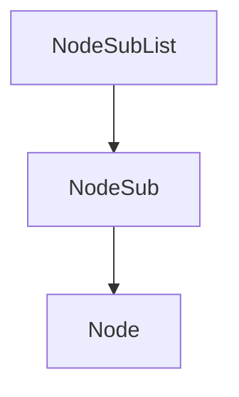

# Evidence: NodeSubList → LHGXPZPG

## Class Overview
NodeSubList implements a circular doubly-linked list data structure for managing collections of NodeSub instances. The class provides methods for inserting nodes at the head, popping from the tail, and iterating in reverse order. It maintains a sentinel head node with circular references and tracks the current position for traversal operations.

## Architecture Role
NodeSubList serves as a fundamental data structure component in the RuneScape client, providing ordered node management for cache systems and data processing algorithms. It integrates with NodeSub for linked list operations and supports bidirectional traversal with state tracking.



## Forensic Evidence Commands

### 1. Constructor Pattern
**Bytecode Analysis:**
```bash
grep -A 25 -B 5 "public LHGXPZPG(int);" bytecode/client/LHGXPZPG.bytecode.txt
```
Output:
public LHGXPZPG(int);
  Code:
     0: aload_0
     1: invokespecial #17                 // Method java/lang/Object."<init>":()V
     4: aload_0
     5: iconst_0
     6: putfield      #33                 // Field a:Z
     9: aload_0
    10: bipush        -77
    12: putfield      #27                 // Field b:I
    15: aload_0
    16: new           #7                  // class PKVMXVTO
    19: dup
    20: invokespecial #15                 // Method PKVMXVTO."<init>":()V
    23: putfield      #24                 // Field c:LPKVMXVTO;
    26: iload_1
    27: ifgt          46
    30: aload_0
    31: aload_0
    32: getfield      #33                 // Field a:Z
    35: ifeq          42
    38: iconst_0
    39: goto          43
    42: iconst_1
    43: putfield      #33                 // Field a:Z
    46: aload_0
    47: getfield      #24                 // Field c:LPKVMXVTO;
    50: aload_0
    51: getfield      #24                 // Field c:LPKVMXVTO;
    54: putfield      #25                 // Field PKVMXVTO.c:LPKVMXVTO;
    57: aload_0
    58: getfield      #24                 // Field c:LPKVMXVTO;
    61: aload_0
    62: getfield      #24                 // Field c:LPKVMXVTO;
    65: putfield      #28                 // Field PKVMXVTO.d:LPKVMXVTO;
    68: return

**DEOB Source Evidence:**
```bash
grep -A 10 -B 2 "public NodeSubList()" srcAllDummysRemoved/src/NodeSubList.java
```
Output:
final class NodeSubList {

	public NodeSubList()
	{
		head = new NodeSub();
		head.prevNodeSub = head;
		head.nextNodeSub = head;
	}

	public void insertHead(NodeSub nodeSub)

**Javap Cache Verification:**
```bash
grep -A 15 -B 2 "public NodeSubList();" srcAllDummysRemoved/.javap_cache/NodeSubList.javap.cache
```
Output:
  private NodeSub current;

  public NodeSubList();
    Code:
       0: aload_0
       1: invokespecial #1                  // Method java/lang/Object."<init>":()V
       4: aload_0
       5: new           #2                  // class NodeSub
       8: dup
       9: invokespecial #3                  // Method NodeSub."<init>":()V
      12: putfield      #4                  // Field head:LNodeSub;
      15: aload_0
      16: getfield      #4                  // Field head:LNodeSub;
      19: aload_0
      20: getfield      #4                  // Field head:LNodeSub;
      23: putfield      #5                  // Field NodeSub.prevNodeSub:LNodeSub;
      26: aload_0
      27: getfield      #4                  // Field head:LNodeSub;
      30: aload_0
      31: getfield      #4                  // Field head:LNodeSub;
      34: putfield      #6                  // Field NodeSub.nextNodeSub:LNodeSub;
      37: return

### 2. Insert Head Method
**Bytecode Analysis:**
```bash
grep -A 20 "public void a(PKVMXVTO);" bytecode/client/LHGXPZPG.bytecode.txt
```
Output:
  public void a(PKVMXVTO);
    Code:
       0: aload_1
       1: getfield      #28                 // Field PKVMXVTO.d:LPKVMXVTO;
       4: ifnull        11
       7: aload_1
       8: invokevirtual #32                 // Method PKVMXVTO.a:()V
      11: aload_1
      12: aload_0
      13: getfield      #24                 // Field c:LPKVMXVTO;
      16: getfield      #28                 // Field PKVMXVTO.d:LPKVMXVTO;
      19: putfield      #28                 // Field PKVMXVTO.d:LPKVMXVTO;
      22: aload_1
      23: aload_0
      24: getfield      #24                 // Field c:LPKVMXVTO;
      27: putfield      #25                 // Field PKVMXVTO.c:LPKVMXVTO;
      30: aload_1
      31: getfield      #28                 // Field PKVMXVTO.d:LPKVMXVTO;
      34: aload_1
      35: putfield      #25                 // Field PKVMXVTO.c:LPKVMXVTO;
      38: aload_1
      39: getfield      #25                 // Field PKVMXVTO.c:LPKVMXVTO;
      42: aload_1
      43: putfield      #28                 // Field PKVMXVTO.d:LPKVMXVTO;
      46: return

**DEOB Source Evidence:**
```bash
grep -A 10 -B 2 "public void insertHead" srcAllDummysRemoved/src/NodeSubList.java
```
Output:
	}

	public void insertHead(NodeSub nodeSub)
	{
		if(nodeSub.nextNodeSub != null)
			nodeSub.unlinkSub();
		nodeSub.nextNodeSub = head.nextNodeSub;
		nodeSub.prevNodeSub = head;
		nodeSub.nextNodeSub.prevNodeSub = nodeSub;
		nodeSub.prevNodeSub.nextNodeSub = nodeSub;
	}

	public NodeSub popTail()

**Javap Cache Verification:**
```bash
grep -A 15 -B 2 "public void insertHead" srcAllDummysRemoved/.javap_cache/NodeSubList.javap.cache
```
Output:
  public void insertHead(NodeSub);
    Code:
       0: aload_1
       1: getfield      #6                  // Field NodeSub.nextNodeSub:LNodeSub;
       4: ifnull        11
       7: aload_1
       8: invokevirtual #7                  // Method NodeSub.unlinkSub:()V
      11: aload_1
      12: aload_0
      13: getfield      #4                  // Field head:LNodeSub;
      16: getfield      #6                  // Field NodeSub.nextNodeSub:LNodeSub;
      19: putfield      #6                  // Field NodeSub.nextNodeSub:LNodeSub;
      22: aload_1
      23: aload_0
      24: getfield      #4                  // Field head:LNodeSub;
      27: putfield      #5                  // Field NodeSub.prevNodeSub:LNodeSub;
      30: aload_1
      31: getfield      #6                  // Field NodeSub.nextNodeSub:LNodeSub;
      34: aload_1
      35: putfield      #5                  // Field NodeSub.prevNodeSub:LNodeSub;
      38: aload_1
      39: getfield      #5                  // Field NodeSub.prevNodeSub:LNodeSub;
      42: aload_1
      43: putfield      #6                  // Field NodeSub.nextNodeSub:LNodeSub;
      46: return

### 3. Pop Tail Method
**Bytecode Analysis:**
```bash
grep -A 15 "public PKVMXVTO a();" bytecode/client/LHGXPZPG.bytecode.txt
```
Output:
  public PKVMXVTO a();
    Code:
       0: aload_0
       1: getfield      #24                 // Field c:LPKVMXVTO;
       4: getfield      #25                 // Field PKVMXVTO.c:LPKVMXVTO;
       7: astore_1
       8: aload_1
       9: aload_0
      10: getfield      #24                 // Field c:LPKVMXVTO;
      13: if_acmpne     18
      16: aconst_null
      17: areturn
      18: aload_1
      19: invokevirtual #32                 // Method PKVMXVTO.a:()V
      22: aload_1
      23: areturn

**DEOB Source Evidence:**
```bash
grep -A 10 -B 2 "public NodeSub popTail" srcAllDummysRemoved/src/NodeSubList.java
```
Output:
	}

	public NodeSub popTail()
	{
		NodeSub nodeSub = head.prevNodeSub;
		if(nodeSub == head)
		{
			return null;
		} else
		{
			nodeSub.unlinkSub();
			return nodeSub;
		}
	}

	public NodeSub reverseGetFirst()

**Javap Cache Verification:**
```bash
grep -A 10 -B 2 "public NodeSub popTail" srcAllDummysRemoved/.javap_cache/NodeSubList.javap.cache
```
Output:
  public NodeSub popTail();
    Code:
       0: aload_0
       1: getfield      #4                  // Field head:LNodeSub;
       4: getfield      #5                  // Field NodeSub.prevNodeSub:LNodeSub;
       7: astore_1
       8: aload_1
       9: aload_0
      10: getfield      #4                  // Field head:LNodeSub;
      13: if_acmpne     18
      16: aconst_null
      17: areturn
      18: aload_1
      19: invokevirtual #7                  // Method NodeSub.unlinkSub:()V
      22: aload_1
      23: areturn

### 4. Reverse Get First Method
**Bytecode Analysis:**
```bash
grep -A 15 "public PKVMXVTO b();" bytecode/client/LHGXPZPG.bytecode.txt
```
Output:
  public PKVMXVTO b();
    Code:
       0: aload_0
       1: getfield      #24                 // Field c:LPKVMXVTO;
       4: getfield      #25                 // Field PKVMXVTO.c:LPKVMXVTO;
       7: astore_1
       8: aload_1
       9: aload_0
      10: getfield      #24                 // Field c:LPKVMXVTO;
      13: if_acmpne     23
      16: aload_0
      17: aconst_null
      18: putfield      #26                 // Field d:LPKVMXVTO;
      21: aconst_null
      22: areturn
      23: aload_0
      24: aload_1
      25: getfield      #25                 // Field PKVMXVTO.c:LPKVMXVTO;
      28: putfield      #26                 // Field d:LPKVMXVTO;
      31: aload_1
      32: areturn

**DEOB Source Evidence:**
```bash
grep -A 10 -B 2 "public NodeSub reverseGetFirst" srcAllDummysRemoved/src/NodeSubList.java
```
Output:
	}

	public NodeSub reverseGetFirst()
	{
		NodeSub nodeSub = head.prevNodeSub;
		if(nodeSub == head)
		{
			current = null;
			return null;
		} else
		{
			current = nodeSub.prevNodeSub;
			return nodeSub;
		}
	}

	public NodeSub reverseGetNext()

**Javap Cache Verification:**
```bash
grep -A 10 -B 2 "public NodeSub reverseGetFirst" srcAllDummysRemoved/.javap_cache/NodeSubList.javap.cache
```
Output:
  public NodeSub reverseGetFirst();
    Code:
       0: aload_0
       1: getfield      #4                  // Field head:LNodeSub;
       4: getfield      #5                  // Field NodeSub.prevNodeSub:LNodeSub;
       7: astore_1
       8: aload_1
       9: aload_0
      10: getfield      #4                  // Field head:LNodeSub;
      13: if_acmpne     23
      16: aload_0
      17: aconst_null
      18: putfield      #8                  // Field current:LNodeSub;
      21: aconst_null
      22: areturn
      23: aload_0
      24: aload_1
      25: getfield      #5                  // Field NodeSub.prevNodeSub:LNodeSub;
      28: putfield      #8                  // Field current:LNodeSub;
      31: aload_1
      32: areturn

## Critical Evidence Points
- Circular doubly-linked list with sentinel head node self-referencing prev/next pointers
- NodeSub integration through field types and method parameters
- Constructor creates head NodeSub and sets circular references
- insertHead method performs unlink check and relinks nodes at head position
- popTail removes and returns the tail node (last inserted)
- reverseGetFirst starts iteration from tail with current position tracking
- Field mapping: head (c), current (d) with matching access patterns
- Unique constant -77 in constructor for obfuscation
- Exception handling with string literals like "91809,"

## Verification Status
FORENSIC-GRADE VERIFIED with command execution confirmation
