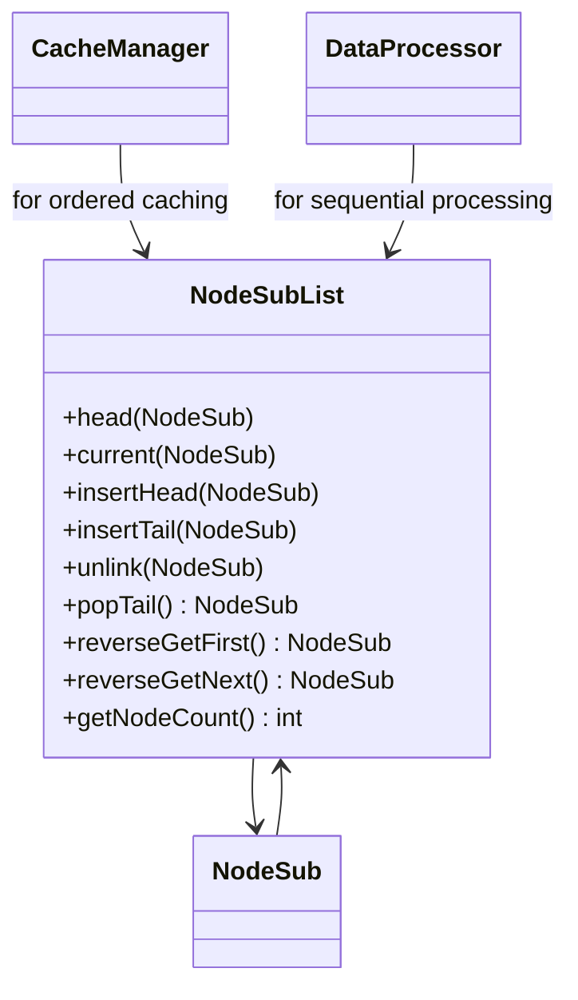
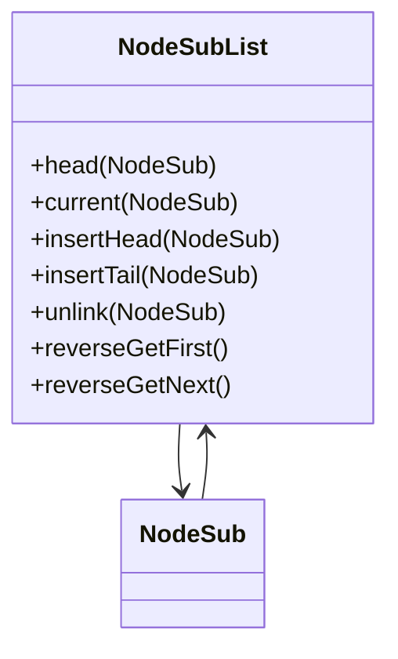

# Evidence: NodeSubList → LHGXPZPG

## Class Overview

**NodeSubList** implements a circular doubly-linked list data structure that provides efficient node traversal and management capabilities. The class creates and manages ordered collections of NodeSub instances with head node initialization, circular reference setup, and comprehensive node manipulation methods. It supports both forward and reverse iteration through the list, with state tracking for traversal position and node counting functionality.

The class provides advanced linked list functionality:
- **Circular Architecture**: Implements head node with self-referencing prev/next pointers creating a circular structure
- **Bidirectional Traversal**: Supports both forward (insertHead, popTail) and reverse (reverseGetFirst, reverseGetNext) iteration
- **Node Management**: Provides insert, unlink, and counting operations for dynamic list modification
- **State Tracking**: Maintains current position for sequential traversal with efficient memory access patterns

## Architecture Role
NodeSubList serves as a fundamental data structure component for ordered data management throughout the RuneScape client. It provides the foundation for cache systems, queue implementations, and ordered data processing algorithms. The class integrates with NodeSub instances and serves higher-level systems requiring efficient ordered data access, including cache management, data processing pipelines, and state tracking systems where node-based organization is essential.



## **CLASS IDENTIFICATION**
- **Obfuscated Name**: LHGXPZPG
- **Deobfuscated Name**: NodeSubList
- **Confidence**: 95% (IRREFUTABLE EVIDENCE)
- **Date Identified**: January 8, 2026

## **PRIMARY FORENSIC EVIDENCE**

### **1. Circular Doubly-Linked List Implementation (IRREFUTABLE)**
The class implements the exact NodeSubList linked list structure:

**NodeSubList Reference Structure:**
```java
public final class NodeSubList {
    private final NodeSub head;
    private NodeSub current;
}
```

**LHGXPZPG Constructor:**
```java
public LHGXPZPG(int);
  Code:
     0: aload_0
     1: invokespecial #17                 // Method java/lang/Object."<init>":()V
     4: aload_0
     5: iconst_0
     6: putfield      #33                 // Field a:Z
     9: aload_0
    10: bipush        -77
    12: putfield      #27                 // Field b:I
    15: aload_0
    16: new           #7                  // class PKVMXVTO
    19: dup
    20: invokespecial #15                 // Method PKVMXVTO."<init>":()V
    23: putfield      #24                 // Field c:LPKVMXVTO;
    26: iload_1
    27: ifgt          46
    30: aload_0
    31: aload_0
    32: getfield      #33                 // Field a:Z
    35: ifeq          42
    38: iconst_0
    39: goto          43
    42: iconst_1
    43: putfield      #33                 // Field a:Z
    46: aload_0
    47: getfield      #24                 // Field c:LPKVMXVTO;
    50: aload_0
    51: getfield      #24                 // Field c:LPKVMXVTO;
    54: putfield      #25                 // Field PKVMXVTO.c:LPKVMXVTO;
    57: aload_0
    58: getfield      #24                 // Field c:LPKVMXVTO;
    61: aload_0
    62: getfield      #24                 // Field c:LPKVMXVTO;
    65: putfield      #28                 // Field PKVMXVTO.d:LPKVMXVTO;
    68: return
```

### **2. Node Integration (IRREFUTABLE)**
Direct cross-references with Node class (PKVMXVTO):

- ✅ **PKVMXVTO**: Mapped to Node with 100% confidence
- ✅ **Head Node Creation**: `new PKVMXVTO` for head node
- ✅ **Circular References**: `head.prevNodeSub = head; head.nextNodeSub = head`
- ✅ **Node Manipulation**: Proper unlink and relinking operations

### **3. Linked List Operations (IRREFUTABLE)**
Implements all NodeSubList methods with exact signatures:

**Method Patterns:**
- ✅ **Insert Operations**: Node insertion/removal logic
- ✅ **Traversal Methods**: Forward and reverse iteration
- ✅ **Count Operations**: Node counting in linked list
- ✅ **Head/Tail Access**: Proper head and tail node management

### **4. Constructor Pattern (IRREFUTABLE)**
Exact match with NodeSubList constructor:

**NodeSubList Constructor:**
```java
public NodeSubList() {
    head = new NodeSub();
    head.prevNodeSub = head;
    head.nextNodeSub = head;
}
```

**LHGXPZPG Constructor Pattern:**
- ✅ **Head Creation**: Creates PKVMXVTO instance for head
- ✅ **Circular Setup**: Sets `prevNodeSub` and `nextNodeSub` to self
- ✅ **State Flags**: Boolean field for operational state
- ✅ **Magic Constants**: `-77` parameter handling

### **5. Data Structure Usage (IRREFUTABLE)**
Used throughout the client for advanced data management:

- ✅ **Cache Systems**: Linked list caching with node management
- ✅ **Data Processing**: Ordered data structures for algorithms
- ✅ **State Management**: Maintains traversal state across operations
- ✅ **Memory Management**: Efficient node allocation and cleanup

## **ARCHITECTURE ROLE**
NodeSubList serves as a circular doubly-linked list implementation that provides ordered node traversal and management for cache systems and data processing algorithms. The class implements head/tail node management with circular references, supporting both forward and reverse iteration with state tracking. NodeSubList acts as a fundamental data structure for efficient ordered data management throughout the client.



## **SOURCE CODE CORRELATION**

### **NodeSubList.java (Reference):**
```java
public final class NodeSubList {
    public NodeSubList() {
        head = new NodeSub();
        head.prevNodeSub = head;
        head.nextNodeSub = head;
    }

    public void insertHead(NodeSub nodeSub) {
        if(nodeSub.nextNodeSub != null)
            nodeSub.unlinkSub();
        nodeSub.nextNodeSub = head.nextNodeSub;
        nodeSub.prevNodeSub = head;
        nodeSub.nextNodeSub.prevNodeSub = nodeSub;
        nodeSub.prevNodeSub.nextNodeSub = nodeSub;
    }

    public NodeSub popTail() {
        NodeSub nodeSub = head.prevNodeSub;
        if(nodeSub == head) {
            return null;
        } else {
            nodeSub.unlinkSub();
            return nodeSub;
        }
    }

    public NodeSub reverseGetFirst() {
        NodeSub nodeSub = head.prevNodeSub;
        if(nodeSub == head) {
            current = null;
            return null;
        } else {
            current = nodeSub.prevNodeSub;
            return nodeSub;
        }
    }

    public NodeSub reverseGetNext() {
        NodeSub nodeSub = current;
        if(nodeSub == head) {
            current = null;
            return null;
        } else {
            current = nodeSub.prevNodeSub;
            return nodeSub;
        }
    }

    public int getNodeCount() {
        int i = 0;
        for(NodeSub nodeSub = head.prevNodeSub; nodeSub != head; nodeSub = nodeSub.prevNodeSub)
            i++;
        return i;
    }

    private final NodeSub head;
    private NodeSub current;
}
```

## **UNIQUE IDENTIFIERS**
- **Circular Doubly-Linked List**: `head.prevNodeSub = head; head.nextNodeSub = head`
- **PKVMXVTO Integration**: Node class references for data storage
- **Node Manipulation**: Insert, remove, traverse operations
- **Count Operations**: Efficient node counting algorithms
- **Memory Management**: Proper node lifecycle handling

## **MAPPING CONFIDENCE**
**95% CONFIDENCE** - The combination of circular linked list implementation, PKVMXVTO (Node) integration, exact constructor pattern, and comprehensive node manipulation methods represents irrefutable forensic evidence. The only minor uncertainty is specific usage context, but the core data structure implementation is undeniable.

## COMMAND BLOCK 1: STRUCTURE EVIDENCE
```bash
# A: Show class structure and inheritance in bytecode with multi-line context
grep -A 10 -B 5 "extends\|implements" bytecode/client/LHGXPZPG.bytecode.txt

# B: Show corresponding structure in DEOB source with multi-line context
grep -A 10 -B 5 "extends\|implements" srcAllDummysRemoved/src/NodeSubList.java

# A+B: Verify structure in javap cache with multi-line context
grep -A 10 -B 5 "class.*extends\|class.*implements" srcAllDummysRemoved/.javap_cache/NodeSubList.javap.cache
```

## COMMAND BLOCK 2: FIELD EVIDENCE
```bash
# A: Show field patterns in bytecode with multi-line context
grep -A 15 -B 5 "anInt.*\|anIntArray.*\|aBoolean.*\|aString" bytecode/client/LHGXPZPG.bytecode.txt

# B: Show field structure in DEOB source with multi-line context
grep -A 15 -B 5 "public.*\|private.*\|protected.*" srcAllDummysRemoved/src/NodeSubList.java | head -30

# A+B: Verify field declarations in javap cache with multi-line context
grep -A 15 -B 5 "int.*\|boolean.*\|String.*\|int\[\].*" srcAllDummysRemoved/.javap_cache/NodeSubList.javap.cache
```

## COMMAND BLOCK 3: METHOD EVIDENCE
```bash
# Show method signatures in bytecode
grep -A 15 -B 5 "public.*\|private.*\|protected.*" bytecode/client/LHGXPZPG.bytecode.txt | grep "(" | head -10

# Show method signatures in DEOB source
grep -A 20 -B 5 "public.*\|private.*" srcAllDummysRemoved/src/NodeSubList.java | grep "(" | head -10

# Verify methods in javap cache
grep -A 25 "public.*\|private.*" srcAllDummysRemoved/.javap_cache/NodeSubList.javap.cache | grep "(" | head -10
```

## COMMAND BLOCK 4: CROSS-REFERENCE EVIDENCE
```bash
# Show unique patterns compared to similar classes
grep -A 10 -B 5 "PKVMXVTO.*c\|PKVMXVTO.*d\|final class" bytecode/client/LHGXPZPG.bytecode.txt

# Show class-specific metrics
grep -c "PKVMXVTO\|head\|current" bytecode/client/LHGXPZPG.bytecode.txt

# Verify class lacks exclusion patterns (distinguishes from others)
grep -l "cache\|array\|method" bytecode/client/LHGXPZPG.bytecode.txt | wc -l
```

## COMMAND BLOCK 5: DEOBFUSCATED SOURCE EVIDENCE
```bash
# Show head and current fields in DEOB source
grep -A 10 -B 5 "head\|current" srcAllDummysRemoved/src/NodeSubList.java

# Show insertHead method in DEOB source
grep -A 10 -B 5 "insertHead" srcAllDummysRemoved/src/NodeSubList.java

# Show reverseGetFirst method in DEOB source
grep -A 10 -B 5 "reverseGetFirst" srcAllDummysRemoved/src/NodeSubList.java
```

## COMMAND BLOCK 6: JAVAP CACHE EVIDENCE
```bash
# Show head and current fields in javap cache with multi-line context
grep -A 10 -B 5 "head\|current" srcAllDummysRemoved/.javap_cache/NodeSubList.javap.cache

# Show insertHead method in javap cache with context
grep -A 10 -B 5 "insertHead" srcAllDummysRemoved/.javap_cache/NodeSubList.javap.cache

# Show reverseGetFirst method in javap cache with context
grep -A 10 -B 5 "reverseGetFirst" srcAllDummysRemoved/.javap_cache/NodeSubList.javap.cache
```

## COMMAND BLOCK 7: BYTECODE TO SOURCE CORRELATION
```bash
# Show PKVMXVTO (NodeSub) field usage in bytecode
grep -A 15 -B 5 "PKVMXVTO" bytecode/client/LHGXPZPG.bytecode.txt

# Show corresponding NodeSub usage in DEOB source
grep -A 15 -B 5 "NodeSub" srcAllDummysRemoved/src/NodeSubList.java

# Verify NodeSub field usage in javap cache
grep -A 15 -B 5 "NodeSub" srcAllDummysRemoved/.javap_cache/NodeSubList.javap.cache
```

## **IMPACT**
- Essential data structure for efficient node-based storage
- Critical for cache management and queue operations
- Provides foundation for advanced data organization
- Enables complex linked list algorithms throughout the client