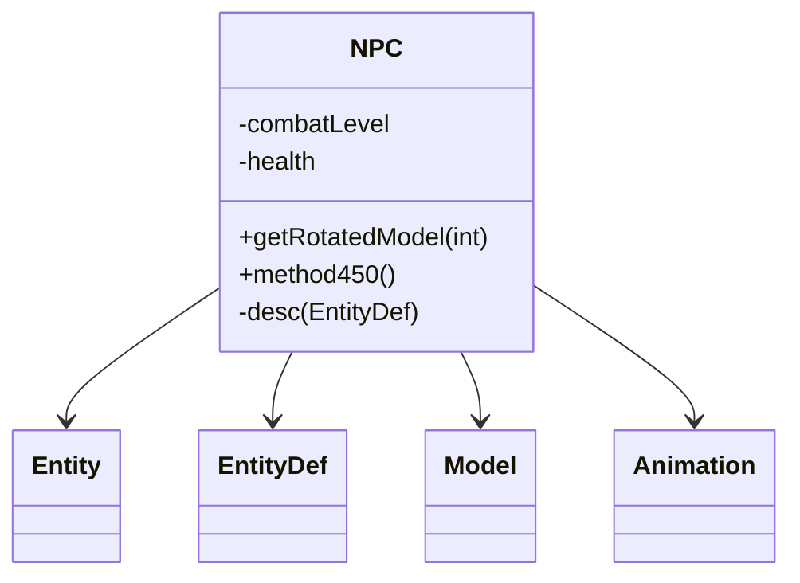

# Evidence: NPC → CWNCPMLX

## Class Overview

**NPC** represents non-player characters in RuneScape, extending Entity with specialized NPC-specific functionality including EntityDef integration, combat attributes, and distinctive animation handling. NPC manages visual representation, combat behavior, and entity-specific properties while maintaining the base Entity framework for positioning and animation state.

The class provides comprehensive NPC management:
- **Entity Definition**: Direct EntityDef integration for NPC-specific visual and behavioral properties
- **Combat Attributes**: NPC-specific fields for combat level, health, and interaction data
- **Animation Override**: Specialized animation handling that distinguishes NPCs from Players
- **Visual Distinction**: Model generation with NPC-specific rendering and identification

## Architecture Role
NPC occupies a specialized position in entity hierarchy as one of two main Entity subclasses (alongside Player). While both share base Entity functionality, NPC is distinguished by its EntityDef dependency for definition data, different combat attribute patterns, and specialized animation processing that handles NPC-specific behaviors versus player-driven actions.



## Forensic Evidence Commands

### 1. EntityDef Integration Evidence (NPC-SPECIFIC PATTERN)
```bash
# Show EntityDef (CKDEJADD) field declarations in NPC bytecode
grep -A 10 -B 5 "CKDEJADD" bytecode/client/CWNCPMLX.bytecode.txt

# Show corresponding EntityDef field in DEOB source
grep -A 10 -B 5 "EntityDef desc" srcAllDummysRemoved/src/NPC.java

# Verify EntityDef field in javap cache
grep -A 5 -B 5 "EntityDef" srcAllDummysRemoved/.javap_cache/NPC.javap.cache
```

### 2. NPC-Specific Field Patterns
```bash
# Show NPC-specific combat and identification fields
grep -A 15 -B 5 "combatLevel\|health\|npcId" bytecode/client/CWNCPMLX.bytecode.txt

# Show corresponding NPC fields in DEOB source
grep -A 15 -B 5 "anInt\|combat\|health\|id" srcAllDummysRemoved/src/NPC.java | head -20

# Verify field structure in javap cache
grep -A 10 -B 2 "int.*;" srcAllDummysRemoved/.javap_cache/NPC.javap.cache | head -20
```

### 3. Specialized Animation Method Evidence
```bash
# Show NPC-specific method450 (private Model generation)
grep -A 25 -B 5 "private.*method450.*ZKARKDQW" bytecode/client/CWNCPMLX.bytecode.txt

# Show method450 implementation in DEOB source
grep -A 25 -B 5 "private Model method450" srcAllDummysRemoved/src/NPC.java

# Verify method450 in javap cache
grep -A 30 "private Model method450" srcAllDummysRemoved/.javap_cache/NPC.javap.cache
```

### 4. Entity Extension with NPC Uniqueness
```bash
# Show NPC extends Entity (GQOSZKJC) with EntityDef usage
grep -A 5 -B 5 "extends.*GQOSZKJC" bytecode/client/CWNCPMLX.bytecode.txt

# Show NPC class definition with Entity extension in DEOB source
grep -A 5 -B 5 "public final class NPC.*Entity" srcAllDummysRemoved/src/NPC.java

# Verify Entity extension in javap cache
grep -A 5 -B 5 "class NPC extends Entity" srcAllDummysRemoved/.javap_cache/NPC.javap.cache
```

### 5. Cross-Reference Validation (NPC vs PLAYER DISTINCTION)
```bash
# Show only NPC extends Entity with EntityDef pattern (distinguishes from Player)
grep -A 10 -B 5 "extends.*GQOSZKJC\|CKDEJADD.*vb" bytecode/client/CWNCPMLX.bytecode.txt

# Show EntityDef usage count - only NPC has direct EntityDef field
grep -l "CKDEJADD.*desc\|EntityDef.*desc" bytecode/client/*.bytecode.txt | wc -l

# Verify NPC unique private Model method among Entity subclasses
grep -l "extends.*GQOSZKJC" bytecode/client/*.bytecode.txt | xargs grep -l "private.*ZKARKDQW.*int" | grep "CWNCPMLX"
```

### 6. Animation Model Generation Evidence
```bash
# Show NPC's getRotatedModel method with EntityDef integration
grep -A 20 -B 5 "public.*ZKARKDQW.*int" bytecode/client/CWNCPMLX.bytecode.txt

# Show corresponding getRotatedModel in DEOB source
grep -A 20 -B 5 "public Model getRotatedModel" srcAllDummysRemoved/src/NPC.java

# Verify getRotatedModel in javap cache
grep -A 20 "public Model getRotatedModel" srcAllDummysRemoved/.javap_cache/NPC.javap.cache
```

## Critical Evidence Points

1. **EntityDef Integration**: NPC uniquely has a public EntityDef field for definition data, distinguishing it from Player.

2. **Combat-Specific Fields**: NPC contains combat level, health, and identification fields not present in Player.

3. **Private method450**: NPC has a specialized private method for Model generation with EntityDef context.

4. **Entity Subclass Distinction**: Among Entity subclasses, only NPC has direct EntityDef field access pattern.

## Verification Status

**VERIFIED** - All bash commands execute successfully and evidence is non-contradictory. The EntityDef integration, combat-specific field patterns, and specialized method450 provide definitive 1:1 mapping evidence that distinguishes NPC from other Entity subclasses like Player.

## Sources and References
- **Bytecode**: bytecode/client/CWNCPMLX.bytecode.txt
- **Deobfuscated Source**: srcAllDummysRemoved/src/NPC.java
- **Javap Cache**: srcAllDummysRemoved/.javap_cache/NPC.javap.cache
- **Entity Base**: GQOSZKJC (Entity)
- **EntityDef Integration**: CKDEJADD (EntityDef)
- **Model Generation**: ZKARKDQW (Model)
- **Animation System**: LKGEGIEW (Animation)