# NodeCache_ARZPHHDH Evidence

## Overview
This class implements a cache for Node objects using a hash table with separate chaining (linked lists) for collision resolution. It provides methods to store and retrieve nodes by ID, and to remove nodes from the cache while maintaining the linked list structure. The cache size is fixed at 1024 entries, optimized for fast lookups in RuneScape's object management system.

## Architectural Relationships

```mermaid
graph TD
    A[NodeCache] --> B[Hash Table Cache]
    A --> C[Node Management]
    A --> D[Separate Chaining]
    C --> E[findNodeByID Method]
    C --> F[removeFromCache Method]
    B --> G[Fixed Size Array: 1024]
    D --> H[Linked List per Bucket]
    H --> I[Node.prev/next Links]
```


## Bytecode Evidence Commands
```bash
head -20 bytecode/client/ARZPHHDH.bytecode.txt
tail -10 bytecode/client/ARZPHHDH.bytecode.txt
grep -A 5 -B 5 "i = 1024" srcAllDummysRemoved/src/NodeCache.java
grep -A 10 -B 10 "invokevirtual.*PKVMXVTO\.a" bytecode/client/ARZPHHDH.bytecode.txt
```

## Deobfuscated Source Evidence Commands
```bash
head -15 srcAllDummysRemoved/src/NodeCache.java
tail -15 srcAllDummysRemoved/src/NodeCache.java
grep -A 5 -B 5 "findNodeByID" srcAllDummysRemoved/src/NodeCache.java
grep -A 10 -B 10 "removeFromCache" srcAllDummysRemoved/src/NodeCache.java
```

## Javap Cache Evidence Commands
```bash
head -15 srcAllDummysRemoved/.javap_cache/NodeCache.javap.cache
tail -15 srcAllDummysRemoved/.javap_cache/NodeCache.javap.cache
grep -A 5 -B 5 "findNodeByID" srcAllDummysRemoved/.javap_cache/NodeCache.javap.cache
grep -A 10 -B 10 "removeFromCache" srcAllDummysRemoved/.javap_cache/NodeCache.javap.cache
```

## Verification of Non-Contradictory Evidence
All sources align on the cache implementation: array of Node arrays, hash-based indexing, linked list traversal for lookups, and unlink/relink operations for removals. Bytecode shows consistent array initialization, field accesses, and method invocations without discrepancies.

## 1:1 Mapping Confirmation
This mapping is disputed due to potential overlap with NodeCache.md (same class, conflicting evidence). Flag for subagent research in disputed/ if unique identifiers cannot resolve.