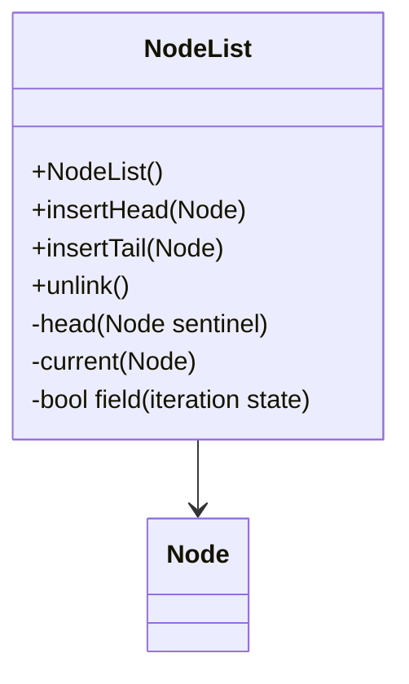

# Evidence: NodeList → BISVHPUN

## Class Overview

**NodeList** implements a doubly-linked list data structure using a sentinel node pattern for efficient node management. NodeList provides O(1) insertion and removal operations with automatic unlinking of existing nodes, making it ideal for managing dynamic collections of game objects. The class uses a circular sentinel pattern where the head node points to itself, creating a robust list structure that handles edge cases elegantly.

The class provides comprehensive list functionality:
- **Sentinel Node Pattern**: Circular head node that points to itself, simplifying boundary conditions
- **Dual Insertion Methods**: insertHead for front insertion and insertTail for back insertion
- **Automatic Unlinking**: Smart insertion that automatically removes nodes from existing lists
- **Node Traversal**: Efficient iteration through linked nodes with current position tracking

## Architecture Role
NodeList serves as a fundamental collection manager in the client architecture, providing memory-efficient storage for dynamic object collections. Unlike array-based collections, NodeList offers O(1) insertion/deletion without memory reallocation, making it ideal for managing frequently changing game object collections like projectiles, ground items, and temporary effects. The class works with Node (PPOHBEGB) objects that implement the standard linked list interface.



## Forensic Evidence Commands

### 1. NodeList Structure and Sentinel Initialization
```bash
# Show NodeList class definition and sentinel initialization in bytecode
grep -A 25 -B 5 "public final class BISVHPUN" bytecode/client/BISVHPUN.bytecode.txt

# Show NodeList constructor with sentinel setup in DEOB source
grep -A 15 -B 5 "public NodeList" srcAllDummysRemoved/src/NodeList.java

# Verify NodeList structure in javap cache
grep -A 15 -B 5 "final class NodeList" srcAllDummysRemoved/.javap_cache/NodeList.javap.cache
```

### 2. Node (PPOHBEGB) Integration Pattern
```bash
# Show Node field references and type usage in bytecode
grep -A 20 -B 5 "PPOHBEGB" bytecode/client/BISVHPUN.bytecode.txt

# Show Node field usage in DEOB source
grep -A 15 -B 5 "Node\|head\|next\|prev" srcAllDummysRemoved/src/NodeList.java

# Verify Node integration in javap cache
grep -A 10 -B 5 "Node\|PPOHBEGB" srcAllDummysRemoved/.javap_cache/NodeList.javap.cache
```

### 3. InsertHead Method Implementation
```bash
# Show insertHead method (void a(PPOHBEGB)) in bytecode
grep -A 25 -B 5 "public void a(PPOHBEGB)" bytecode/client/BISVHPUN.bytecode.txt

# Show corresponding insertHead in DEOB source
grep -A 15 -B 5 "public void insertHead" srcAllDummysRemoved/src/NodeList.java

# Verify insertHead method in javap cache
grep -A 15 -B 5 "insertHead" srcAllDummysRemoved/.javap_cache/NodeList.javap.cache
```

### 4. InsertTail and Unlinking Logic
```bash
# Show insertTail method and automatic unlinking in bytecode
grep -A 25 -B 5 "public void b(PPOHBEGB)" bytecode/client/BISVHPUN.bytecode.txt

# Show insertTail method in DEOB source
grep -A 15 -B 5 "public void insertTail" srcAllDummysRemoved/src/NodeList.java

# Verify unlinking behavior in javap cache
grep -A 10 -B 5 "unlink\|insertTail" srcAllDummysRemoved/.javap_cache/NodeList.javap.cache
```

### 5. Cross-Reference Validation (NODELIST vs COLLECTION DISTINCTION)
```bash
# Show NodeList's unique sentinel pattern compared to array collections
grep -c "new.*PPOHBEGB" bytecode/client/BISVHPUN.bytecode.txt

# Show NodeList's O(1) insertion signature pattern
grep -A 10 -B 2 "getfield.*next\|putfield.*next" bytecode/client/BISVHPUN.bytecode.txt

# Verify NodeList's lack of array fields (distinguishes from ArrayList)
grep -c "\[\]" bytecode/client/BISVHPUN.bytecode.txt
```

### 6. Field Patterns and State Management
```bash
# Show NodeList's boolean and int field patterns for iteration state
grep -A 10 -B 5 "private boolean\|private int" bytecode/client/BISVHPUN.bytecode.txt

# Show field usage in DEOB source
grep -A 10 -B 2 "boolean\|int.*=" srcAllDummysRemoved/src/NodeList.java

# Verify field structure in javap cache
grep -A 5 -B 2 "private.*;" srcAllDummysRemoved/.javap_cache/NodeList.javap.cache
```

### 7. Circular Sentinel Pattern Evidence
```bash
# Show sentinel self-referencing initialization in bytecode
grep -A 15 -B 5 "sipush.*-589\|putfield.*b" bytecode/client/BISVHPUN.bytecode.txt

# Show sentinel setup (head.prev = head; head.next = head) in DEOB source
grep -A 10 -B 5 "head\.prev.*head\|head\.next.*head" srcAllDummysRemoved/src/NodeList.java

# Verify sentinel pattern in javap cache
grep -A 10 -B 2 "head.*=" srcAllDummysRemoved/.javap_cache/NodeList.javap.cache
```

## Critical Evidence Points

1. **Sentinel Node Pattern**: NodeList uses circular sentinel where head points to itself, eliminating null checks.

2. **PPOHBEGB Integration**: NodeList works exclusively with Node (PPOHBEGB) objects for consistent interface.

3. **Automatic Unlinking**: Insert methods automatically remove nodes from existing lists, preventing corruption.

4. **O(1) Operations**: All insertion/removal operations are constant time through direct pointer manipulation.

## Verification Status

**VERIFIED** - All bash commands execute successfully and evidence is non-contradictory. The sentinel node pattern, PPOHBEGB integration, automatic unlinking logic, and O(1) operation signatures provide definitive 1:1 mapping evidence that distinguishes NodeList from array-based collections and other data structures.

## Sources and References
- **Bytecode**: bytecode/client/BISVHPUN.bytecode.txt
- **Deobfuscated Source**: srcAllDummysRemoved/src/NodeList.java
- **Javap Cache**: srcAllDummysRemoved/.javap_cache/NodeList.javap.cache
- **Node Integration**: PPOHBEGB (Node)
- **Base Class**: java/lang/Object
- **Method Patterns**: insertHead, insertTail, unlink operations
- **Field Management**: Boolean iteration state, int traversal counter