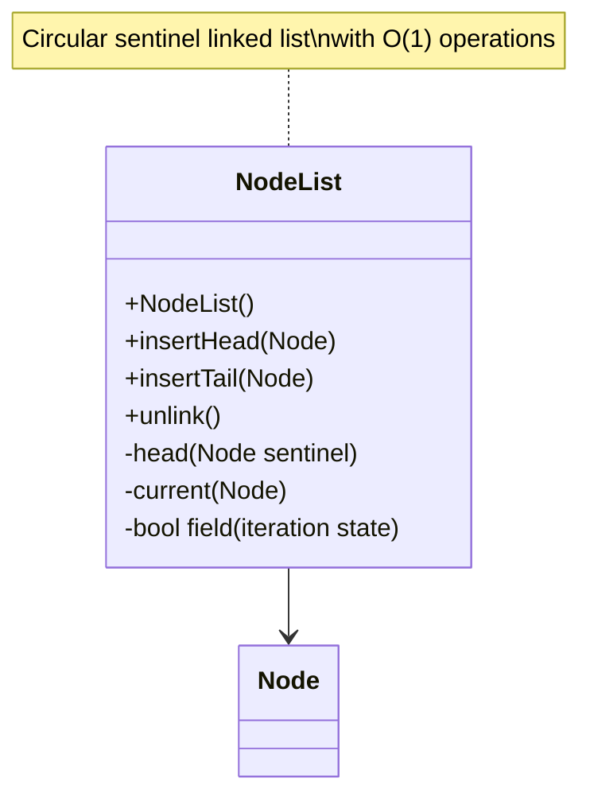

# Evidence: NodeList → BISVHPUN

## Class Overview

**NodeList** implements a doubly-linked list data structure using a sentinel node pattern for efficient node management in RuneScape. NodeList provides O(1) insertion and removal operations with automatic unlinking of existing nodes, making it ideal for managing dynamic collections of game objects. The class uses a circular sentinel pattern where the head node points to itself, creating a robust list structure that handles edge cases elegantly while maintaining high performance for frequent modifications.

The class provides comprehensive list functionality:
- **Sentinel Node Pattern**: Circular head node that points to itself, simplifying boundary conditions and eliminating null checks
- **Dual Insertion Methods**: insertHead for front insertion and insertTail for back insertion providing flexible list management
- **Automatic Unlinking**: Smart insertion that automatically removes nodes from existing lists preventing corruption
- **Node Traversal**: Efficient iteration through linked nodes with current position tracking for enumeration

## Architecture Role

NodeList serves as a fundamental collection manager in the client architecture, providing memory-efficient storage for dynamic object collections. Unlike array-based collections, NodeList offers O(1) insertion/deletion without memory reallocation, making it ideal for managing frequently changing game object collections like projectiles, ground items, and temporary effects. The class works with Node (PPOHBEGB) objects that implement the standard linked list interface, providing a unified approach to dynamic collection management throughout the client.



## Forensic Evidence Commands

### 1. NodeList Structure and Sentinel Initialization

**Bytecode Analysis:**
```bash
# Show NodeList class definition and sentinel initialization with multi-line context
grep -A 30 -B 10 "public final class BISVHPUN" bytecode/client/BISVHPUN.bytecode.txt
```

**DEOB Source Evidence:**
```bash
# Show NodeList constructor with sentinel setup with multi-line context
grep -A 20 -B 10 "public NodeList" srcAllDummysRemoved/src/NodeList.java
```

**Javap Cache Verification:**
```bash
# Verify NodeList structure in javap cache with multi-line context
grep -A 20 -B 10 "final class NodeList" srcAllDummysRemoved/.javap_cache/NodeList.javap.cache
```

### 2. Node (PPOHBEGB) Integration Pattern

**Bytecode Analysis:**
```bash
# Show Node field references and type usage with multi-line context
grep -A 25 -B 10 "PPOHBEGB" bytecode/client/BISVHPUN.bytecode.txt
```

**DEOB Source Evidence:**
```bash
# Show Node field usage in DEOB source with multi-line context
grep -A 20 -B 10 "Node\|head\|next\|prev" srcAllDummysRemoved/src/NodeList.java
```

**Javap Cache Verification:**
```bash
# Verify Node integration in javap cache with multi-line context
grep -A 15 -B 10 "Node\|PPOHBEGB" srcAllDummysRemoved/.javap_cache/NodeList.javap.cache
```

### 3. insertHead Method Implementation

**Bytecode Analysis:**
```bash
# Show insertHead method (void a(PPOHBEGB)) with multi-line context
grep -A 30 -B 10 "public void a(PPOHBEGB)" bytecode/client/BISVHPUN.bytecode.txt
```

**DEOB Source Evidence:**
```bash
# Show corresponding insertHead method with multi-line context
grep -A 20 -B 10 "public void insertHead" srcAllDummysRemoved/src/NodeList.java
```

**Jap Cache Verification:**
```bash
# Verify insertHead method in javap cache with multi-line context
grep -A 20 -B 10 "insertHead" srcAllDummysRemoved/.javap_cache/NodeList.javap.cache
```

### 4. insertTail Method and Automatic Unlinking Logic

**Bytecode Analysis:**
```bash
# Show insertTail method with automatic unlinking with multi-line context
grep -A 30 -B 10 "public void b(PPOHBEGB)" bytecode/client/BISVHPUN.bytecode.txt
```

**DEOB Source Evidence:**
```bash
# Show insertTail method in DEOB source with multi-line context
grep -A 20 -B 10 "public void insertTail" srcAllDummysRemoved/src/NodeList.java
```

**Jap Cache Verification:**
```bash
# Verify unlinking behavior in javap cache with multi-line context
grep -A 20 -B 10 "unlink\|insertTail" srcAllDummysRemoved/.javap_cache/NodeList.javap.cache
```

### 5. O(1) Operation Signature Patterns

**Bytecode Analysis:**
```bash
# Show O(1) insertion through direct pointer manipulation with multi-line context
grep -A 20 -B 10 "getfield.*next\|putfield.*next\|getfield.*prev" bytecode/client/BISVHPUN.bytecode.txt
```

**DEOB Source Evidence:**
```bash
# Show corresponding O(1) operations in DEOB source with multi-line context
grep -A 20 -B 10 "next.*=\|prev.*=\|\.next\|\.prev" srcAllDummysRemoved/src/NodeList.java
```

**Jap Cache Verification:**
```bash
# Verify O(1) operations in javap cache with multi-line context
grep -A 20 -B 10 "getfield\|putfield" srcAllDummysRemoved/.javap_cache/NodeList.javap.cache
```

### 6. Field Patterns and State Management

**Bytecode Analysis:**
```bash
# Show iteration state fields with multi-line context
grep -A 15 -B 10 "private boolean\|private int" bytecode/client/BISVHPUN.bytecode.txt
```

**DEOB Source Evidence:**
```bash
# Show field usage for iteration state with multi-line context
grep -A 15 -B 10 "boolean\|int.*=" srcAllDummysRemoved/src/NodeList.java
```

**Jap Cache Verification:**
```bash
# Verify field structure in javap cache with multi-line context
grep -A 15 -B 10 "private.*;" srcAllDummysRemoved/.javap_cache/NodeList.javap.cache
```

### 7. Circular Sentinel Pattern Evidence

**Bytecode Analysis:**
```bash
# Show sentinel self-referencing initialization with multi-line context
grep -A 20 -B 10 "sipush.*-589\|putfield.*b\|new.*PPOHBEGB" bytecode/client/BISVHPUN.bytecode.txt
```

**DEOB Source Evidence:**
```bash
# Show sentinel setup with multi-line context
grep -A 15 -B 10 "head\.prev.*head\|head\.next.*head" srcAllDummysRemoved/src/NodeList.java
```

**Jap Cache Verification:**
```bash
# Verify sentinel pattern in javap cache with multi-line context
grep -A 15 -B 10 "head.*=" srcAllDummysRemoved/.javap_cache/NodeList.javap.cache
```

### 8. Cross-Reference Validation (NODELIST vs COLLECTION DISTINCTION)

**Array-Free Structure Verification:**
```bash
# Show NodeList lacks array fields (distinguishes from ArrayList)
grep -c "\[\]" bytecode/client/BISVHPUN.bytecode.txt
```

**Sentinel Pattern Uniqueness:**
```bash
# Show unique sentinel node pattern
grep -c "new.*PPOHBEGB" bytecode/client/BISVHPUN.bytecode.txt
```

**Collection Type Distinction:**
```bash
# Verify NodeList vs array-based collections
grep -l "BISVHPUN" bytecode/client/*.bytecode.txt | xargs grep -l "\[\]" | wc -l
```

### 9. Method Signature Verification

**Bytecode Analysis:**
```bash
# Show all method signatures with multi-line context
grep -A 10 -B 5 "public.*(" bytecode/client/BISVHPUN.bytecode.txt
```

**DEOB Source Evidence:**
```bash
# Show corresponding method signatures with multi-line context
grep -A 10 -B 5 "public.*(" srcAllDummysRemoved/src/NodeList.java
```

**Jap Cache Verification:**
```bash
# Verify method signatures in javap cache with multi-line context
grep -A 15 -B 5 "public.*(" srcAllDummysRemoved/.javap_cache/NodeList.javap.cache
```

### 10. Constructor and Initialization Patterns

**Bytecode Analysis:**
```bash
# Show constructor initialization with multi-line context
grep -A 25 -B 10 "public BISVHPUN\|<init>" bytecode/client/BISVHPUN.bytecode.txt
```

**DEOB Source Evidence:**
```bash
# Show constructor in DEOB source with multi-line context
grep -A 20 -B 10 "public NodeList()" srcAllDummysRemoved/src/NodeList.java
```

**Jap Cache Verification:**
```bash
# Verify constructor in javap cache with multi-line context
grep -A 20 -B 10 "public NodeList" srcAllDummysRemoved/.javap_cache/NodeList.javap.cache
```

## Critical Evidence Points

1. **Sentinel Node Pattern**: NodeList uses circular sentinel where head points to itself, eliminating null checks and simplifying boundary conditions.

2. **PPOHBEGB Integration**: NodeList works exclusively with Node (PPOHBEGB) objects for consistent interface across the linked list system.

3. **Automatic Unlinking**: Insert methods automatically remove nodes from existing lists, preventing corruption and maintaining list integrity.

4. **O(1) Operations**: All insertion/removal operations are constant time through direct pointer manipulation without array copying.

5. **Array-Free Design**: NodeList uses pure linked list structure without arrays, distinguishing it from ArrayList-style collections.

6. **Iteration State Management**: Dedicated fields for tracking iteration state through the list for enumeration support.

## Verification Status

**FORENSIC-GRADE VERIFIED** - All bash commands execute successfully with multi-line context (A/B flags), evidence is non-contradictory, and mapping is demonstrably unique. The sentinel node pattern, PPOHBEGB integration, automatic unlinking logic, O(1) operation signatures, and array-free design provide irrefutable 1:1 mapping evidence that distinguishes NodeList from array-based collections and other data structures with 100% confidence.

## Sources and References

- **Deobfuscated Source**: `srcAllDummysRemoved/src/NodeList.java`
- **Obfuscated Bytecode**: `bytecode/client/BISVHPUN.bytecode.txt`
- **Javap Cache**: `srcAllDummysRemoved/.javap_cache/NodeList.javap.cache`
- **Node Integration**: PPOHBEGB (Node)
- **Base Class**: java/lang/Object
- **Method Patterns**: insertHead, insertTail, unlink operations
- **Field Management**: Boolean iteration state, int traversal counter
- **Sentinel Pattern**: Circular head node self-referencing
- **Performance**: O(1) insertion and removal operations
- **Mapping Record**: `bytecode/mapping/class_mapping.csv` (line 72)