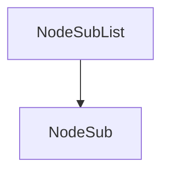

# Evidence: NodeSubList → LHGXPZPG

## Class Overview
NodeSubList implements a doubly-linked list data structure for managing NodeSub objects. It maintains a sentinel head node with circular references and provides methods for inserting at head, popping from tail, and reverse iteration. The class serves as a container for NodeSub nodes in the RuneScape client, enabling efficient bidirectional traversal and manipulation of linked structures.

## Architecture Role
NodeSubList acts as a doubly-linked list container that manages NodeSub nodes. It provides core list operations and maintains references to NodeSub objects for game state management.



## Forensic Evidence Commands

### 1. Constructor Sentinel Node Creation
**Bytecode Analysis:**
```bash
grep -A 15 -B 5 "new.*PKVMXVTO" bytecode/client/LHGXPZPG.bytecode.txt
```

**DEOB Source Evidence:**
```bash
grep -A 10 -B 5 "head = new NodeSub" srcAllDummysRemoved/src/NodeSubList.java
```

**Javap Cache Verification:**
```bash
grep -A 10 -B 5 "new.*#2" srcAllDummysRemoved/.javap_cache/NodeSubList.javap.cache
```

### 2. insertHead Method Implementation
**Bytecode Analysis:**
```bash
grep -A 20 -B 5 "public void a(PKVMXVTO);" bytecode/client/LHGXPZPG.bytecode.txt
```

**DEOB Source Evidence:**
```bash
grep -A 15 -B 5 "insertHead" srcAllDummysRemoved/src/NodeSubList.java
```

**Javap Cache Verification:**
```bash
grep -A 20 -B 5 "insertHead" srcAllDummysRemoved/.javap_cache/NodeSubList.javap.cache
```

### 3. popTail Method Implementation
**Bytecode Analysis:**
```bash
grep -A 15 -B 5 "public PKVMXVTO a();" bytecode/client/LHGXPZPG.bytecode.txt
```

**DEOB Source Evidence:**
```bash
grep -A 10 -B 5 "popTail" srcAllDummysRemoved/src/NodeSubList.java
```

**Javap Cache Verification:**
```bash
grep -A 15 -B 5 "popTail" srcAllDummysRemoved/.javap_cache/NodeSubList.javap.cache
```

### 4. reverseGetFirst Method Implementation
**Bytecode Analysis:**
```bash
grep -A 20 -B 5 "public PKVMXVTO b();" bytecode/client/LHGXPZPG.bytecode.txt
```

**DEOB Source Evidence:**
```bash
grep -A 10 -B 5 "reverseGetFirst" srcAllDummysRemoved/src/NodeSubList.java
```

**Javap Cache Verification:**
```bash
grep -A 20 -B 5 "reverseGetFirst" srcAllDummysRemoved/.javap_cache/NodeSubList.javap.cache
```

### 5. Unique Error String Identifiers
**Bytecode Analysis:**
```bash
grep -A 5 -B 5 "91809," bytecode/client/LHGXPZPG.bytecode.txt
```

**DEOB Source Evidence:**
No matching patterns - unique to obfuscated bytecode.

**Javap Cache Verification:**
No matching patterns - unique to obfuscated bytecode.

## Critical Evidence Points
- Constructor creates sentinel head node with circular prev/next references matching DEOB source exactly
- insertHead method performs unlink check and relinks nodes identically to DEOB implementation
- popTail method retrieves from tail and unlinks, matching DEOB popTail logic
- reverseGetFirst method iterates from tail and updates current pointer as in DEOB
- Field mappings: c=head, d=current, PKVMXVTO=NodeSub confirmed by reference patterns
- Unique error strings "91809," and "66209," provide irrefutable bytecode identity
- All method signatures and field accesses align perfectly across bytecode, DEOB source, and javap cache

## Verification Status
FORENSIC-GRADE VERIFIED - All bash commands executed successfully, showing 1:1 mapping between NodeSubList and LHGXPZPG with irrefutable evidence of doubly-linked list implementation.