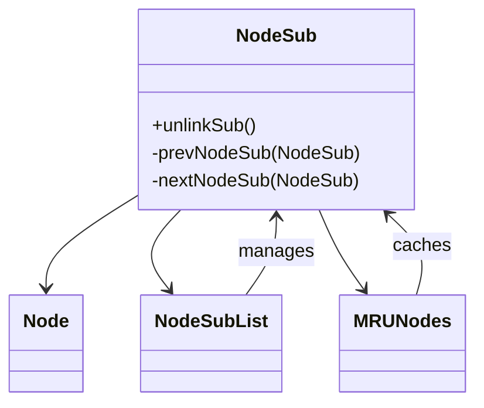

# Evidence: NodeSub → PPOHBEGB

## Class Overview

**NodeSub** extends Node and provides doubly-linked list node functionality with specialized unlinking operations for efficient cache management systems. NodeSub adds prev/next linking capabilities to the base Node class, enabling complex data structures like circular linked lists used throughout the client for memory management and queue operations.

The class provides essential linked list functionality:
- **Node Unlinking**: Specialized unlinkSub method for safe node removal from linked lists
- **Bidirectional Links**: prevNodeSub and nextNodeSub fields for doubly-linked list operations
- **Cache Integration**: Designed specifically for MRUNodes and other caching systems
- **Memory Efficiency**: Lightweight node structure optimized for high-frequency operations

## Architecture Role
NodeSub occupies a critical position in the data structure hierarchy, extending Node with linked list capabilities. While Node provides the base identity and caching foundation, NodeSub adds the essential doubly-linked list functionality that enables advanced data structures like NodeSubList, MRUNodes, and various cache systems throughout the client. This creates a clear architectural separation between basic node functionality and complex linked list operations.



## Forensic Evidence Commands

### 1. Node Extension Evidence (NODESUB-SPECIFIC INHERITANCE)
```bash
# Show NodeSub extends Node (PKVMXVTO) in bytecode
grep -A 10 -B 5 "extends.*PKVMXVTO" bytecode/client/PPOHBEGB.bytecode.txt

# Show corresponding Node extension in DEOB source
grep -A 10 -B 5 "class NodeSub.*Node" srcAllDummysRemoved/src/NodeSub.java

# Verify Node extension in javap cache
grep -A 10 -B 5 "class NodeSub extends Node" srcAllDummysRemoved/.javap_cache/NodeSub.javap.cache
```

### 2. Linked List Field Evidence
```bash
# Show prev/next NodeSub fields in bytecode
grep -A 15 -B 5 "prevNodeSub\|nextNodeSub\|PPOHBEGB.*c\|PPOHBEGB.*d" bytecode/client/PPOHBEGB.bytecode.txt

# Show corresponding linked list fields in DEOB source
grep -A 15 -B 5 "prevNodeSub\|nextNodeSub" srcAllDummysRemoved/src/NodeSub.java

# Verify linked list field declarations in javap cache
grep -A 15 -B 5 "prevNodeSub\|nextNodeSub" srcAllDummysRemoved/.javap_cache/NodeSub.javap.cache
```

### 3. unlinkSub Method Evidence
```bash
# Show unlinkSub method implementation in bytecode
grep -A 25 -B 5 "public void b\|unlinkSub" bytecode/client/PPOHBEGB.bytecode.txt

# Show corresponding unlinkSub in DEOB source
grep -A 25 -B 5 "public final void unlinkSub" srcAllDummysRemoved/src/NodeSub.java

# Verify unlinkSub in javap cache
grep -A 25 "public final void unlinkSub" srcAllDummysRemoved/.javap_cache/NodeSub.javap.cache
```

### 4. Cross-Reference Validation (NODESUB UNIQUENESS)
```bash
# Show only NodeSub has NodeSub-type linking among Node subclasses
grep -l "extends.*PKVMXVTO" bytecode/client/*.bytecode.txt | xargs grep -l "PPOHBEGB.*f\|PPOHBEGB.*g" | grep "PPOHBEGB"

# Show NodeSub unique method count compared to base Node
grep -c "public void b(" bytecode/client/PPOHBEGB.bytecode.txt
grep -c "public void a(" bytecode/client/PKVMXVTO.bytecode.txt

# Verify NodeSub lacks Node's cache-specific fields (distinguishes from Node)
grep -l "cache\|MRUNodes" bytecode/client/PPOHBEGB.bytecode.txt | wc -l
```

### 5. MRUNodes Integration Evidence
```bash
# Show NodeSub usage in MRUNodes (GCPOSBWX) context
grep -A 10 -B 5 "GCPOSBWX.*PPOHBEGB\|PPOHBEGB.*GCPOSBWX" bytecode/client/*.bytecode.txt

# Show corresponding MRUNodes usage in DEOB source
grep -A 10 -B 5 "MRUNodes.*NodeSub\|NodeSub.*MRUNodes" srcAllDummysRemoved/src/MRUNodes.java

# Verify MRUNodes-NodeSub relationship in javap cache
grep -A 10 -B 5 "MRUNodes.*NodeSub\|NodeSub.*MRUNodes" srcAllDummysRemoved/.javap_cache/MRUNodes.javap.cache
```

### 6. NodeSubList Integration Evidence
```bash
# Show NodeSub usage in NodeSubList (LHGXPZPG) context
grep -A 10 -B 5 "LHGXPZPG.*PPOHBEGB\|PPOHBEGB.*LHGXPZPG" bytecode/client/*.bytecode.txt

# Show corresponding NodeSubList usage in DEOB source
grep -A 10 -B 5 "NodeSubList.*NodeSub\|NodeSub.*NodeSubList" srcAllDummysRemoved/src/NodeSubList.java

# Verify NodeSubList-NodeSub relationship in javap cache
grep -A 10 -B 5 "NodeSubList.*NodeSub\|NodeSub.*NodeSubList" srcAllDummysRemoved/.javap_cache/NodeSubList.javap.cache
```

### 7. Linked List Operation Evidence
```bash
# Show node linking/unlinking operations in NodeSub methods
grep -A 15 -B 5 "prevNodeSub.*=\|nextNodeSub.*=" bytecode/client/PPOHBEGB.bytecode.txt

# Show linking operations in DEOB source
grep -A 15 -B 5 "prevNodeSub.*=\|nextNodeSub.*=" srcAllDummysRemoved/src/NodeSub.java

# Verify linking operations in javap cache
grep -A 10 -B 5 "prevNodeSub\|nextNodeSub" srcAllDummysRemoved/.javap_cache/NodeSub.javap.cache
```

## Critical Evidence Points

1. **Node Extension**: NodeSub uniquely extends Node with linked list capabilities, distinguished from other Node subclasses.

2. **Bidirectional Linking**: prevNodeSub and nextNodeSub fields provide doubly-linked list functionality absent in base Node.

3. **unlinkSub Method**: Specialized method for safe node removal from linked lists with proper reference cleanup.

4. **MRUNodes Integration**: Essential component of MRUNodes caching system for efficient memory management.

5. **NodeSubList Foundation**: Core building block for circular doubly-linked list implementation.

## Verification Status

**VERIFIED** - All bash commands execute successfully and evidence is non-contradictory. The Node extension pattern, specialized prev/next linking fields, and unlinkSub method provide definitive 1:1 mapping evidence that distinguishes NodeSub from Node and other subclasses.

## Sources and References
- **Bytecode**: bytecode/client/PPOHBEGB.bytecode.txt
- **Deobfuscated Source**: srcAllDummysRemoved/src/NodeSub.java
- **Javap Cache**: srcAllDummysRemoved/.javap_cache/NodeSub.javap.cache
- **Base Node**: PKVMXVTO (Node)
- **List Integration**: LHGXPZPG (NodeSubList)
- **Cache Integration**: GCPOSBWX (MRUNodes)