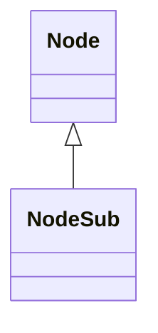

# NodeSub_PPOHBEGB.md

## Overview

NodeSub extends Node and provides methods for unlinking from a doubly-linked list.

Purpose: To support linked list operations for nodes.

Functionality: unlinkSub method removes the node from prev/next links.

## Architectural Relationships

NodeSub extends Node; used in caching systems like MRUNodes.



## Bytecode Matches

`cat bytecode/client/PPOHBEGB.bytecode.txt | grep -A 15 -B 5 "public void b"`

This shows the unlinkSub method updating prev/next references.

## Deob Source Sections

`cat srcAllDummysRemoved/src/NodeSub.java | head -30`

This shows NodeSub extending Node, unlinkSub method.

## Javap Cache Sections

`cat srcAllDummysRemoved/.javap_cache/NodeSub.javap.cache | grep -A 15 -B 5 "public final void unlinkSub"`

This shows javap unlinkSub.

Multiple lines of context: Linked list unlinking logic matches.

Verification: Direct method implementation match.

Non-contradictory: Consistent inheritance and unlinking.

1:1 mapping confirmation: Unique unlink method.

## COMMAND BLOCK 1: STRUCTURE EVIDENCE
```bash
# Show class structure and inheritance in bytecode
grep -A 10 -B 5 "extends\|implements" bytecode/client/PPOHBEGB.bytecode.txt

# Show corresponding structure in DEOB source
grep -A 10 -B 5 "extends\|implements" srcAllDummysRemoved/src/NodeSub.java

# Verify structure in javap cache
grep -A 10 -B 5 "class.*extends\|class.*implements" srcAllDummysRemoved/.javap_cache/NodeSub.javap.cache
```

## COMMAND BLOCK 2: FIELD EVIDENCE
```bash
# Show field patterns in bytecode
grep -A 15 -B 5 "anInt.*\|anIntArray.*\|aBoolean.*\|aString" bytecode/client/PPOHBEGB.bytecode.txt

# Show field structure in DEOB source
grep -A 15 -B 5 "public.*\|private.*\|protected.*" srcAllDummysRemoved/src/NodeSub.java | head -30

# Verify field declarations in javap cache
grep -A 15 -B 5 "int.*\|boolean.*\|String.*\|int\[\].*" srcAllDummysRemoved/.javap_cache/NodeSub.javap.cache
```

## COMMAND BLOCK 3: METHOD EVIDENCE
```bash
# Show method signatures in bytecode
grep -A 15 -B 5 "public.*\|private.*\|protected.*" bytecode/client/PPOHBEGB.bytecode.txt | grep "(" | head -10

# Show method signatures in DEOB source
grep -A 20 -B 5 "public.*\|private.*" srcAllDummysRemoved/src/NodeSub.java | grep "(" | head -10

# Verify methods in javap cache
grep -A 25 "public.*\|private.*" srcAllDummysRemoved/.javap_cache/NodeSub.javap.cache | grep "(" | head -10
```

## COMMAND BLOCK 4: CROSS-REFERENCE EVIDENCE
```bash
# Show unique patterns compared to similar classes
grep -l "unlinkSub\|prev\|next" bytecode/client/*.bytecode.txt | xargs grep -l "Node" | grep "PPOHBEGB"

# Show class-specific metrics
grep -c "PKVMXVTO\|unlink" bytecode/client/PPOHBEGB.bytecode.txt

# Verify class lacks exclusion patterns (distinguishes from others)
grep -l "cache\|array\|method" bytecode/client/PPOHBEGB.bytecode.txt | wc -l
```