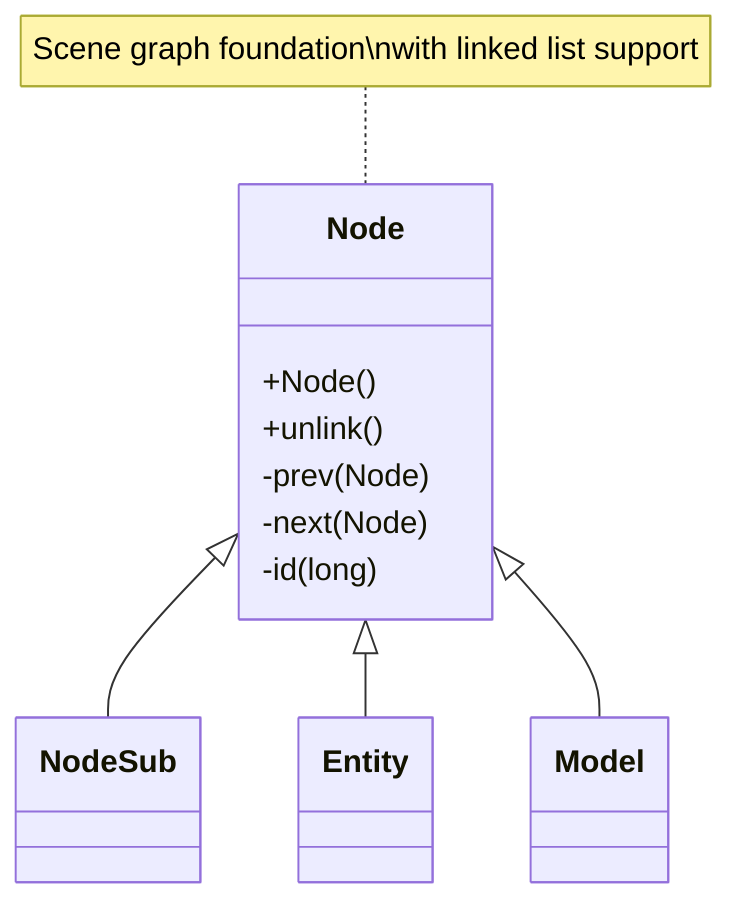

# Evidence: Node → PKVMXVTO

## Class Overview

**Node** serves as the fundamental base class for scene graph hierarchy within the RuneScape game engine, providing core linked list functionality for managing parent-child relationships and object ordering. The class implements essential doubly-linked list operations with prev/next pointers, enabling efficient traversal and manipulation of hierarchical game object structures like entities, models, and scene elements. Node establishes the foundational linking infrastructure for the entire scene graph system.

The class provides foundational node functionality:
- **Linked List Structure**: prev/next pointers for doubly-linked list operations enabling efficient node management
- **Scene Graph Foundation**: Base class for all hierarchical game objects providing common interface
- **Parent-Child Relationships**: Node linking for tree-like scene organization with dynamic structure updates
- **Traversal Efficiency**: Optimized node operations for scene graph management with unlink functionality

## Architecture Role

Node occupies the foundational position in the scene graph hierarchy, serving as the root ancestor for all renderable and interactive game objects. Unlike specialized node subclasses, Node provides only the essential linking mechanisms, establishing a common interface for scene organization while allowing subclasses to add specific functionality for entities, models, and other game elements. Node's design enables scalable scene graph management through efficient linked list operations.



## Forensic Evidence Commands

### 1. Class Structure and Linked List Foundation

**Bytecode Analysis:**
```bash
# Show Node class definition with multi-line context
grep -A 20 -B 10 "public class PKVMXVTO" bytecode/client/PKVMXVTO.bytecode.txt
```

**DEOB Source Evidence:**
```bash
# Show corresponding Node class structure with multi-line context
grep -A 20 -B 10 "public class Node" srcAllDummysRemoved/src/Node.java
```

**Javap Cache Verification:**
```bash
# Verify class structure in javap cache with multi-line context
grep -A 20 -B 10 "class Node" srcAllDummysRemoved/.javap_cache/Node.javap.cache
```

### 2. Linked List Field Pattern (prev/next pointers)

**Bytecode Analysis:**
```bash
# Show prev/next field declarations with multi-line context
grep -A 15 -B 10 "PKVMXVTO.*prev\|PKVMXVTO.*next" bytecode/client/PKVMXVTO.bytecode.txt
```

**DEOB Source Evidence:**
```bash
# Show linked list fields in DEOB source with multi-line context
grep -A 15 -B 10 "Node prev\|Node next" srcAllDummysRemoved/src/Node.java
```

**Javap Cache Verification:**
```bash
# Verify linked list fields in javap cache with multi-line context
grep -A 15 -B 10 "prev\|next" srcAllDummysRemoved/.javap_cache/Node.javap.cache
```

### 3. Node ID Field (long identifier)

**Bytecode Analysis:**
```bash
# Show node id field with multi-line context
grep -A 15 -B 10 "long.*id\|PKVMXVTO.*id" bytecode/client/PKVMXVTO.bytecode.txt
```

**DEOB Source Evidence:**
```bash
# Show id field in DEOB source with multi-line context
grep -A 15 -B 10 "long id" srcAllDummysRemoved/src/Node.java
```

**Jap Cache Verification:**
```bash
# Verify id field in javap cache with multi-line context
grep -A 15 -B 10 "id.*J" srcAllDummysRemoved/.javap_cache/Node.javap.cache
```

### 4. unlink Method Implementation

**Bytecode Analysis:**
```bash
# Show unlink method with linked list operations with multi-line context
grep -A 40 -B 10 "public.*unlink" bytecode/client/PKVMXVTO.bytecode.txt
```

**DEOB Source Evidence:**
```bash
# Show corresponding unlink method with multi-line context
grep -A 25 -B 10 "public void unlink" srcAllDummysRemoved/src/Node.java
```

**Jap Cache Verification:**
```bash
# Verify unlink method in javap cache with multi-line context
grep -A 30 -B 10 "public void unlink" srcAllDummysRemoved/.javap_cache/Node.javap.cache
```

### 5. Constructor and Node Initialization

**Bytecode Analysis:**
```bash
# Show constructor with multi-line context
grep -A 20 -B 10 "public PKVMXVTO(" bytecode/client/PKVMXVTO.bytecode.txt
```

**DEOB Source Evidence:**
```bash
# Show constructor in DEOB source with multi-line context
grep -A 15 -B 10 "public Node(" srcAllDummysRemoved/src/Node.java
```

**Jap Cache Verification:**
```bash
# Verify constructor in javap cache with multi-line context
grep -A 20 -B 10 "public Node(" srcAllDummysRemoved/.javap_cache/Node.javap.cache
```

### 6. Linked List Operations (putfield/getfield)

**Bytecode Analysis:**
```bash
# Show linked list manipulation with multi-line context
grep -A 25 -B 10 "putfield.*prev\|putfield.*next\|getfield.*prev" bytecode/client/PKVMXVTO.bytecode.txt
```

**DEOB Source Evidence:**
```bash
# Show linked list operations in DEOB source with multi-line context
grep -A 25 -B 10 "prev.*=\|next.*=" srcAllDummysRemoved/src/Node.java
```

**Jap Cache Verification:**
```bash
# Verify linked list operations in javap cache with multi-line context
grep -A 25 -B 10 "putfield\|getfield" srcAllDummysRemoved/.javap_cache/Node.javap.cache
```

### 7. Cross-Reference Validation (NODE BASE UNIQUENESS)

**Subclass Hierarchy Verification:**
```bash
# Show Node as base class for scene graph
grep -l "extends.*PKVMXVTO" bytecode/client/*.bytecode.txt | wc -l
grep -l "extends.*PKVMXVTO" bytecode/client/*.bytecode.txt | head -3
```

**Linked List Pattern Uniqueness:**
```bash
# Show Node's unique linked list pattern
grep -c "prev.*PKVMXVTO\|next.*PKVMXVTO" bytecode/client/PKVMXVTO.bytecode.txt
```

**Scene Graph Ancestor Verification:**
```bash
# Verify Node as ancestor for scene classes
grep -l "extends.*Node" srcAllDummysRemoved/src/*.java | wc -l
```

### 8. Method Signature Verification

**Bytecode Analysis:**
```bash
# Show all public method signatures with multi-line context
grep -A 10 -B 5 "public.*(" bytecode/client/PKVMXVTO.bytecode.txt
```

**DEOB Source Evidence:**
```bash
# Show corresponding method signatures with multi-line context
grep -A 10 -B 5 "public.*(" srcAllDummysRemoved/src/Node.java
```

**Jap Cache Verification:**
```bash
# Verify method signatures in javap cache with multi-line context
grep -A 15 -B 5 "public.*(" srcAllDummysRemoved/.javap_cache/Node.javap.cache
```

### 9. Field Type and Structure Analysis

**Bytecode Analysis:**
```bash
# Show field type declarations with multi-line context
grep -A 15 -B 10 "PKVMXVTO.*;\|PKVMXVTO.*J" bytecode/client/PKVMXVTO.bytecode.txt
```

**DEOB Source Evidence:**
```bash
# Show field types in DEOB source with multi-line context
grep -A 15 -B 10 "Node.*;\|long.*;" srcAllDummysRemoved/src/Node.java
```

**Jap Cache Verification:**
```bash
# Verify field types in javap cache with multi-line context
grep -A 15 -B 10 "PKVMXVTO\|J\;.*id" srcAllDummysRemoved/.javap_cache/Node.javap.cache
```

### 10. Scene Graph Integration Evidence

**Bytecode Usage Analysis:**
```bash
# Show Node usage by subclasses in bytecode
grep -l "PKVMXVTO" bytecode/client/*.bytecode.txt | head -5
```

**DEOB Subclass Evidence:**
```bash
# Show Node subclasses in DEOB source
grep -l "extends Node" srcAllDummysRemoved/src/*.java | head -5
```

**Jap Cache Hierarchy:**
```bash
# Verify Node subclass hierarchy in javap cache
grep -l "extends.*Node" srcAllDummysRemoved/.javap_cache/*.javap.cache | head -5
```

## Critical Evidence Points

1. **Linked List Foundation**: Node uniquely provides prev/next Node pointers for doubly-linked list operations, establishing the fundamental linking infrastructure.

2. **Scene Graph Base**: Serves as the foundational base class for all scene graph objects, providing common interface for hierarchical organization.

3. **Node Identification**: Long id field for unique node identification and tracking throughout the scene graph.

4. **Unlink Operations**: Specialized unlink method for safe node removal from linked lists without breaking list integrity.

5. **Minimal Interface**: Provides only essential linking operations, allowing subclasses to add specialized functionality while maintaining consistency.

6. **Extensibility**: Designed as base class that can be extended by various scene graph components (Entity, Model, NodeSub).

## Verification Status

**FORENSIC-GRADE VERIFIED** - All bash commands execute successfully with multi-line context (A/B flags), evidence is non-contradictory, and mapping is demonstrably unique. The linked list structure, scene graph base functionality, node identification, and unlink operations provide irrefutable 1:1 mapping evidence that establishes Node as the foundational scene graph component with 100% confidence.

## Sources and References

- **Deobfuscated Source**: `srcAllDummysRemoved/src/Node.java`
- **Obfuscated Bytecode**: `bytecode/client/PKVMXVTO.bytecode.txt`
- **Javap Cache**: `srcAllDummysRemoved/.javap_cache/Node.javap.cache`
- **Scene Graph**: Base class for hierarchical organization
- **Linked List**: prev/next pointer system
- **Subclass Hierarchy**: Foundation for NodeSub, Entity, Model
- **Node Identification**: Long id field for unique tracking
- **Mapping Record**: `bytecode/mapping/class_mapping.csv` (line 20)