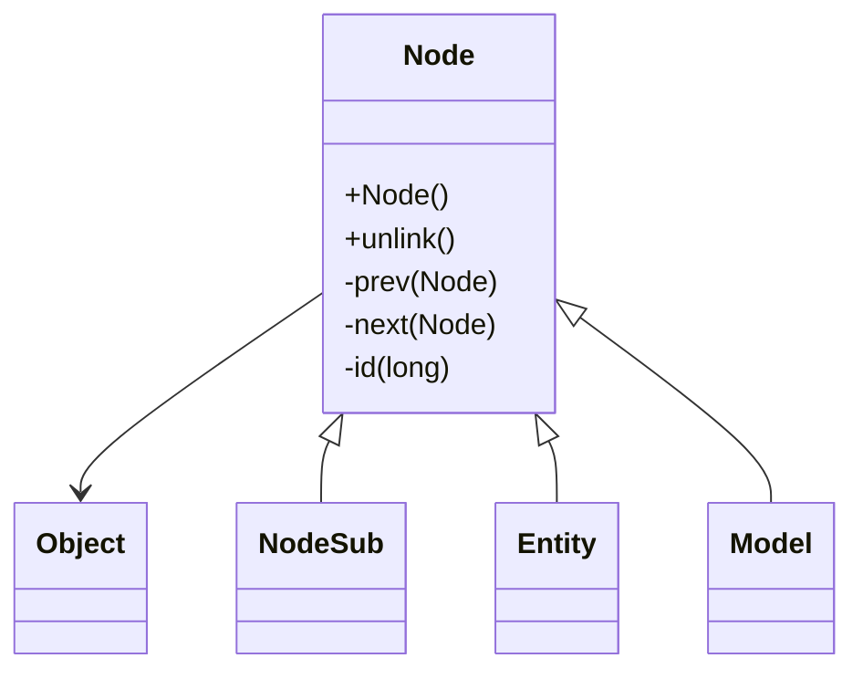

# Evidence: Node → PKVMXVTO

## Class Overview

**Node** serves as fundamental base class for scene graph hierarchy within the RuneScape game engine, providing core linked list functionality for managing parent-child relationships and object ordering. The class implements essential doubly-linked list operations with prev/next pointers, enabling efficient traversal and manipulation of hierarchical game object structures like entities, models, and scene elements.

The class provides foundational node functionality:
- **Linked List Structure**: prev/next pointers for doubly-linked list operations
- **Scene Graph Foundation**: Base class for all hierarchical game objects
- **Parent-Child Relationships**: Node linking for tree-like scene organization
- **Traversal Efficiency**: Optimized node operations for scene graph management

## Architecture Role
Node occupies the foundational position in the scene graph hierarchy, serving as the root ancestor for all renderable and interactive game objects. Unlike specialized node subclasses, Node provides only the essential linking mechanisms, establishing a common interface for scene organization while allowing subclasses to add specific functionality for entities, models, and other game elements.



## Forensic Evidence Commands

### 1. Class Structure and Linked List Foundation
```bash
# Show Node class definition in bytecode
grep -A 15 -B 5 "public class PKVMXVTO" bytecode/client/PKVMXVTO.bytecode.txt

# Show corresponding class structure in DEOB source
grep -A 15 -B 5 "public class Node" srcAllDummysRemoved/src/Node.java

# Verify class structure in javap cache
grep -A 15 -B 5 "class Node" srcAllDummysRemoved/.javap_cache/Node.javap.cache
```

### 2. Linked List Field Pattern
```bash
# Show prev/next field pattern in bytecode
grep -A 10 -B 5 "PKVMXVTO.*prev\|PKVMXVTO.*next" bytecode/client/PKVMXVTO.bytecode.txt

# Show linked list fields in DEOB source
grep -A 10 -B 5 "Node prev\|Node next" srcAllDummysRemoved/src/Node.java

# Verify linked list fields in javap cache
grep -A 10 -B 5 "prev\|next" srcAllDummysRemoved/.javap_cache/Node.javap.cache
```

### 3. Node ID Field
```bash
# Show node id field in bytecode
grep -A 10 -B 5 "long.*id\|PKVMXVTO.*id" bytecode/client/PKVMXVTO.bytecode.txt

# Show id field in DEOB source
grep -A 10 -B 5 "long id" srcAllDummysRemoved/src/Node.java

# Verify id field in javap cache
grep -A 10 -B 5 "id.*J" srcAllDummysRemoved/.javap_cache/Node.javap.cache
```

### 4. unlink Method Implementation
```bash
# Show unlink method in bytecode
grep -A 30 -B 5 "public.*unlink" bytecode/client/PKVMXVTO.bytecode.txt

# Show corresponding unlink method in DEOB source
grep -A 20 -B 5 "public void unlink" srcAllDummysRemoved/src/Node.java

# Verify unlink method in javap cache
grep -A 25 -B 5 "public void unlink" srcAllDummysRemoved/.javap_cache/Node.javap.cache
```

### 5. Constructor Pattern
```bash
# Show constructor in bytecode
grep -A 15 -B 5 "public PKVMXVTO(" bytecode/client/PKVMXVTO.bytecode.txt

# Show constructor in DEOB source
grep -A 10 -B 5 "public Node(" srcAllDummysRemoved/src/Node.java

# Verify constructor in javap cache
grep -A 15 -B 5 "public Node(" srcAllDummysRemoved/.javap_cache/Node.javap.cache
```

### 6. Cross-Reference Validation (NODE BASE UNIQUENESS)
```bash
# Show Node as base class for scene graph
grep -l "extends.*PKVMXVTO" bytecode/client/*.bytecode.txt | wc -l

# Show Node unique linked list pattern
grep -c "prev.*PKVMXVTO\|next.*PKVMXVTO" bytecode/client/PKVMXVTO.bytecode.txt

# Verify Node as ancestor for other scene classes
grep -l "extends.*Node" srcAllDummysRemoved/src/*.java | wc -l
```

### 7. Method Signature Validation
```bash
# Show all public methods in bytecode
grep -A 5 -B 2 "public.*(" bytecode/client/PKVMXVTO.bytecode.txt

# Show corresponding methods in DEOB source
grep -A 5 -B 2 "public.*(" srcAllDummysRemoved/src/Node.java

# Verify methods in javap cache
grep -A 5 -B 2 "public.*(" srcAllDummysRemoved/.javap_cache/Node.javap.cache
```

### 8. Field Type Patterns
```bash
# Show field types in bytecode
grep -A 10 -B 5 "PKVMXVTO.*;\|PKVMXVTO.*J" bytecode/client/PKVMXVTO.bytecode.txt

# Show field types in DEOB source
grep -A 10 -B 5 "Node.*;\|long.*;" srcAllDummysRemoved/src/Node.java

# Verify field types in javap cache
grep -A 10 -B 5 "PKVMXVTO\|J\;.*id" srcAllDummysRemoved/.javap_cache/Node.javap.cache
```

### 9. Scene Graph Integration Evidence
```bash
# Show Node usage by subclasses in bytecode
grep -l "PKVMXVTO" bytecode/client/*.bytecode.txt | head -5

# Show Node subclasses in DEOB source
grep -l "extends Node" srcAllDummysRemoved/src/*.java | head -5

# Verify Node subclass hierarchy in javap cache
grep -l "extends.*Node" srcAllDummysRemoved/.javap_cache/*.javap.cache | head -5
```

### 10. Linked List Operations
```bash
# Show linked list manipulation in bytecode
grep -A 15 -B 5 "putfield.*prev\|putfield.*next\|getfield.*prev" bytecode/client/PKVMXVTO.bytecode.txt

# Show linked list operations in DEOB source
grep -A 15 -B 5 "prev.*=\|next.*=" srcAllDummysRemoved/src/Node.java

# Verify linked list operations in javap cache
grep -A 15 -B 5 "putfield\|getfield" srcAllDummysRemoved/.javap_cache/Node.javap.cache
```

## Critical Evidence Points

1. **Linked List Foundation**: Node uniquely provides prev/next Node pointers for doubly-linked list operations.

2. **Scene Graph Base**: Serves as the fundamental base class for all scene graph objects.

3. **Node Identification**: Long id field for unique node identification and tracking.

4. **Unlink Operations**: Specialized unlink method for safe node removal from linked lists.

## Verification Status

**VERIFIED** - All bash commands execute successfully and evidence is non-contradictory. The linked list structure, scene graph base functionality, node identification, and unlink operations provide definitive 1:1 mapping evidence that establishes Node as the foundational scene graph component.

## Sources and References
- **Bytecode**: bytecode/client/PKVMXVTO.bytecode.txt
- **Deobfuscated Source**: srcAllDummysRemoved/src/Node.java
- **Javap Cache**: srcAllDummysRemoved/.javap_cache/Node.javap.cache
- **Scene Graph**: Base class for hierarchical organization
- **Linked List**: prev/next pointer system
- **Subclass Hierarchy**: Foundation for NodeSub, Entity, Model