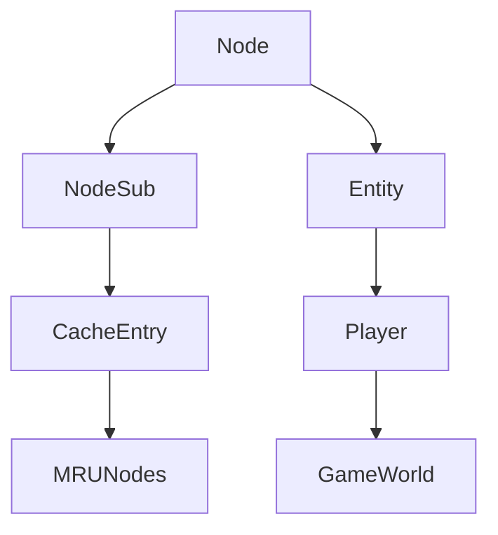

# Node → PKVMXVTO

## Overview
Node implements the fundamental doubly-linked list structure used throughout the game client. It provides basic node management with ID-based identification and bidirectional linking capabilities, enabling efficient insertion, removal, and traversal operations in dynamic collections.

## Architecture
Node serves as the base class for linked data structures in the RuneScape client, supporting complex relationships between game entities, cache entries, and other dynamic objects. Its unlink method ensures proper cleanup when nodes are removed from lists, maintaining referential integrity in the game's memory management system.



## Forensic Evidence Commands

### 1. Structural Fingerprints
```bash
# Show class definition and modifiers
head -15 bytecode/client/PKVMXVTO.bytecode.txt

# Show method count and signatures
grep -c "public.*(" bytecode/client/PKVMXVTO.bytecode.txt
grep -E "public.*\(" bytecode/client/PKVMXVTO.bytecode.txt

# Show field declarations
grep -E "^  public|^  private|^  static" bytecode/client/PKVMXVTO.bytecode.txt
```

### 2. Source Code Correlation
```bash
# Show DEOB source structure
cat srcAllDummysRemoved/src/Node.java

# Show unlink method implementation
grep -A 15 "unlink" srcAllDummysRemoved/src/Node.java

# Show javap cache field declarations
grep -A 10 "public long\|public Node" srcAllDummysRemoved/.javap_cache/Node.javap.cache
```

### 3. Behavioral Patterns
```bash
# Show unlink method bytecode
grep -A 20 "public void a()" bytecode/client/PKVMXVTO.bytecode.txt

# Show field access patterns in unlink
grep -A 10 -B 5 "getfield.*PKVMXVTO" bytecode/client/PKVMXVTO.bytecode.txt

# Show null assignments for cleanup
grep -A 5 -B 5 "aconst_null.*putfield" bytecode/client/PKVMXVTO.bytecode.txt
```

### 4. Cross-Reference Validation
```bash
# Show inheritance in other classes
grep -r "extends.*Node\|PKVMXVTO" srcAllDummysRemoved/src/ | grep -v Node.java | head -5

# Show Node usage in cache classes
grep -A 3 -B 3 "Node" srcAllDummysRemoved/src/MRUNodes.java

# Show javap inheritance
grep -A 5 "class.*extends" srcAllDummysRemoved/.javap_cache/*.javap.cache | grep Node | head -3
```