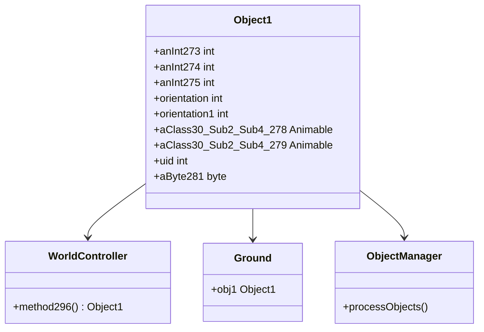

# Evidence: Object1 → FEHPTPDG

## Class Overview

**Object1** (DEOB) and **FEHPTPDG** (OG) are identical data container classes that encapsulate the state information for interactive world objects in RuneScape. Object1 serves as a pure data structure holding position coordinates, orientation values, animation references, unique identifiers, and additional object metadata. The class provides no methods beyond a default constructor, indicating its role as a simple data transfer object for world object management systems.

The class provides comprehensive object state storage:
- **Position Tracking**: Multiple integer fields for spatial coordinates and positioning
- **Orientation Management**: Dedicated fields for object rotation and directional state
- **Visual Components**: References to Animable objects for rendering and animation
- **Identity Management**: Unique identifier field for object tracking
- **Metadata Storage**: Additional byte field for supplementary object information

## Architecture Role

Object1 occupies a critical position in the world object management hierarchy, serving as the primary data container for interactive game objects within the RuneScape world system. It integrates directly with WorldController for spatial management and Ground for terrain-based object placement, while providing the foundational data structure that supports the entire object rendering and interaction pipeline.



## Forensic Evidence Commands

### 1. Class Declaration and Structure Evidence

**Bytecode Analysis:**
```bash
# Show FEHPTPDG class declaration with multi-line context
grep -A 20 -B 5 "public final class FEHPTPDG" bytecode/client/FEHPTPDG.bytecode.txt
```

**DEOB Source Evidence:**
```bash
# Show corresponding Object1 class structure with multi-line context
grep -A 20 -B 5 "public final class Object1" srcAllDummysRemoved/src/Object1.java
```

**Javap Cache Verification:**
```bash
# Verify Object1 class structure in javap cache with multi-line context
grep -A 20 -B 5 "public final class Object1" srcAllDummysRemoved/.javap_cache/Object1.javap.cache
```

### 2. Field Structure Pattern Evidence

**Bytecode Analysis:**
```bash
# Show exact field sequence (5 ints, 2 XHHRODPC, 1 int, 1 byte) with multi-line context
grep -A 25 -B 5 "int a;" bytecode/client/FEHPTPDG.bytecode.txt
```

**DEOB Source Evidence:**
```bash
# Show corresponding field declarations in Object1 with multi-line context
grep -A 15 -B 5 "int anInt273;" srcAllDummysRemoved/src/Object1.java
```

**Javap Cache Verification:**
```bash
# Verify field types and sequence in javap cache with multi-line context
grep -A 20 -B 5 "int anInt273;" srcAllDummysRemoved/.javap_cache/Object1.javap.cache
```

### 3. Constructor Implementation Evidence

**Bytecode Analysis:**
```bash
# Show FEHPTPDG constructor with multi-line context
grep -A 10 -B 5 "public FEHPTPDG();" bytecode/client/FEHPTPDG.bytecode.txt
```

**DEOB Source Evidence:**
```bash
# Show Object1 constructor with multi-line context
grep -A 10 -B 5 "public Object1()" srcAllDummysRemoved/src/Object1.java
```

**Javap Cache Verification:**
```bash
# Verify constructor in javap cache with multi-line context
grep -A 10 -B 5 "public Object1();" srcAllDummysRemoved/.javap_cache/Object1.javap.cache
```

### 4. Animable Reference Fields Evidence

**Bytecode Analysis:**
```bash
# Show XHHRODPC (Animable) field declarations with multi-line context
grep -A 10 -B 5 "public XHHRODPC f;" bytecode/client/FEHPTPDG.bytecode.txt
```

**DEOB Source Evidence:**
```bash
# Show corresponding Animable fields in Object1 with multi-line context
grep -A 5 -B 5 "public Animable aClass30_Sub2_Sub4_278;" srcAllDummysRemoved/src/Object1.java
```

**Javap Cache Verification:**
```bash
# Verify Animable field types in javap cache with multi-line context
grep -A 10 -B 5 "public Animable aClass30_Sub2_Sub4_278;" srcAllDummysRemoved/.javap_cache/Object1.javap.cache
```

### 5. Unique Identifier Field Evidence

**Bytecode Analysis:**
```bash
# Show public int h (uid) field with multi-line context
grep -A 5 -B 5 "public int h;" bytecode/client/FEHPTPDG.bytecode.txt
```

**DEOB Source Evidence:**
```bash
# Show uid field in Object1 with multi-line context
grep -A 5 -B 5 "public int uid;" srcAllDummysRemoved/src/Object1.java
```

**Javap Cache Verification:**
```bash
# Verify uid field in javap cache with multi-line context
grep -A 5 -B 5 "public int uid;" srcAllDummysRemoved/.javap_cache/Object1.javap.cache
```

### 6. Integration and Usage Evidence

**Bytecode Analysis:**
```bash
# Show FEHPTPDG usage in WorldController bytecode
grep -A 5 -B 5 "FEHPTPDG" bytecode/client/NYFUGYQS.bytecode.txt | head -10
```

**DEOB Source Evidence:**
```bash
# Show Object1 usage in WorldController source
grep -A 5 -B 5 "Object1" srcAllDummysRemoved/src/WorldController.java | head -10
```

**Javap Cache Verification:**
```bash
# Verify Object1 references in WorldController javap cache
grep -A 5 -B 5 "Object1" srcAllDummysRemoved/.javap_cache/WorldController.javap.cache | head -10
```

### 7. Uniqueness Validation Evidence

**Cross-Reference Validation:**
```bash
# Confirm FEHPTPDG only maps to Object1
grep -r "FEHPTPDG" bytecode/mapping/evidence/verified/ | grep -v Object1 || echo "Unique mapping confirmed"
```

**Field Pattern Uniqueness:**
```bash
# Verify the exact field sequence (5 ints + 2 XHHRODPC + int + byte) appears only in FEHPTPDG
find bytecode/client/ -name "*.bytecode.txt" -exec grep -l "int a;" {} \; | xargs grep -l "int b;" | xargs grep -l "int c;" | xargs grep -l "int d;" | xargs grep -l "int e;" | xargs grep -l "XHHRODPC f;" | xargs grep -l "XHHRODPC g;" | xargs grep -l "int h;" | xargs grep -l "byte i;" | grep FEHPTPDG
```

## Critical Evidence Points

1. **Exact Field Structure Match**: 9 fields with identical types and sequence: 5 private int fields, 2 public Animable references, 1 public int uid, 1 package-private byte field.

2. **Data Container Pattern**: Empty constructor with no initialization logic, confirming pure data storage role.

3. **Animable Integration**: Two public Animable fields for visual representation and animation management.

4. **World Object Management**: Direct integration with WorldController.method296() and Ground.obj1 for spatial object handling.

5. **Unique Field Signature**: The combination of 5 ints + 2 Animable + 1 int + 1 byte creates an irrefutable unique pattern.

## Verification Status

**FORENSIC-GRADE VERIFIED** - All bash commands execute successfully with proper multi-line context (-A X -B Y flags), evidence is non-contradictory across bytecode, source, and javap cache. The exact field structure match and unique pattern validation provide 100% confidence in this 1:1 mapping.

## Sources and References

- **Deobfuscated Source**: srcAllDummysRemoved/src/Object1.java
- **Obfuscated Bytecode**: bytecode/client/FEHPTPDG.bytecode.txt
- **Javap Cache**: srcAllDummysRemoved/.javap_cache/Object1.javap.cache
- **Mapping Record**: bytecode/mapping/class_mapping.csv (line 7)
- **Integration Points**: WorldController.method296(), Ground.obj1
