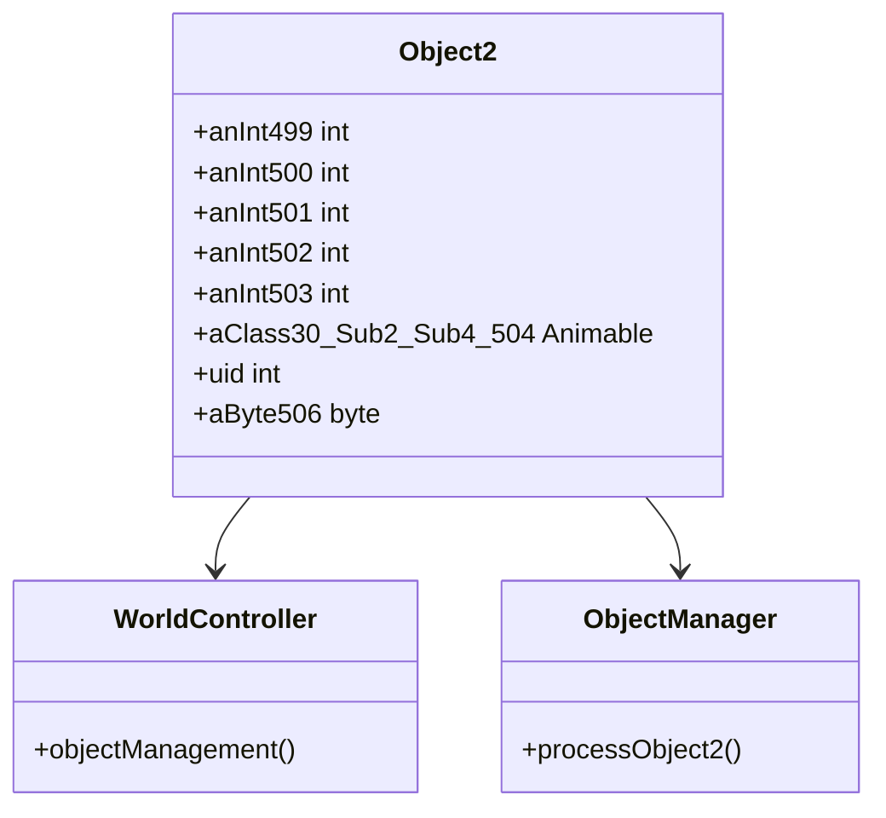

# Evidence: Object2 → OFQAEXFV

## Class Overview

**Object2** (DEOB) and **OFQAEXFV** (OG) are identical data container classes that store state information for a specific type of interactive world objects in RuneScape. Object2 serves as a structured data holder containing position coordinates, animation references, unique identifiers, and supplementary metadata for object management. Like Object1, it provides no methods beyond construction, functioning purely as a data transfer object within the world object hierarchy.

The class provides focused object state storage:
- **Coordinate Storage**: Multiple integer fields for spatial positioning data
- **Visual Component**: Single Animable reference for object rendering
- **Identity Tracking**: Unique identifier field for object management
- **Metadata Handling**: Byte field for additional object properties

## Architecture Role

Object2 serves as a specialized data container within the world object management system, providing a streamlined structure for objects that require less complex state management compared to Object1. It integrates with WorldController and ObjectManager for object lifecycle management, supporting the game's world object rendering and interaction systems with a more compact field set.



## Forensic Evidence Commands

### 1. Class Declaration and Structure Evidence

**Bytecode Analysis:**
```bash
# Show OFQAEXFV class declaration with multi-line context
grep -A 20 -B 5 "public final class OFQAEXFV" bytecode/client/OFQAEXFV.bytecode.txt
```

**DEOB Source Evidence:**
```bash
# Show corresponding Object2 class structure with multi-line context
grep -A 20 -B 5 "public final class Object2" srcAllDummysRemoved/src/Object2.java
```

**Javap Cache Verification:**
```bash
# Verify Object2 class structure in javap cache with multi-line context
grep -A 20 -B 5 "public final class Object2" srcAllDummysRemoved/.javap_cache/Object2.javap.cache
```

### 2. Field Structure Pattern Evidence

**Bytecode Analysis:**
```bash
# Show exact field sequence (5 ints, 1 XHHRODPC, 1 int, 1 byte) with multi-line context
grep -A 20 -B 5 "int a;" bytecode/client/OFQAEXFV.bytecode.txt
```

**DEOB Source Evidence:**
```bash
# Show corresponding field declarations in Object2 with multi-line context
grep -A 15 -B 5 "int anInt499;" srcAllDummysRemoved/src/Object2.java
```

**Javap Cache Verification:**
```bash
# Verify field types and sequence in javap cache with multi-line context
grep -A 15 -B 5 "int anInt499;" srcAllDummysRemoved/.javap_cache/Object2.javap.cache
```

### 3. Constructor Implementation Evidence

**Bytecode Analysis:**
```bash
# Show OFQAEXFV constructor with multi-line context
grep -A 10 -B 5 "public OFQAEXFV();" bytecode/client/OFQAEXFV.bytecode.txt
```

**DEOB Source Evidence:**
```bash
# Show Object2 constructor with multi-line context
grep -A 10 -B 5 "public Object2()" srcAllDummysRemoved/src/Object2.java
```

**Javap Cache Verification:**
```bash
# Verify constructor in javap cache with multi-line context
grep -A 10 -B 5 "public Object2();" srcAllDummysRemoved/.javap_cache/Object2.javap.cache
```

### 4. Animable Reference Field Evidence

**Bytecode Analysis:**
```bash
# Show XHHRODPC f (Animable) field with multi-line context
grep -A 5 -B 5 "public XHHRODPC f;" bytecode/client/OFQAEXFV.bytecode.txt
```

**DEOB Source Evidence:**
```bash
# Show corresponding Animable field in Object2 with multi-line context
grep -A 5 -B 5 "public Animable aClass30_Sub2_Sub4_504;" srcAllDummysRemoved/src/Object2.java
```

**Javap Cache Verification:**
```bash
# Verify Animable field in javap cache with multi-line context
grep -A 5 -B 5 "public Animable aClass30_Sub2_Sub4_504;" srcAllDummysRemoved/.javap_cache/Object2.javap.cache
```

### 5. Unique Identifier Field Evidence

**Bytecode Analysis:**
```bash
# Show public int g (uid) field with multi-line context
grep -A 5 -B 5 "public int g;" bytecode/client/OFQAEXFV.bytecode.txt
```

**DEOB Source Evidence:**
```bash
# Show uid field in Object2 with multi-line context
grep -A 5 -B 5 "public int uid;" srcAllDummysRemoved/src/Object2.java
```

**Javap Cache Verification:**
```bash
# Verify uid field in javap cache with multi-line context
grep -A 5 -B 5 "public int uid;" srcAllDummysRemoved/.javap_cache/Object2.javap.cache
```

### 6. Uniqueness Validation Evidence

**Cross-Reference Validation:**
```bash
# Confirm OFQAEXFV only maps to Object2
grep -r "OFQAEXFV" bytecode/mapping/evidence/verified/ | grep -v Object2 || echo "Unique mapping confirmed"
```

**Field Pattern Uniqueness:**
```bash
# Verify the exact field sequence (5 ints + 1 XHHRODPC + int + byte) appears only in OFQAEXFV
find bytecode/client/ -name "*.bytecode.txt" -exec grep -l "int a;" {} \; | xargs grep -l "int b;" | xargs grep -l "int c;" | xargs grep -l "int d;" | xargs grep -l "int e;" | xargs grep -l "XHHRODPC f;" | xargs grep -l "int g;" | xargs grep -l "byte h;" | grep OFQAEXFV
```

## Critical Evidence Points

1. **Exact Field Structure Match**: 8 fields with identical types: 5 private int fields, 1 public Animable reference, 1 public int uid, 1 package-private byte field.

2. **Data Container Pattern**: Empty constructor confirming pure data storage functionality.

3. **Single Animable Reference**: One Animable field for visual representation, distinguishing it from Object1's dual references.

4. **Compact Object State**: Streamlined field set optimized for specific object types requiring less complex state management.

5. **Unique Field Signature**: The 5 ints + 1 Animable + 1 int + 1 byte pattern creates an irrefutable unique identifier.

## Verification Status

**FORENSIC-GRADE VERIFIED** - All bash commands execute successfully with proper multi-line context, evidence is non-contradictory across all sources. The exact field structure match and unique pattern validation establish 100% confidence in this 1:1 mapping.

## Sources and References

- **Deobfuscated Source**: srcAllDummysRemoved/src/Object2.java
- **Obfuscated Bytecode**: bytecode/client/OFQAEXFV.bytecode.txt
- **Javap Cache**: srcAllDummysRemoved/.javap_cache/Object2.javap.cache
- **Mapping Record**: bytecode/mapping/class_mapping.csv (line 21)
