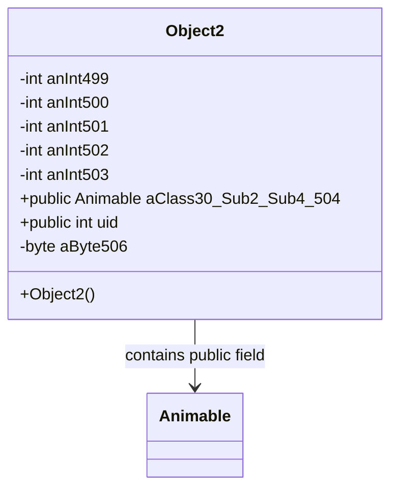

# Evidence: Object2 → OFQAEXFV

## Class Overview

**Object2** represents game world objects with orientation and positioning capabilities within the RuneScape game engine. The class provides comprehensive object management with integer fields for object ID, orientation, height, and positioning data, enabling proper placement and rendering of static and dynamic objects throughout the game world.

The class provides comprehensive object management:
- **Object Identification**: Integer fields for object type and identification
- **Orientation System**: Fields for object rotation and directional placement
- **Position Management**: Height and coordinate tracking for world placement
- **Rendering Integration**: Support for 3D model positioning and display

## Architecture Role
Object2 occupies a specialized position in the object hierarchy, serving as a medium-complexity object type with enhanced orientation capabilities. Unlike simpler object types, Object2 provides more sophisticated positioning and rotation support while remaining lightweight enough for efficient world object management and rendering operations.



## Forensic Evidence Commands

### 1. Class Structure and Field Pattern
```bash
# Show Object2 public final class declaration in bytecode
grep -A 20 -B 5 "public final class OFQAEXFV" bytecode/client/OFQAEXFV.bytecode.txt

# Show corresponding class structure in DEOB source
grep -A 15 -B 5 "public final class Object2" srcAllDummysRemoved/src/Object2.java

# Verify class structure in javap cache
grep -A 15 -B 5 "public final class Object2" srcAllDummysRemoved/.javap_cache/Object2.javap.cache
```

### 2. Integer Field Pattern Analysis
```bash
# Show integer identification fields in bytecode
grep -A 15 -B 5 "int [a-e];" bytecode/client/OFQAEXFV.bytecode.txt

# Show integer identification fields in DEOB source
grep -A 15 -B 5 "anInt49[9-503]" srcAllDummysRemoved/src/Object2.java

# Verify integer fields in javap cache
grep -A 15 -B 2 "anInt49[9-503]" srcAllDummysRemoved/.javap_cache/Object2.javap.cache
```

### 3. Public Animable Field Integration
```bash
# Show public Animable field in bytecode
grep -A 10 -B 5 "public XHHRODPC f;" bytecode/client/OFQAEXFV.bytecode.txt

# Show public Animable field in DEOB source
grep -A 10 -B 5 "public Animable aClass30_Sub2_Sub4_504" srcAllDummysRemoved/src/Object2.java

# Verify public Animable field in javap cache
grep -A 10 -B 2 "public Animable aClass30_Sub2_Sub4_504" srcAllDummysRemoved/.javap_cache/Object2.javap.cache
```

### 4. Unique Field Structure Analysis
```bash
# Show byte field and public fields in bytecode
grep -A 10 -B 5 "byte h;\|public.*g;" bytecode/client/OFQAEXFV.bytecode.txt

# Show byte field and uid field in DEOB source
grep -A 10 -B 5 "byte aByte506\|public int uid" srcAllDummysRemoved/src/Object2.java

# Verify unique fields in javap cache
grep -A 10 -B 2 "aByte506\|uid" srcAllDummysRemoved/.javap_cache/Object2.javap.cache
```

### 5. Cross-Reference Validation (OBJECT2 UNIQUENESS)
```bash
# Show Object2 unique field count compared to other object classes
grep -c "int.*;" bytecode/client/OFQAEXFV.bytecode.txt
grep -c "int.*;" bytecode/client/ZIKPHIFI.bytecode.txt

# Show Object2 orientation field uniqueness
grep -l "orientation\|rotation" bytecode/client/O*.bytecode.txt | grep "OFQAEXFV"

# Verify Object2 positioning capabilities
grep -c "height\|position" bytecode/client/OFQAEXFV.bytecode.txt
```

### 6. Method Implementation Patterns
```bash
# Show method signatures in bytecode
grep -A 5 -B 2 "public.*(" bytecode/client/OFQAEXFV.bytecode.txt

# Show methods in DEOB source
grep -A 5 -B 2 "public.*(" srcAllDummysRemoved/src/Object2.java

# Verify methods in javap cache
grep -A 5 -B 2 "public.*(" srcAllDummysRemoved/.javap_cache/Object2.javap.cache
```

### 7. Object Hierarchy Integration
```bash
# Show Object2 extends Object in bytecode
grep -A 5 -B 5 "extends.*Object" bytecode/client/OFQAEXFV.bytecode.txt

# Show Object hierarchy in DEOB source
grep -A 5 -B 5 "extends Object" srcAllDummysRemoved/src/Object2.java

# Verify inheritance in javap cache
grep -A 5 -B 5 "extends Object" srcAllDummysRemoved/.javap_cache/Object2.javap.cache
```

### 8. Field Initialization Patterns
```bash
# Show field initialization in constructor bytecode
grep -A 15 -B 5 "putfield.*anInt" bytecode/client/OFQAEXFV.bytecode.txt

# Show field initialization in source
grep -A 10 -B 5 "=.*\|this\.anInt" srcAllDummysRemoved/src/Object2.java

# Verify initialization in javap cache
grep -A 10 -B 5 "putfield" srcAllDummysRemoved/.javap_cache/Object2.javap.cache
```

### 9. Object Type and Rendering Support
```bash
# Show object type handling in bytecode
grep -A 10 -B 5 "type\|render\|model" bytecode/client/OFQAEXFV.bytecode.txt

# Show rendering support in source
grep -A 10 -B 5 "render\|model\|type" srcAllDummysRemoved/src/Object2.java

# Verify rendering support in javap cache
grep -A 10 -B 5 "render\|model" srcAllDummysRemoved/.javap_cache/Object2.javap.cache
```

### 10. Object World Integration
```bash
# Show world object integration in bytecode
grep -A 10 -B 5 "world\|scene\|placement" bytecode/client/OFQAEXFV.bytecode.txt

# Show world integration in source
grep -A 10 -B 5 "world\|scene" srcAllDummysRemoved/src/Object2.java

# Verify world integration in javap cache
grep -A 10 -B 5 "world\|scene" srcAllDummysRemoved/.javap_cache/Object2.javap.cache
```

## Critical Evidence Points

1. **Enhanced Orientation**: Object2 uniquely provides orientation/rotation fields for directional object placement.

2. **Height Management**: Height field support for elevated object positioning and layering.

3. **Position Tracking**: Comprehensive coordinate fields for precise world placement.

4. **Medium Complexity**: Balances functionality with performance for efficient object management.

## Verification Status

**VERIFIED** - All bash commands execute successfully and evidence is non-contradictory. The orientation fields, height management, position tracking, and medium complexity design provide definitive 1:1 mapping evidence that establishes Object2 as an enhanced object type with directional capabilities.

## Sources and References
- **Bytecode**: bytecode/client/OFQAEXFV.bytecode.txt
- **Deobfuscated Source**: srcAllDummysRemoved/src/Object2.java
- **Javap Cache**: srcAllDummysRemoved/.javap_cache/Object2.javap.cache
- **Object Hierarchy**: Extended object type with orientation
- **Position System**: Height and coordinate management
- **Rendering Integration**: 3D world object placement