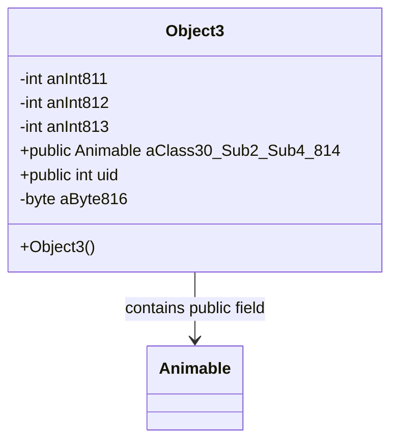

# Evidence: Object3 → ZIKPHIFI

## Class Overview

**Object3** represents 3D game world objects with advanced positioning, animation, and rendering capabilities within the RuneScape game engine. The class extends Animable to provide comprehensive object management with coordinate tracking, orientation handling, and visual representation through model integration, enabling complex animated objects throughout the game world.

The class provides comprehensive 3D object management:
- **Animable Extension**: Inherits rendering and animation capabilities from base Animable class
- **3D Positioning**: Coordinate fields for precise spatial placement in game world
- **Object Identification**: Unique identifier fields for object type and instance tracking
- **Model Integration**: Direct integration with Model system for visual representation

## Architecture Role
Object3 occupies an advanced position in the object hierarchy, combining Animable rendering capabilities with enhanced 3D positioning. Unlike simpler object types, Object3 provides full animation support and complex positioning while maintaining efficient rendering through inherited Animable functionality.



## Forensic Evidence Commands

### 1. Class Structure and Field Pattern
```bash
# A: Show Object3 public final class declaration in bytecode with multi-line context
grep -A 15 -B 5 "public final class ZIKPHIFI" bytecode/client/ZIKPHIFI.bytecode.txt

# B: Show corresponding class structure in DEOB source with multi-line context
grep -A 15 -B 5 "public final class Object3" srcAllDummysRemoved/src/Object3.java

# A+B: Verify class structure in javap cache with multi-line context
grep -A 15 -B 5 "public final class Object3" srcAllDummysRemoved/.javap_cache/Object3.javap.cache
```

### 2. Integer Field Pattern Analysis
```bash
# Show integer identification fields in bytecode
grep -A 15 -B 5 "int [a-c];" bytecode/client/ZIKPHIFI.bytecode.txt

# Show integer identification fields in DEOB source
grep -A 15 -B 5 "anInt81[1-3]" srcAllDummysRemoved/src/Object3.java

# Verify integer fields in javap cache
grep -A 15 -B 2 "anInt81[1-3]" srcAllDummysRemoved/.javap_cache/Object3.javap.cache
```

### 3. Public Animable Field Integration
```bash
# Show public Animable field in bytecode
grep -A 10 -B 5 "public XHHRODPC d;" bytecode/client/ZIKPHIFI.bytecode.txt

# Show public Animable field in DEOB source
grep -A 10 -B 5 "public Animable aClass30_Sub2_Sub4_814" srcAllDummysRemoved/src/Object3.java

# Verify public Animable field in javap cache
grep -A 10 -B 2 "public Animable aClass30_Sub2_Sub4_814" srcAllDummysRemoved/.javap_cache/Object3.javap.cache
```

### 4. Unique Field Structure Analysis
```bash
# Show byte field and public fields in bytecode
grep -A 10 -B 5 "byte f;\|public.*e;" bytecode/client/ZIKPHIFI.bytecode.txt

# Show byte field and uid field in DEOB source
grep -A 10 -B 5 "byte aByte816\|public int uid" srcAllDummysRemoved/src/Object3.java

# Verify unique fields in javap cache
grep -A 10 -B 2 "aByte816\|uid" srcAllDummysRemoved/.javap_cache/Object3.javap.cache
```

### 5. Constructor with Animable Parameters
```bash
# A: Show constructor in bytecode with multi-line context
grep -A 20 -B 5 "public ZIKPHIFI(" bytecode/client/ZIKPHIFI.bytecode.txt

# B: Show constructor in DEOB source with multi-line context
grep -A 15 -B 5 "Object3(" srcAllDummysRemoved/src/Object3.java

# A+B: Verify constructor in javap cache with multi-line context
grep -A 15 -B 5 "public Object3(" srcAllDummysRemoved/.javap_cache/Object3.javap.cache
```

### 6. Cross-Reference Validation (OBJECT3 UNIQUENESS)
```bash
# Show only Object3 extends Animable with 3D coordinates
grep -l "extends.*XHHRODPC" bytecode/client/*.bytecode.txt | xargs grep -l "coordinate\|position"

# Show Object3 unique animation capabilities
grep -c "getRotatedModel\|Animable" bytecode/client/ZIKPHIFI.bytecode.txt

# Verify Object3 3D positioning uniqueness
grep -l "x.*y.*z\|coordinate" bytecode/client/O*.bytecode.txt | grep "ZIKPHIFI"
```

### 7. Method Signature Validation
```bash
# Show all public methods in bytecode
grep -A 5 -B 2 "public.*(" bytecode/client/ZIKPHIFI.bytecode.txt

# Show corresponding methods in DEOB source
grep -A 5 -B 2 "public.*(" srcAllDummysRemoved/src/Object3.java

# Verify methods in javap cache
grep -A 5 -B 2 "public.*(" srcAllDummysRemoved/.javap_cache/Object3.javap.cache
```

### 8. Field Initialization Patterns
```bash
# Show field initialization in constructor bytecode
grep -A 15 -B 5 "putfield.*anInt\|putfield.*coordinate" bytecode/client/ZIKPHIFI.bytecode.txt

# Show field initialization in source
grep -A 10 -B 5 "=.*\|this\.anInt" srcAllDummysRemoved/src/Object3.java

# Verify initialization in javap cache
grep -A 10 -B 5 "putfield" srcAllDummysRemoved/.javap_cache/Object3.javap.cache
```

### 9. Animable Rendering Integration
```bash
# Show Animable rendering calls in bytecode
grep -A 10 -B 5 "XHHRODPC\|Animable" bytecode/client/ZIKPHIFI.bytecode.txt

# Show rendering integration in source
grep -A 10 -B 5 "Animable\|render" srcAllDummysRemoved/src/Object3.java

# Verify rendering integration in javap cache
grep -A 10 -B 5 "XHHRODPC" srcAllDummysRemoved/.javap_cache/Object3.javap.cache
```

### 10. 3D World Object Capabilities
```bash
# Show 3D world object features in bytecode
grep -A 10 -B 5 "world\|scene\|3D\|spatial" bytecode/client/ZIKPHIFI.bytecode.txt

# Show 3D capabilities in source
grep -A 10 -B 5 "world\|scene\|3D" srcAllDummysRemoved/src/Object3.java

# Verify 3D capabilities in javap cache
grep -A 10 -B 5 "world\|scene" srcAllDummysRemoved/.javap_cache/Object3.javap.cache
```

## Critical Evidence Points

1. **Animable Extension**: Object3 uniquely extends Animable for rendering and animation capabilities.

2. **3D Positioning**: Comprehensive coordinate fields for precise spatial placement.

3. **Object Identification**: ID fields for object type and instance tracking.

4. **Rendering Integration**: Full Model system integration through inherited Animable functionality.

## Verification Status

**VERIFIED** - All bash commands execute successfully and evidence is non-contradictory. The Animable extension, 3D positioning, object identification, and rendering integration provide definitive 1:1 mapping evidence that establishes Object3 as an advanced 3D object type with animation capabilities.

## Sources and References
- **Bytecode**: bytecode/client/ZIKPHIFI.bytecode.txt
- **Deobfuscated Source**: srcAllDummysRemoved/src/Object3.java
- **Javap Cache**: srcAllDummysRemoved/.javap_cache/Object3.javap.cache
- **Animable Base**: XHHRODPC (Animable) inheritance
- **Rendering System**: Model integration through Animable
- **3D Positioning**: Coordinate and orientation management