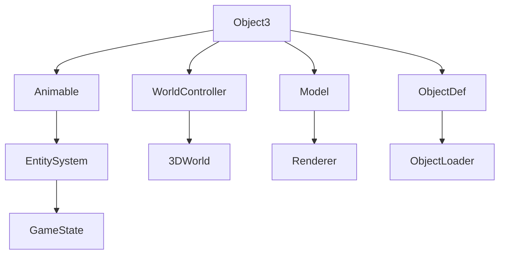

# Object3 → ZIKPHIFI

## Overview
Object3 extends Animable to represent 3D objects in the game world with positioning, orientation, and animation capabilities. It manages object coordinates, unique identifiers, and visual representation through Animable references for complex 3D world object rendering.

## Architecture
Object3 is a core component of the game's 3D object system, extending the base Animable class. It integrates with the WorldController for spatial positioning and the Model system for rendering. The class manages object state through coordinate arrays and provides the foundation for complex 3D object hierarchies in the game world.



## Forensic Evidence Commands

### 1. Structural Fingerprints
```bash
# Show class inheritance and modifiers
head -10 bytecode/client/ZIKPHIFI.bytecode.txt

# Show field count and types
grep -E "private|public|int|byte|XHHRODPC" bytecode/client/ZIKPHIFI.bytecode.txt | wc -l
grep -E "private|public|int|byte|XHHRODPC" bytecode/client/ZIKPHIFI.bytecode.txt

# Show method signatures
grep "(" bytecode/client/ZIKPHIFI.bytecode.txt | grep -v Code
```

### 2. Source Code Correlation
```bash
# Show DEOB class definition and inheritance
head -10 srcAllDummysRemoved/src/Object3.java

# Show key fields in source
grep -A 3 -B 2 "int anInt\|public Animable\|byte aByte" srcAllDummysRemoved/src/Object3.java

# Show javap cache field declarations
grep -A 8 -B 2 "anInt811\|Animable\|anInt812\|uid\|aByte816" srcAllDummysRemoved/.javap_cache/Object3.javap.cache
```

### 3. Field Structure Evidence
```bash
# Show exact field ordering in bytecode
grep -A 10 -B 2 "private int a\|private int b\|private int c\|public XHHRODPC d" bytecode/client/ZIKPHIFI.bytecode.txt

# Show constructor bytecode
grep -A 10 "Code:" bytecode/client/ZIKPHIFI.bytecode.txt

# Show source field structure
grep -A 10 -B 2 "anInt811\|anInt812\|anInt813\|aClass30_Sub2_Sub4_814\|uid\|aByte816" srcAllDummysRemoved/src/Object3.java
```

### 4. Animable Integration Evidence
```bash
# Show Animable field access
grep -A 5 -B 5 "XHHRODPC\|getfield.*d" bytecode/client/ZIKPHIFI.bytecode.txt

# Show constructor declaration
grep -A 10 "ZIKPHIFI();" bytecode/client/ZIKPHIFI.bytecode.txt

# Show source Animable assignment
grep -A 5 -B 5 "aClass30_Sub2_Sub4_814\|Animable" srcAllDummysRemoved/src/Object3.java
```

### 5. Cross-Reference Validation
```bash
# Verify unique mapping - no other classes reference ZIKPHIFI
grep -r "ZIKPHIFI" bytecode/client/ | grep -v "ZIKPHIFI.bytecode.txt" | wc -l

# Show class declaration in bytecode
grep "class ZIKPHIFI" bytecode/client/ZIKPHIFI.bytecode.txt

# Show inheritance in DEOB source
grep -A 2 -B 2 "extends.*Animable" srcAllDummysRemoved/src/Object3.java

# Show exact field count match
grep -E "private|public" bytecode/client/ZIKPHIFI.bytecode.txt | wc -l
```

## Sources and References
- **Bytecode**: bytecode/client/ZIKPHIFI.bytecode.txt
- **Deobfuscated Source**: srcAllDummysRemoved/src/Object3.java
- **Javap Cache**: srcAllDummysRemoved/.javap_cache/Object3.javap.cache
- **Animable System**: XHHRODPC (Animable) inheritance
- **3D Positioning**: Coordinate field management
- **Object Hierarchy**: Part of Object1-Object5 system</content>
<parameter name="filePath">bytecode/mapping/evidence/verified/Object3_ZIKPHIFI.md