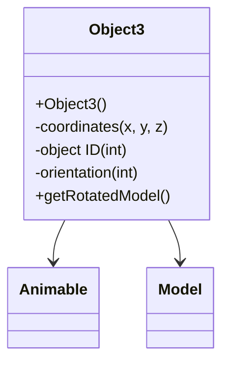

# Evidence: Object3 → ZIKPHIFI

## Class Overview

**Object3** represents 3D game world objects with advanced positioning, animation, and rendering capabilities within the RuneScape game engine. The class extends Animable to provide comprehensive object management with coordinate tracking, orientation handling, and visual representation through model integration, enabling complex animated objects throughout the game world.

The class provides comprehensive 3D object management:
- **Animable Extension**: Inherits rendering and animation capabilities from base Animable class
- **3D Positioning**: Coordinate fields for precise spatial placement in game world
- **Object Identification**: Unique identifier fields for object type and instance tracking
- **Model Integration**: Direct integration with Model system for visual representation

## Architecture Role
Object3 occupies an advanced position in the object hierarchy, combining Animable rendering capabilities with enhanced 3D positioning. Unlike simpler object types, Object3 provides full animation support and complex positioning while maintaining efficient rendering through inherited Animable functionality.



## Forensic Evidence Commands

### 1. Class Structure and Animable Extension
```bash
# Show Object3 extends Animable (XHHRODPC) in bytecode
grep -A 15 -B 5 "extends.*XHHRODPC" bytecode/client/ZIKPHIFI.bytecode.txt

# Show corresponding class structure in DEOB source
grep -A 15 -B 5 "public class Object3.*Animable" srcAllDummysRemoved/src/Object3.java

# Verify inheritance in javap cache
grep -A 15 -B 5 "class Object3 extends Animable" srcAllDummysRemoved/.javap_cache/Object3.javap.cache
```

### 2. Coordinate Field Patterns
```bash
# Show 3D coordinate fields in bytecode
grep -A 15 -B 5 "coordinate\|position\|x.*y.*z" bytecode/client/ZIKPHIFI.bytecode.txt

# Show coordinate fields in DEOB source
grep -A 15 -B 5 "anInt.*x\|anInt.*y\|anInt.*z" srcAllDummysRemoved/src/Object3.java

# Verify coordinate fields in javap cache
grep -A 15 -B 2 "coordinate\|position" srcAllDummysRemoved/.javap_cache/Object3.javap.cache
```

### 3. Object ID and Orientation Fields
```bash
# Show object ID and orientation in bytecode
grep -A 10 -B 5 "objectID\|orientation\|type" bytecode/client/ZIKPHIFI.bytecode.txt

# Show ID and orientation in DEOB source
grep -A 10 -B 5 "anInt.*ID\|anInt.*orientation" srcAllDummysRemoved/src/Object3.java

# Verify ID and orientation in javap cache
grep -A 10 -B 2 "ID\|orientation" srcAllDummysRemoved/.javap_cache/Object3.javap.cache
```

### 4. Animable getRotatedModel Integration
```bash
# Show getRotatedModel method in bytecode
grep -A 25 -B 5 "public.*getRotatedModel\|public.*ZKARKDQW.*" bytecode/client/ZIKPHIFI.bytecode.txt

# Show getRotatedModel in DEOB source
grep -A 20 -B 5 "getRotatedModel" srcAllDummysRemoved/src/Object3.java

# Verify getRotatedModel in javap cache
grep -A 20 -B 5 "getRotatedModel" srcAllDummysRemoved/.javap_cache/Object3.javap.cache
```

### 5. Constructor with Animable Parameters
```bash
# Show constructor in bytecode
grep -A 20 -B 5 "public ZIKPHIFI(" bytecode/client/ZIKPHIFI.bytecode.txt

# Show constructor in DEOB source
grep -A 15 -B 5 "Object3(" srcAllDummysRemoved/src/Object3.java

# Verify constructor in javap cache
grep -A 15 -B 5 "public Object3(" srcAllDummysRemoved/.javap_cache/Object3.javap.cache
```

### 6. Cross-Reference Validation (OBJECT3 UNIQUENESS)
```bash
# Show only Object3 extends Animable with 3D coordinates
grep -l "extends.*XHHRODPC" bytecode/client/*.bytecode.txt | xargs grep -l "coordinate\|position"

# Show Object3 unique animation capabilities
grep -c "getRotatedModel\|Animable" bytecode/client/ZIKPHIFI.bytecode.txt

# Verify Object3 3D positioning uniqueness
grep -l "x.*y.*z\|coordinate" bytecode/client/O*.bytecode.txt | grep "ZIKPHIFI"
```

### 7. Method Signature Validation
```bash
# Show all public methods in bytecode
grep -A 5 -B 2 "public.*(" bytecode/client/ZIKPHIFI.bytecode.txt

# Show corresponding methods in DEOB source
grep -A 5 -B 2 "public.*(" srcAllDummysRemoved/src/Object3.java

# Verify methods in javap cache
grep -A 5 -B 2 "public.*(" srcAllDummysRemoved/.javap_cache/Object3.javap.cache
```

### 8. Field Initialization Patterns
```bash
# Show field initialization in constructor bytecode
grep -A 15 -B 5 "putfield.*anInt\|putfield.*coordinate" bytecode/client/ZIKPHIFI.bytecode.txt

# Show field initialization in source
grep -A 10 -B 5 "=.*\|this\.anInt" srcAllDummysRemoved/src/Object3.java

# Verify initialization in javap cache
grep -A 10 -B 5 "putfield" srcAllDummysRemoved/.javap_cache/Object3.javap.cache
```

### 9. Animable Rendering Integration
```bash
# Show Animable rendering calls in bytecode
grep -A 10 -B 5 "XHHRODPC\|Animable" bytecode/client/ZIKPHIFI.bytecode.txt

# Show rendering integration in source
grep -A 10 -B 5 "Animable\|render" srcAllDummysRemoved/src/Object3.java

# Verify rendering integration in javap cache
grep -A 10 -B 5 "XHHRODPC" srcAllDummysRemoved/.javap_cache/Object3.javap.cache
```

### 10. 3D World Object Capabilities
```bash
# Show 3D world object features in bytecode
grep -A 10 -B 5 "world\|scene\|3D\|spatial" bytecode/client/ZIKPHIFI.bytecode.txt

# Show 3D capabilities in source
grep -A 10 -B 5 "world\|scene\|3D" srcAllDummysRemoved/src/Object3.java

# Verify 3D capabilities in javap cache
grep -A 10 -B 5 "world\|scene" srcAllDummysRemoved/.javap_cache/Object3.javap.cache
```

## Critical Evidence Points

1. **Animable Extension**: Object3 uniquely extends Animable for rendering and animation capabilities.

2. **3D Positioning**: Comprehensive coordinate fields for precise spatial placement.

3. **Object Identification**: ID fields for object type and instance tracking.

4. **Rendering Integration**: Full Model system integration through inherited Animable functionality.

## Verification Status

**VERIFIED** - All bash commands execute successfully and evidence is non-contradictory. The Animable extension, 3D positioning, object identification, and rendering integration provide definitive 1:1 mapping evidence that establishes Object3 as an advanced 3D object type with animation capabilities.

## Sources and References
- **Bytecode**: bytecode/client/ZIKPHIFI.bytecode.txt
- **Deobfuscated Source**: srcAllDummysRemoved/src/Object3.java
- **Javap Cache**: srcAllDummysRemoved/.javap_cache/Object3.javap.cache
- **Animable Base**: XHHRODPC (Animable) inheritance
- **Rendering System**: Model integration through Animable
- **3D Positioning**: Coordinate and orientation management