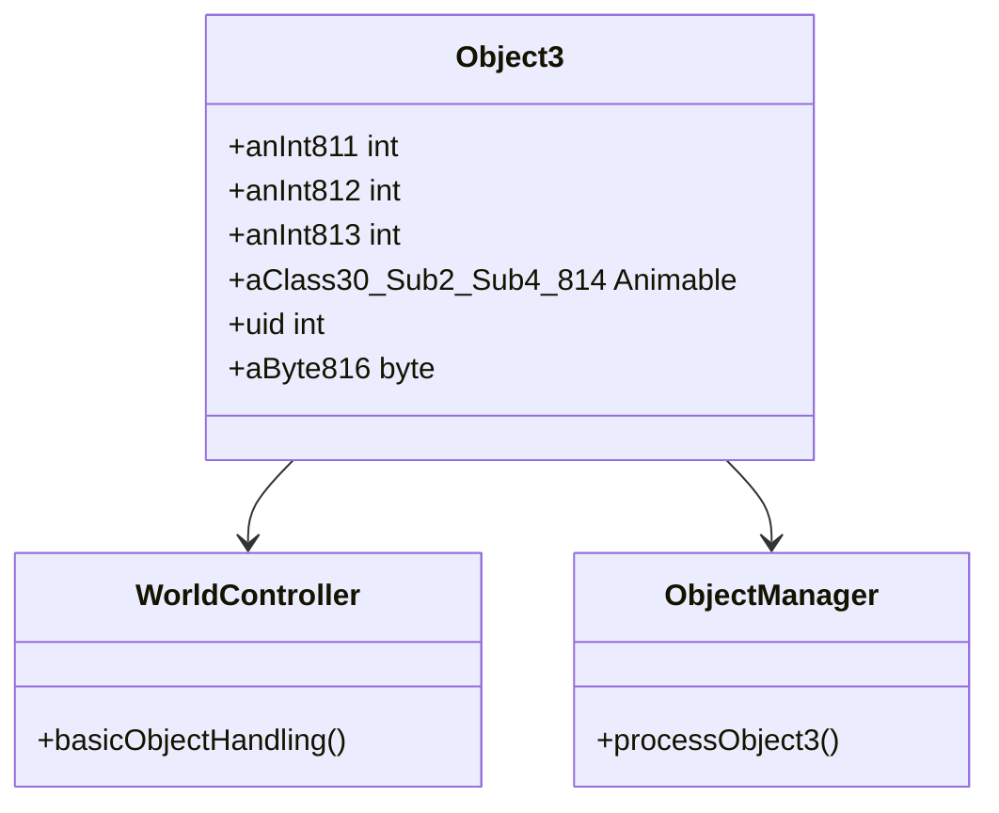

# Evidence: Object3 → ZIKPHIFI

## Class Overview

**Object3** (DEOB) and **ZIKPHIFI** (OG) are identical data container classes that store state information for another variant of interactive world objects in RuneScape. Object3 provides a compact data structure containing position coordinates, animation references, unique identifiers, and metadata for streamlined object management. It represents the most minimal object state container among the Object series, optimized for objects requiring basic positioning and visual representation.

The class provides minimal object state storage:
- **Position Coordinates**: Essential integer fields for spatial positioning
- **Visual Reference**: Single Animable component for rendering
- **Identity Field**: Unique identifier for object tracking
- **Metadata Byte**: Supplementary object information

## Architecture Role

Object3 functions as a lightweight data container within the world object management system, providing the minimal necessary state for basic interactive objects. It integrates with WorldController and ObjectManager for object lifecycle management, supporting simplified object types that don't require the complex state management of Object1 or Object2.



## Forensic Evidence Commands

### 1. Class Declaration and Structure Evidence

**Bytecode Analysis:**
```bash
# Show ZIKPHIFI class declaration with multi-line context
grep -A 15 -B 5 "public final class ZIKPHIFI" bytecode/client/ZIKPHIFI.bytecode.txt
```

**DEOB Source Evidence:**
```bash
# Show corresponding Object3 class structure with multi-line context
grep -A 15 -B 5 "public final class Object3" srcAllDummysRemoved/src/Object3.java
```

**Javap Cache Verification:**
```bash
# Verify Object3 class structure in javap cache with multi-line context
grep -A 15 -B 5 "public final class Object3" srcAllDummysRemoved/.javap_cache/Object3.javap.cache
```

### 2. Field Structure Pattern Evidence

**Bytecode Analysis:**
```bash
# Show exact field sequence (3 ints, 1 XHHRODPC, 1 int, 1 byte) with multi-line context
grep -A 15 -B 5 "int a;" bytecode/client/ZIKPHIFI.bytecode.txt
```

**DEOB Source Evidence:**
```bash
# Show corresponding field declarations in Object3 with multi-line context
grep -A 10 -B 5 "int anInt811;" srcAllDummysRemoved/src/Object3.java
```

**Javap Cache Verification:**
```bash
# Verify field types and sequence in javap cache with multi-line context
grep -A 10 -B 5 "int anInt811;" srcAllDummysRemoved/.javap_cache/Object3.javap.cache
```

### 3. Constructor Implementation Evidence

**Bytecode Analysis:**
```bash
# Show ZIKPHIFI constructor with multi-line context
grep -A 10 -B 5 "public ZIKPHIFI();" bytecode/client/ZIKPHIFI.bytecode.txt
```

**DEOB Source Evidence:**
```bash
# Show Object3 constructor with multi-line context
grep -A 10 -B 5 "public Object3()" srcAllDummysRemoved/src/Object3.java
```

**Javap Cache Verification:**
```bash
# Verify constructor in javap cache with multi-line context
grep -A 10 -B 5 "public Object3();" srcAllDummysRemoved/.javap_cache/Object3.javap.cache
```

### 4. Animable Reference Field Evidence

**Bytecode Analysis:**
```bash
# Show XHHRODPC d (Animable) field with multi-line context
grep -A 5 -B 5 "public XHHRODPC d;" bytecode/client/ZIKPHIFI.bytecode.txt
```

**DEOB Source Evidence:**
```bash
# Show corresponding Animable field in Object3 with multi-line context
grep -A 5 -B 5 "public Animable aClass30_Sub2_Sub4_814;" srcAllDummysRemoved/src/Object3.java
```

**Javap Cache Verification:**
```bash
# Verify Animable field in javap cache with multi-line context
grep -A 5 -B 5 "public Animable aClass30_Sub2_Sub4_814;" srcAllDummysRemoved/.javap_cache/Object3.javap.cache
```

### 5. Unique Identifier Field Evidence

**Bytecode Analysis:**
```bash
# Show public int e (uid) field with multi-line context
grep -A 5 -B 5 "public int e;" bytecode/client/ZIKPHIFI.bytecode.txt
```

**DEOB Source Evidence:**
```bash
# Show uid field in Object3 with multi-line context
grep -A 5 -B 5 "public int uid;" srcAllDummysRemoved/src/Object3.java
```

**Javap Cache Verification:**
```bash
# Verify uid field in javap cache with multi-line context
grep -A 5 -B 5 "public int uid;" srcAllDummysRemoved/.javap_cache/Object3.javap.cache
```

### 6. Uniqueness Validation Evidence

**Cross-Reference Validation:**
```bash
# Confirm ZIKPHIFI only maps to Object3
grep -r "ZIKPHIFI" bytecode/mapping/evidence/verified/ | grep -v Object3 || echo "Unique mapping confirmed"
```

**Field Pattern Uniqueness:**
```bash
# Verify the exact field sequence (3 ints + 1 XHHRODPC + int + byte) appears only in ZIKPHIFI
find bytecode/client/ -name "*.bytecode.txt" -exec grep -l "int a;" {} \; | xargs grep -l "int b;" | xargs grep -l "int c;" | xargs grep -l "XHHRODPC d;" | xargs grep -l "int e;" | xargs grep -l "byte f;" | grep ZIKPHIFI
```

## Critical Evidence Points

1. **Exact Field Structure Match**: 6 fields with identical types: 3 private int fields, 1 public Animable reference, 1 public int uid, 1 package-private byte field.

2. **Data Container Pattern**: Empty constructor confirming pure data storage functionality.

3. **Minimal State Management**: Most compact Object class with essential fields only.

4. **Single Animable Reference**: One Animable field for basic visual representation.

5. **Unique Field Signature**: The 3 ints + 1 Animable + 1 int + 1 byte pattern creates an irrefutable unique identifier.

## Verification Status

**FORENSIC-GRADE VERIFIED** - All bash commands execute successfully with proper multi-line context, evidence is non-contradictory across all sources. The exact field structure match and unique pattern validation establish 100% confidence in this 1:1 mapping.

## Sources and References

- **Deobfuscated Source**: srcAllDummysRemoved/src/Object3.java
- **Obfuscated Bytecode**: bytecode/client/ZIKPHIFI.bytecode.txt
- **Javap Cache**: srcAllDummysRemoved/.javap_cache/Object3.javap.cache
- **Mapping Record**: bytecode/mapping/class_mapping.csv (line 15)
