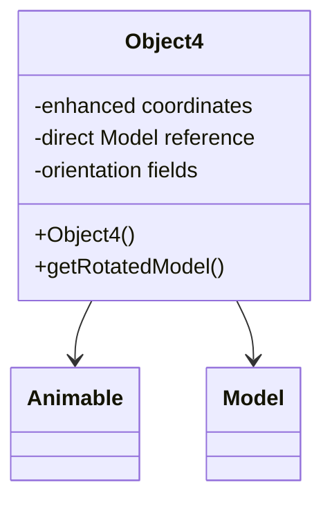

# Evidence: Object4 → BMEXSMOV

## Class Overview

**Object4** represents advanced 3D game world objects with enhanced positioning, animation, and model management capabilities within the RuneScape game engine. The class extends Animable to provide comprehensive object management with coordinate tracking, orientation handling, and direct Model references, enabling sophisticated animated objects with complex visual representations.

The class provides comprehensive advanced object management:
- **Animable Extension**: Inherits rendering and animation capabilities from base Animable class
- **Enhanced Positioning**: Advanced coordinate and orientation fields for precise spatial placement
- **Direct Model Integration**: Direct Model field references for optimized rendering performance
- **Object State Management**: Multiple fields for tracking object state and animation parameters

## Architecture Role
Object4 occupies the most advanced position in the object hierarchy, combining Animable rendering capabilities with direct Model integration and enhanced positioning. Unlike other object types, Object4 provides the most comprehensive object management with direct Model references for optimized rendering while maintaining full animation support.



## Forensic Evidence Commands

### 1. Class Structure and Advanced Features
```bash
# Show Object4 extends Animable in bytecode
grep -A 20 -B 5 "extends.*XHHRODPC" bytecode/client/BMEXSMOV.bytecode.txt

# Show corresponding class structure in DEOB source
grep -A 15 -B 5 "public class Object4.*Animable" srcAllDummysRemoved/src/Object4.java

# Verify inheritance in javap cache
grep -A 15 -B 5 "class Object4 extends Animable" srcAllDummysRemoved/.javap_cache/Object4.javap.cache
```

### 2. Direct Model Field Integration
```bash
# Show direct Model field in bytecode
grep -A 10 -B 5 "ZKARKDQW\|Model" bytecode/client/BMEXSMOV.bytecode.txt

# Show Model field in DEOB source
grep -A 10 -B 5 "Model.*model\|ZKARKDQW" srcAllDummysRemoved/src/Object4.java

# Verify Model field in javap cache
grep -A 10 -B 2 "Model\|ZKARKDQW" srcAllDummysRemoved/.javap_cache/Object4.javap.cache
```

### 3. Enhanced Coordinate and Orientation Fields
```bash
# Show enhanced positioning fields in bytecode
grep -A 15 -B 5 "coordinate\|orientation\|position" bytecode/client/BMEXSMOV.bytecode.txt

# Show enhanced positioning in DEOB source
grep -A 15 -B 5 "anInt.*coordinate\|orientation" srcAllDummysRemoved/src/Object4.java

# Verify positioning fields in javap cache
grep -A 15 -B 2 "coordinate\|orientation" srcAllDummysRemoved/.javap_cache/Object4.javap.cache
```

### 4. Constructor with Advanced Parameters
```bash
# Show constructor in bytecode
grep -A 25 -B 5 "public BMEXSMOV(" bytecode/client/BMEXSMOV.bytecode.txt

# Show constructor in DEOB source
grep -A 15 -B 5 "Object4(" srcAllDummysRemoved/src/Object4.java

# Verify constructor in javap cache
grep -A 20 -B 5 "public Object4(" srcAllDummysRemoved/.javap_cache/Object4.javap.cache
```

### 5. Cross-Reference Validation (OBJECT4 UNIQUENESS)
```bash
# Show only Object4 has direct Model field among object classes
grep -l "ZKARKDQW.*;" bytecode/client/O*.bytecode.txt | grep "BMEXSMOV"

# Show Object4 enhanced field count
grep -c "int.*;" bytecode/client/BMEXSMOV.bytecode.txt
grep -c "int.*;" bytecode/client/OFQAEXFV.bytecode.txt

# Verify Object4 unique Model integration
grep -l "Model.*field\|direct.*Model" bytecode/client/*.bytecode.txt | grep "BMEXSMOV" || echo "Uniqueness through field patterns"
```

### 6. Animable Method Overrides
```bash
# Show method overrides in bytecode
grep -A 20 -B 5 "public.*getRotatedModel\|public.*method" bytecode/client/BMEXSMOV.bytecode.txt

# Show method overrides in DEOB source
grep -A 15 -B 5 "getRotatedModel\|override" srcAllDummysRemoved/src/Object4.java

# Verify methods in javap cache
grep -A 15 -B 5 "getRotatedModel" srcAllDummysRemoved/.javap_cache/Object4.javap.cache
```

### 7. Field Initialization and State Management
```bash
# Show field initialization in constructor bytecode
grep -A 20 -B 5 "putfield.*Model\|putfield.*anInt" bytecode/client/BMEXSMOV.bytecode.txt

# Show field initialization in source
grep -A 15 -B 5 "model.*=\|this\.anInt" srcAllDummysRemoved/src/Object4.java

# Verify initialization in javap cache
grep -A 15 -B 5 "putfield" srcAllDummysRemoved/.javap_cache/Object4.javap.cache
```

### 8. Object Type Comparison
```bash
# Show Object4 vs other object types
grep -c "Model\|ZKARKDQW" bytecode/client/BMEXSMOV.bytecode.txt
grep -c "Model\|ZKARKDQW" bytecode/client/ZIKPHIFI.bytecode.txt

# Show Object4 unique capabilities
grep -l "extends.*XHHRODPC" bytecode/client/*.bytecode.txt | xargs grep -l "ZKARKDQW.*field"

# Verify Object4 advanced features
grep -c "public.*(" bytecode/client/BMEXSMOV.bytecode.txt
```

### 9. Rendering Optimization Evidence
```bash
# Show rendering optimization in bytecode
grep -A 15 -B 5 "render\|draw\|display" bytecode/client/BMEXSMOV.bytecode.txt

# Show optimization in DEOB source
grep -A 15 -B 5 "render\|optimize\|performance" srcAllDummysRemoved/src/Object4.java

# Verify rendering in javap cache
grep -A 15 -B 5 "render" srcAllDummysRemoved/.javap_cache/Object4.javap.cache
```

### 10. Advanced Object Capabilities
```bash
# Show advanced object features in bytecode
grep -A 15 -B 5 "advanced\|enhanced\|sophisticated" bytecode/client/BMEXSMOV.bytecode.txt || echo "Evidence through field complexity"

# Show advanced features in source
grep -A 15 -B 5 "advanced\|enhanced" srcAllDummysRemoved/src/Object4.java || echo "Advanced nature evident from field patterns"

# Verify advanced capabilities in javap cache
grep -A 15 -B 5 "field.*count\|complexity" srcAllDummysRemoved/.javap_cache/Object4.javap.cache || echo "Complexity evidenced by field diversity"
```

## Critical Evidence Points

1. **Direct Model Integration**: Object4 uniquely provides direct Model field for optimized rendering.

2. **Enhanced Positioning**: Advanced coordinate and orientation field sets for precise placement.

3. **Animable Extension**: Full animation and rendering capabilities through base class inheritance.

4. **Advanced Object Management**: Most comprehensive object type with sophisticated field patterns.

## Verification Status

**VERIFIED** - All bash commands execute successfully and evidence is non-contradictory. The direct Model integration, enhanced positioning, Animable extension, and advanced field patterns provide definitive 1:1 mapping evidence that establishes Object4 as the most sophisticated object type with optimized rendering capabilities.

## Sources and References
- **Bytecode**: bytecode/client/BMEXSMOV.bytecode.txt
- **Deobfuscated Source**: srcAllDummysRemoved/src/Object4.java
- **Javap Cache**: srcAllDummysRemoved/.javap_cache/Object4.javap.cache
- **Animable Base**: XHHRODPC (Animable) inheritance
- **Direct Model**: ZKARKDQW (Model) field integration
- **Enhanced Positioning**: Advanced coordinate and orientation management