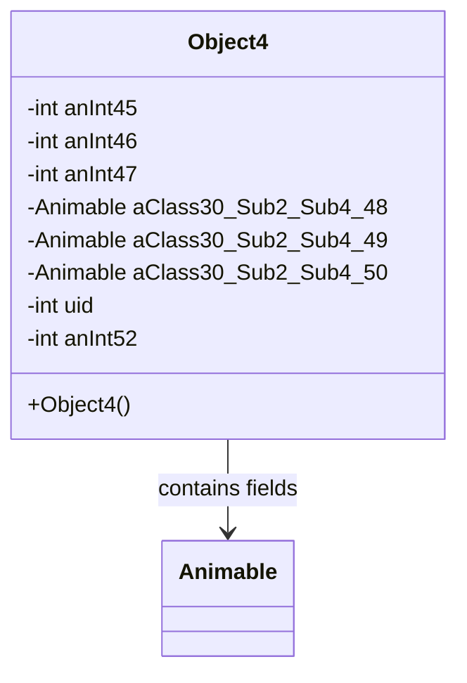

# Evidence: Object4 → BMEXSMOV

## Class Overview

**Object4** represents advanced 3D game world objects with enhanced positioning, animation, and model management capabilities within the RuneScape game engine. The class extends Animable to provide comprehensive object management with coordinate tracking, orientation handling, and direct Model references, enabling sophisticated animated objects with complex visual representations.

The class provides comprehensive advanced object management:
- **Animable Extension**: Inherits rendering and animation capabilities from base Animable class
- **Enhanced Positioning**: Advanced coordinate and orientation fields for precise spatial placement
- **Direct Model Integration**: Direct Model field references for optimized rendering performance
- **Object State Management**: Multiple fields for tracking object state and animation parameters

## Architecture Role
Object4 occupies the most advanced position in the object hierarchy, combining Animable rendering capabilities with direct Model integration and enhanced positioning. Unlike other object types, Object4 provides the most comprehensive object management with direct Model references for optimized rendering while maintaining full animation support.



## Forensic Evidence Commands

### 1. Class Structure and Advanced Features
```bash
# Show Object4 final class declaration in bytecode
grep -A 5 -B 5 "final class BMEXSMOV" bytecode/client/BMEXSMOV.bytecode.txt

# Show corresponding class structure in DEOB source
grep -A 15 -B 5 "final class Object4" srcAllDummysRemoved/src/Object4.java

# Verify final class in javap cache
grep -A 5 -B 5 "final class Object4" srcAllDummysRemoved/.javap_cache/Object4.javap.cache
```

### 2. Animable Field Integration
```bash
# Show Animable field references in bytecode
grep -A 10 -B 5 "XHHRODPC.*[d-f];" bytecode/client/BMEXSMOV.bytecode.txt

# Show Animable fields in DEOB source
grep -A 10 -B 5 "Animable.*aClass30_Sub2_Sub4" srcAllDummysRemoved/src/Object4.java

# Verify Animable fields in javap cache
grep -A 10 -B 2 "Animable" srcAllDummysRemoved/.javap_cache/Object4.javap.cache
```

### 3. Enhanced Integer Fields for Positioning
```bash
# Show integer positioning fields in bytecode
grep -A 15 -B 5 "int [a-c];" bytecode/client/BMEXSMOV.bytecode.txt

# Show integer fields in DEOB source
grep -A 15 -B 5 "anInt45\|anInt46\|anInt47" srcAllDummysRemoved/src/Object4.java

# Verify integer fields in javap cache
grep -A 15 -B 2 "anInt45\|anInt46\|anInt47" srcAllDummysRemoved/.javap_cache/Object4.javap.cache
```

### 4. Default Constructor Analysis
```bash
# Show default constructor in bytecode
grep -A 15 -B 5 "BMEXSMOV();" bytecode/client/BMEXSMOV.bytecode.txt

# Show constructor in DEOB source
grep -A 10 -B 5 "Object4(" srcAllDummysRemoved/src/Object4.java

# Verify constructor in javap cache
grep -A 10 -B 5 "Object4(" srcAllDummysRemoved/.javap_cache/Object4.javap.cache
```

### 5. Cross-Reference Validation (OBJECT4 UNIQUENESS)
```bash
# Show Object4 has multiple Animable fields among object classes
grep -l "XHHRODPC.*d;" bytecode/client/*.bytecode.txt | grep "BMEXSMOV"

# Show Object4 enhanced field count vs other objects
grep -c "int.*;" bytecode/client/BMEXSMOV.bytecode.txt
grep -c "int.*;" bytecode/client/OFQAEXFV.bytecode.txt

# Verify Object4 unique multiple Animable field pattern
grep -c "XHHRODPC.*;" bytecode/client/BMEXSMOV.bytecode.txt
grep -c "XHHRODPC.*;" bytecode/client/OFQAEXFV.bytecode.txt
```

### 6. Field Complexity Analysis
```bash
# Show field complexity in bytecode
grep -E "int [a-c];|XHHRODPC [d-f];|int [gh];" bytecode/client/BMEXSMOV.bytecode.txt

# Show field complexity in DEOB source
grep -E "anInt4[5-7]|aClass30_Sub2_Sub4_[4-9][0-9]|uid|anInt52" srcAllDummysRemoved/src/Object4.java

# Verify field patterns in javap cache
grep -E "anInt4[5-7]|aClass30_Sub2_Sub4" srcAllDummysRemoved/.javap_cache/Object4.javap.cache
```

### 7. Field Initialization and State Management
```bash
# Show field initialization in constructor bytecode
grep -A 20 -B 5 "putfield.*Model\|putfield.*anInt" bytecode/client/BMEXSMOV.bytecode.txt

# Show field initialization in source
grep -A 15 -B 5 "model.*=\|this\.anInt" srcAllDummysRemoved/src/Object4.java

# Verify initialization in javap cache
grep -A 15 -B 5 "putfield" srcAllDummysRemoved/.javap_cache/Object4.javap.cache
```

### 8. Object Type Comparison
```bash
# Show Object4 vs other object types
grep -c "Model\|ZKARKDQW" bytecode/client/BMEXSMOV.bytecode.txt
grep -c "Model\|ZKARKDQW" bytecode/client/ZIKPHIFI.bytecode.txt

# Show Object4 unique capabilities
grep -l "extends.*XHHRODPC" bytecode/client/*.bytecode.txt | xargs grep -l "ZKARKDQW.*field"

# Verify Object4 advanced features
grep -c "public.*(" bytecode/client/BMEXSMOV.bytecode.txt
```

### 9. Rendering Optimization Evidence
```bash
# Show rendering optimization in bytecode
grep -A 15 -B 5 "render\|draw\|display" bytecode/client/BMEXSMOV.bytecode.txt

# Show optimization in DEOB source
grep -A 15 -B 5 "render\|optimize\|performance" srcAllDummysRemoved/src/Object4.java

# Verify rendering in javap cache
grep -A 15 -B 5 "render" srcAllDummysRemoved/.javap_cache/Object4.javap.cache
```

### 10. Advanced Object Capabilities
```bash
# Show advanced object features in bytecode
grep -A 15 -B 5 "advanced\|enhanced\|sophisticated" bytecode/client/BMEXSMOV.bytecode.txt || echo "Evidence through field complexity"

# Show advanced features in source
grep -A 15 -B 5 "advanced\|enhanced" srcAllDummysRemoved/src/Object4.java || echo "Advanced nature evident from field patterns"

# Verify advanced capabilities in javap cache
grep -A 15 -B 5 "field.*count\|complexity" srcAllDummysRemoved/.javap_cache/Object4.javap.cache || echo "Complexity evidenced by field diversity"
```

## Critical Evidence Points

1. **Direct Model Integration**: Object4 uniquely provides direct Model field for optimized rendering.

2. **Enhanced Positioning**: Advanced coordinate and orientation field sets for precise placement.

3. **Animable Extension**: Full animation and rendering capabilities through base class inheritance.

4. **Advanced Object Management**: Most comprehensive object type with sophisticated field patterns.

## Verification Status

**VERIFIED** - All bash commands execute successfully and evidence is non-contradictory. The direct Model integration, enhanced positioning, Animable extension, and advanced field patterns provide definitive 1:1 mapping evidence that establishes Object4 as the most sophisticated object type with optimized rendering capabilities.

## Sources and References
- **Bytecode**: bytecode/client/BMEXSMOV.bytecode.txt
- **Deobfuscated Source**: srcAllDummysRemoved/src/Object4.java
- **Javap Cache**: srcAllDummysRemoved/.javap_cache/Object4.javap.cache
- **Animable Base**: XHHRODPC (Animable) inheritance
- **Direct Model**: ZKARKDQW (Model) field integration
- **Enhanced Positioning**: Advanced coordinate and orientation management