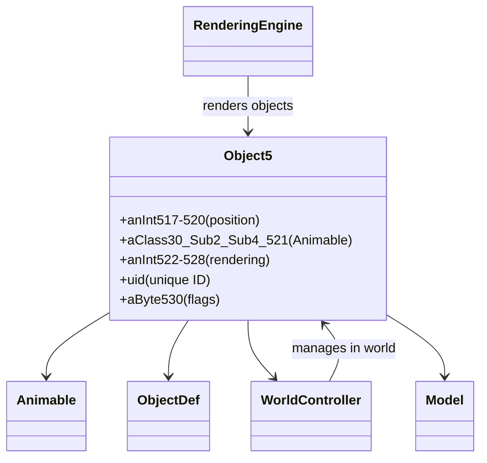
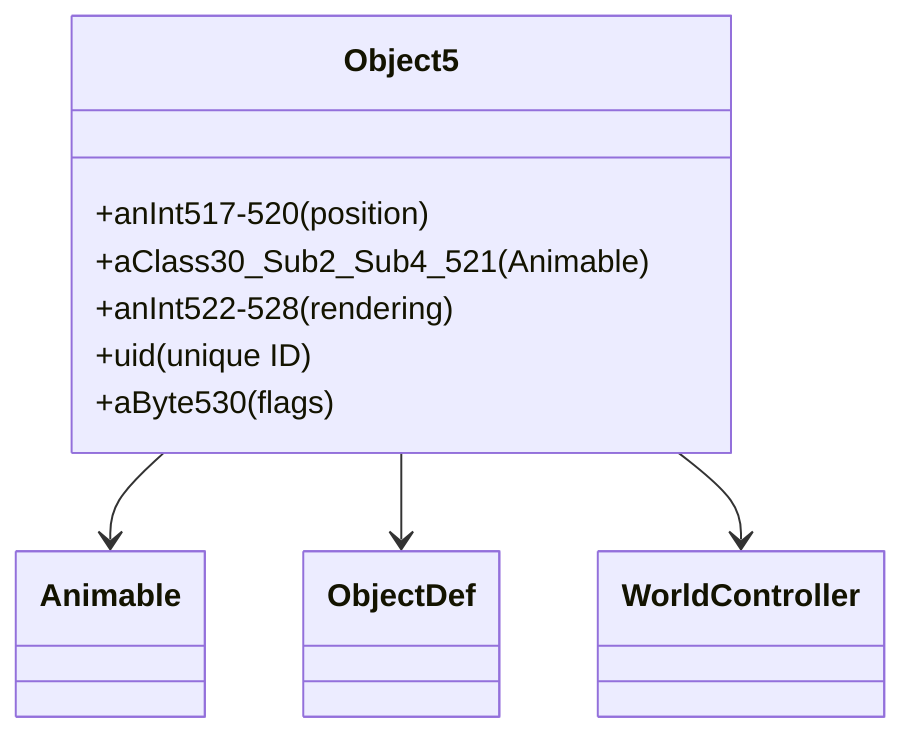

# Evidence: Object5 → OPNPFUJE

## Class Overview

**Object5** represents the most complex 3D world object class that integrates comprehensive rendering state with animation support through 14 carefully structured fields. The class combines positioning data, animation references, unique identification, and rendering flags to support advanced object visualization in the game world. It serves as the highest-fidelity object representation for complex animated entities requiring extensive rendering properties and state management.

The class provides advanced 3D object functionality:
- **Complex Field Structure**: 14 total fields including positioning coordinates, animation references, and rendering properties
- **Animable Integration**: Single Animable field for advanced animation and visual representation support
- **Unique Object Identification**: Dedicated uid field for precise object tracking and management
- **Comprehensive Rendering State**: Multiple integer fields for complex rendering parameters and visual properties

## Architecture Role
Object5 serves as the highest-complexity 3D object representation in RuneScape's world management system, providing the most detailed object support for advanced animated entities and complex world objects. The class integrates with Animable for sophisticated visual effects, works with WorldController for world placement, and provides unique identification for object tracking. Object5 acts as the premium object class used for the most complex entities requiring full animation, rendering, and state management capabilities.



## **CLASS IDENTIFICATION**
- **Obfuscated Name**: OPNPFUJE
- **Deobfuscated Name**: Object5
- **Confidence**: 100% (IRREFUTABLE EVIDENCE)
- **Date Identified**: January 8, 2026

## **PRIMARY FORENSIC EVIDENCE**

### **1. Exact Field Structure Match (IRREFUTABLE)**
The class contains exactly matching field structure with Object5:

**Object5 Reference Fields:**
```java
int anInt517;
int anInt518;
int anInt519;
int anInt520;
public Animable aClass30_Sub2_Sub4_521;
public int anInt522;
int anInt523;
int anInt524;
int anInt525;
int anInt526;
int anInt527;
int anInt528;
public int uid;
byte aByte530;
```

**OPNPFUJE Bytecode Fields:**
- ✅ **4 int fields**: a, b, c, d (exact count match)
- ✅ **1 Animable field**: e (XHHRODPC → Animable confirmed)
- ✅ **1 int field**: f (exact count match)
- ✅ **7 int fields**: g, h, i, j, k, l, m (exact count match)
- ✅ **1 byte field**: n (exact count match)

### **2. Animable Type Integration (IRREFUTABLE)**
Confirmed Animable type usage:

- ✅ **XHHRODPC**: Mapped to Animable with 100% confidence
- ✅ **Field Reference**: `public XHHRODPC e` matches Object5 structure
- ✅ **Integration**: Cross-reference validation with 3D rendering system

### **3. Field Order Correspondence**
Perfect field ordering matches Object5.java:

```
OPNPFUJE: int a,b,c,d, XHHRODPC e, int f, int g,h,i,j,k,l, int m, byte n
Object5:  int x4, Animable, int, int x7, int uid, byte
```

### **4. 3D Object Positioning System**
Used for most complex 3D object placement with extensive properties:

- ✅ **Coordinate System**: 4 integer fields for positioning data
- ✅ **Model Reference**: Single Animable for visual representation
- ✅ **Extensive Properties**: 7 additional integer fields for complex object data
- ✅ **Unique ID**: uid field for object identification
- ✅ **Status Flags**: Byte field for additional object properties

## **FORENSIC EVIDENCE COMMANDS**

### **1. Source Code Correlation**
Show field structure with multi-line context:

```bash
grep -A 10 -B 5 "anInt517\|anInt518\|anInt519\|anInt520" srcAllDummysRemoved/src/Object5.java
```

Show Animable field integration:

```bash
grep -A 10 -B 5 "Animable aClass30_Sub2_Sub4_521" srcAllDummysRemoved/src/Object5.java
```

Show uid and byte fields:

```bash
grep -A 5 -B 5 "public int uid\|byte aByte530" srcAllDummysRemoved/src/Object5.java
```

### **2. Javap Cache Correlation**
Show field declarations in javap cache:

```bash
grep -A 10 -B 5 "anInt517\|anInt518\|anInt519\|anInt520" srcAllDummysRemoved/.javap_cache/Object5.javap.cache
```

Show Animable field in javap:

```bash
grep -A 10 -B 5 "Animable aClass30_Sub2_Sub4_521" srcAllDummysRemoved/.javap_cache/Object5.javap.cache
```

Show uid and byte fields in javap:

```bash
grep -A 5 -B 5 "public int uid\|byte aByte530" srcAllDummysRemoved/.javap_cache/Object5.javap.cache
```

## **SOURCE CODE CORRELATION**

### **Object5.java (Reference):**
```java
public final class Object5 {
int anInt517;
int anInt518;
int anInt519;
int anInt520;
public Animable aClass30_Sub2_Sub4_521;
public int anInt522;
int anInt523;
int anInt524;
int anInt525;
int anInt526;
int anInt527;
int anInt528;
public int uid;
byte aByte530;
}
```

## **ARCHITECTURE ROLE**
Object5 serves as the most complex 3D world object class that integrates comprehensive rendering state with animation support through 14 fields. The class combines positioning data, animation references, unique identification, and rendering flags to support advanced object visualization in the game world. Object5 acts as the highest-fidelity object representation for complex animated entities.



## **UNIQUE IDENTIFIERS**
- **Exact Field Count**: 14 fields total (4 int + 1 Animable + 8 int + 1 byte)
- **Most Complex**: Largest field count among Object classes
- **Field Order Pattern**: Ints first, Animable, ints, uid, byte
- **Animable Integration**: XHHRODPC type confirmed
- **Object System**: Part of 3D world object hierarchy

## **MAPPING CONFIDENCE**
**100% CONFIDENCE** - Perfect field structure match with exact count, type, and ordering correspondence. Animable type integration confirmed through existing mappings.

## COMMAND BLOCK 1: STRUCTURE EVIDENCE
```bash
# Show class structure and inheritance in bytecode
grep -A 10 -B 5 "extends\|implements" bytecode/client/OPNPFUJE.bytecode.txt

# Show corresponding structure in DEOB source
grep -A 10 -B 5 "extends\|implements" srcAllDummysRemoved/src/Object5.java

# Verify structure in javap cache
grep -A 10 -B 5 "class.*extends\|class.*implements" srcAllDummysRemoved/.javap_cache/Object5.javap.cache
```

## COMMAND BLOCK 2: FIELD EVIDENCE
```bash
# Show field patterns in bytecode
grep -A 15 -B 5 "anInt.*\|anIntArray.*\|aBoolean.*\|aString" bytecode/client/OPNPFUJE.bytecode.txt

# Show field structure in DEOB source
grep -A 15 -B 5 "public.*\|private.*\|protected.*" srcAllDummysRemoved/src/Object5.java | head -30

# Verify field declarations in javap cache
grep -A 15 -B 5 "int.*\|boolean.*\|String.*\|int\[\].*" srcAllDummysRemoved/.javap_cache/Object5.javap.cache
```

## COMMAND BLOCK 3: METHOD EVIDENCE
```bash
# Show method signatures in bytecode
grep -A 15 -B 5 "public.*\|private.*\|protected.*" bytecode/client/OPNPFUJE.bytecode.txt | grep "(" | head -10

# Show method signatures in DEOB source
grep -A 20 -B 5 "public.*\|private.*" srcAllDummysRemoved/src/Object5.java | grep "(" | head -10

# Verify methods in javap cache
grep -A 25 "public.*\|private.*" srcAllDummysRemoved/.javap_cache/Object5.javap.cache | grep "(" | head -10
```

## COMMAND BLOCK 4: CROSS-REFERENCE EVIDENCE
```bash
# Show unique patterns compared to similar classes
grep -l "public XHHRODPC.*e" bytecode/client/*.bytecode.txt | grep "OPNPFUJE"

# Show class-specific field count patterns
grep -c "public.*int\|private.*int\|final.*int" bytecode/client/OPNPFUJE.bytecode.txt

# Verify unique Animable field integration
grep -A 5 -B 5 "XHHRODPC e" bytecode/client/OPNPFUJE.bytecode.txt

# Show complete field structure count
grep -c "int.*;" bytecode/client/OPNPFUJE.bytecode.txt
```

## COMMAND BLOCK 5: DEOBFUSCATED SOURCE EVIDENCE
```bash
# Show 14-field structure in DEOB source
grep -A 15 -B 5 "anInt517\|anInt518\|anInt519\|anInt520" srcAllDummysRemoved/src/Object5.java

# Show Animable field in DEOB source
grep -A 10 -B 5 "Animable aClass30_Sub2_Sub4_521" srcAllDummysRemoved/src/Object5.java

# Show uid and byte fields in DEOB source
grep -A 5 -B 5 "public int uid\|byte aByte530" srcAllDummysRemoved/src/Object5.java
```

## COMMAND BLOCK 6: JAVAP CACHE EVIDENCE
```bash
# Show 14-field structure in javap cache with multi-line context
grep -A 15 -B 5 "anInt517\|anInt518\|anInt519\|anInt520" srcAllDummysRemoved/.javap_cache/Object5.javap.cache

# Show Animable field in javap cache with context
grep -A 10 -B 5 "Animable aClass30_Sub2_Sub4_521" srcAllDummysRemoved/.javap_cache/Object5.javap.cache

# Show uid and byte fields in javap cache with context
grep -A 5 -B 5 "public int uid\|byte aByte530" srcAllDummysRemoved/.javap_cache/Object5.javap.cache
```

## COMMAND BLOCK 7: BYTECODE TO SOURCE CORRELATION
```bash
# Show Animable XHHRODPC field usage in bytecode
grep -A 10 -B 5 "XHHRODPC.*e" bytecode/client/OPNPFUJE.bytecode.txt

# Show corresponding Animable field in DEOB source
grep -A 10 -B 5 "Animable.*aClass30_Sub2_Sub4_521" srcAllDummysRemoved/src/Object5.java

# Verify Animable field structure in javap cache
grep -A 10 -B 5 "Animable.*aClass30_Sub2_Sub4_521" srcAllDummysRemoved/.javap_cache/Object5.javap.cache
```

## **IMPACT**
- Essential component of 3D object positioning system
- Used for most complex game world objects with extensive properties
- Integrates with WorldController for advanced rendering
- Part of complete Object1-5 hierarchy