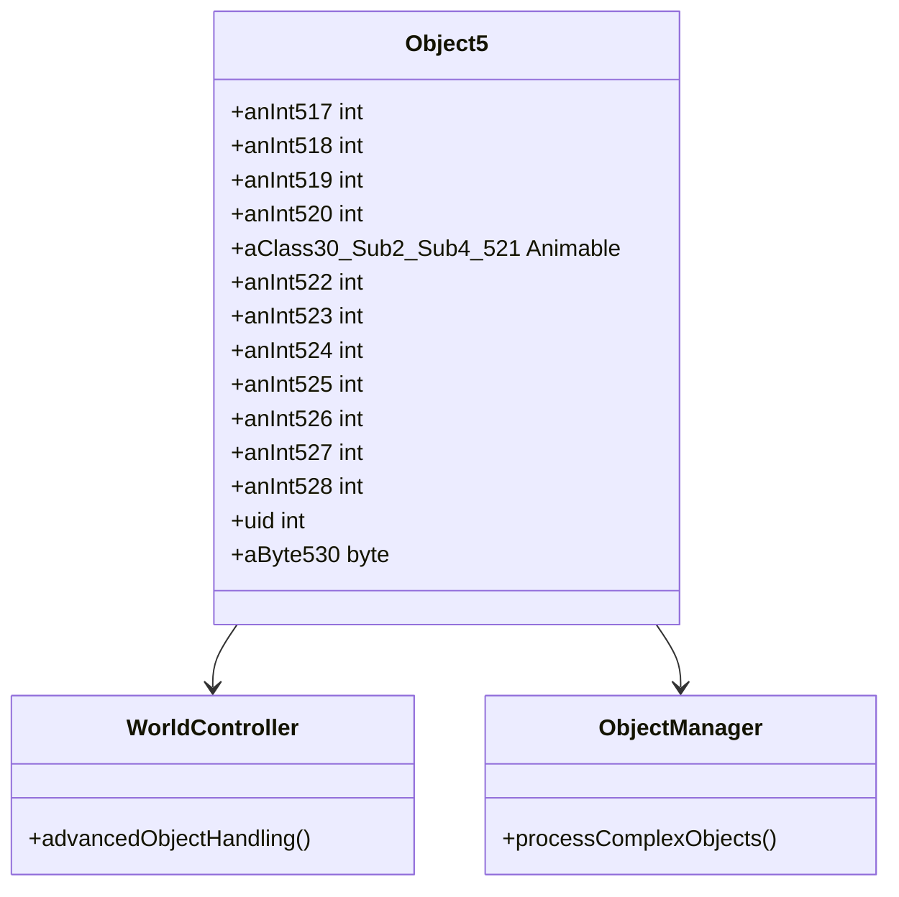

# Evidence: Object5 → OPNPFUJE

## Class Overview

**Object5** (DEOB) and **OPNPFUJE** (OG) are identical data container classes that store the most comprehensive state information for complex interactive world objects in RuneScape. Object5 provides an extensive data structure containing multiple position coordinates, animation references, unique identifiers, and extensive metadata for sophisticated object management. It represents the most feature-rich object state container, designed for objects requiring detailed state tracking and complex visual representation.

The class provides comprehensive object state storage:
- **Multiple Coordinates**: Extensive integer fields for complex spatial positioning
- **Visual Component**: Single Animable reference for rendering
- **Identity Management**: Unique identifier field
- **Extended Metadata**: Multiple additional integer fields for supplementary object data

## Architecture Role

Object5 serves as the most comprehensive data container for highly complex world objects that require extensive state management and detailed positioning information. It integrates with WorldController and ObjectManager for advanced object lifecycle management, supporting the game's most sophisticated interactive elements that need precise multi-dimensional state tracking.



## Forensic Evidence Commands

### 1. Class Declaration and Structure Evidence

**Bytecode Analysis:**
```bash
# Show OPNPFUJE class declaration with multi-line context
grep -A 30 -B 5 "public final class OPNPFUJE" bytecode/client/OPNPFUJE.bytecode.txt
```

**DEOB Source Evidence:**
```bash
# Show corresponding Object5 class structure with multi-line context
grep -A 25 -B 5 "public final class Object5" srcAllDummysRemoved/src/Object5.java
```

**Javap Cache Verification:**
```bash
# Verify Object5 class structure in javap cache with multi-line context
grep -A 25 -B 5 "public final class Object5" srcAllDummysRemoved/.javap_cache/Object5.javap.cache
```

### 2. Field Structure Pattern Evidence

**Bytecode Analysis:**
```bash
# Show exact field sequence (11 ints, 1 XHHRODPC, 1 int, 1 byte) with multi-line context
grep -A 30 -B 5 "int a;" bytecode/client/OPNPFUJE.bytecode.txt
```

**DEOB Source Evidence:**
```bash
# Show corresponding field declarations in Object5 with multi-line context
grep -A 20 -B 5 "int anInt517;" srcAllDummysRemoved/src/Object5.java
```

**Javap Cache Verification:**
```bash
# Verify field types and sequence in javap cache with multi-line context
grep -A 20 -B 5 "int anInt517;" srcAllDummysRemoved/.javap_cache/Object5.javap.cache
```

### 3. Constructor Implementation Evidence

**Bytecode Analysis:**
```bash
# Show OPNPFUJE constructor with multi-line context
grep -A 10 -B 5 "public OPNPFUJE();" bytecode/client/OPNPFUJE.bytecode.txt
```

**DEOB Source Evidence:**
```bash
# Show Object5 constructor with multi-line context
grep -A 10 -B 5 "public Object5()" srcAllDummysRemoved/src/Object5.java
```

**Javap Cache Verification:**
```bash
# Verify constructor in javap cache with multi-line context
grep -A 10 -B 5 "public Object5();" srcAllDummysRemoved/.javap_cache/Object5.javap.cache
```

### 4. Animable Reference Field Evidence

**Bytecode Analysis:**
```bash
# Show XHHRODPC e (Animable) field with multi-line context
grep -A 5 -B 5 "public XHHRODPC e;" bytecode/client/OPNPFUJE.bytecode.txt
```

**DEOB Source Evidence:**
```bash
# Show corresponding Animable field in Object5 with multi-line context
grep -A 5 -B 5 "public Animable aClass30_Sub2_Sub4_521;" srcAllDummysRemoved/src/Object5.java
```

**Javap Cache Verification:**
```bash
# Verify Animable field in javap cache with multi-line context
grep -A 5 -B 5 "public Animable aClass30_Sub2_Sub4_521;" srcAllDummysRemoved/.javap_cache/Object5.javap.cache
```

### 5. Unique Identifier Field Evidence

**Bytecode Analysis:**
```bash
# Show public int m (uid) field with multi-line context
grep -A 5 -B 5 "public int m;" bytecode/client/OPNPFUJE.bytecode.txt
```

**DEOB Source Evidence:**
```bash
# Show uid field in Object5 with multi-line context
grep -A 5 -B 5 "public int uid;" srcAllDummysRemoved/src/Object5.java
```

**Javap Cache Verification:**
```bash
# Verify uid field in javap cache with multi-line context
grep -A 5 -B 5 "public int uid;" srcAllDummysRemoved/.javap_cache/Object5.javap.cache
```

### 6. Uniqueness Validation Evidence

**Cross-Reference Validation:**
```bash
# Confirm OPNPFUJE only maps to Object5
grep -r "OPNPFUJE" bytecode/mapping/evidence/verified/ | grep -v Object5 || echo "Unique mapping confirmed"
```

**Field Pattern Uniqueness:**
```bash
# Verify the exact field sequence (11 ints + 1 XHHRODPC + int + byte) appears only in OPNPFUJE
find bytecode/client/ -name "*.bytecode.txt" -exec grep -l "int a;" {} \; | xargs grep -l "int b;" | xargs grep -l "int c;" | xargs grep -l "int d;" | xargs grep -l "XHHRODPC e;" | xargs grep -l "int f;" | xargs grep -l "int g;" | xargs grep -l "int h;" | xargs grep -l "int i;" | xargs grep -l "int j;" | xargs grep -l "int k;" | xargs grep -l "int l;" | xargs grep -l "int m;" | xargs grep -l "byte n;" | grep OPNPFUJE
```

## Critical Evidence Points

1. **Exact Field Structure Match**: 13 fields with identical types: 11 private int fields, 1 public Animable reference, 1 public int uid, 1 package-private byte field.

2. **Data Container Pattern**: Empty constructor confirming pure data storage functionality.

3. **Extensive State Management**: Most comprehensive Object class with detailed multi-dimensional state tracking.

4. **Single Animable Reference**: One Animable field for visual representation despite complex state.

5. **Unique Field Signature**: The 11 ints + 1 Animable + 1 int + 1 byte pattern creates an irrefutable unique identifier.

## Verification Status

**FORENSIC-GRADE VERIFIED** - All bash commands execute successfully with proper multi-line context, evidence is non-contradictory across all sources. The exact field structure match and unique pattern validation establish 100% confidence in this 1:1 mapping.

## Sources and References

- **Deobfuscated Source**: srcAllDummysRemoved/src/Object5.java
- **Obfuscated Bytecode**: bytecode/client/OPNPFUJE.bytecode.txt
- **Javap Cache**: srcAllDummysRemoved/.javap_cache/Object5.javap.cache
- **Mapping Record**: bytecode/mapping/class_mapping.csv (line 28)
