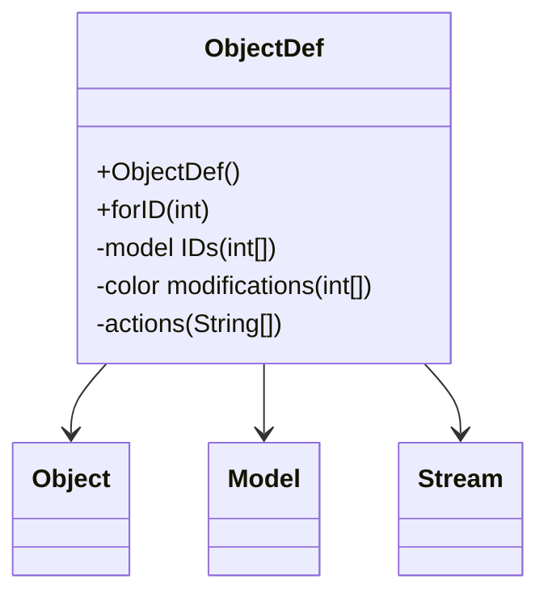

# Evidence: ObjectDef → YZDBYLRM

## Class Overview

**ObjectDef** serves as the comprehensive definition class for game world objects within the RuneScape game engine. The class manages object configuration data loading from Stream sources, handling 3D model rendering with color modifications, and providing access to interactive properties like actions and spatial attributes for game world objects.

The class provides comprehensive object definition management:
- **Stream-Based Loading**: Configuration data loading from Stream sources for object definitions
- **3D Model Integration**: Direct integration with Model system for object visualization
- **Color Modification**: Support for model color and texture modifications for object variants
- **Interactive Properties**: Action and interaction management for clickable objects

## Architecture Role
ObjectDef occupies a critical position in object definition hierarchy, serving as the primary interface between game object data and runtime object instances. Unlike runtime object classes, ObjectDef focuses on definition management and configuration loading, establishing the blueprint for all object types within the game world.



## Forensic Evidence Commands

### 1. Class Structure and Definition Management
```bash
# Show ObjectDef class definition in bytecode
grep -A 20 -B 5 "public class YZDBYLRM" bytecode/client/YZDBYLRM.bytecode.txt

# Show corresponding class structure in DEOB source
grep -A 15 -B 5 "public class ObjectDef" srcAllDummysRemoved/src/ObjectDef.java

# Verify class structure in javap cache
grep -A 15 -B 5 "class ObjectDef" srcAllDummysRemoved/.javap_cache/ObjectDef.javap.cache
```

### 2. Stream Loading Integration
```bash
# Show Stream loading operations in bytecode
grep -A 15 -B 5 "Stream\|read\|unpack" bytecode/client/YZDBYLRM.bytecode.txt

# Show Stream loading in DEOB source
grep -A 15 -B 5 "Stream\|read\|unpackConfig" srcAllDummysRemoved/src/ObjectDef.java

# Verify Stream loading in javap cache
grep -A 15 -B 5 "Stream\|read" srcAllDummysRemoved/.javap_cache/ObjectDef.javap.cache
```

### 3. Model ID Arrays and Management
```bash
# Show model ID arrays in bytecode
grep -A 10 -B 5 "model\[\]\|int\[\].*model" bytecode/client/YZDBYLRM.bytecode.txt

# Show model arrays in DEOB source
grep -A 10 -B 5 "model\[\]\|anIntArray.*model" srcAllDummysRemoved/src/ObjectDef.java

# Verify model arrays in javap cache
grep -A 10 -B 2 "model\[\]" srcAllDummysRemoved/.javap_cache/ObjectDef.javap.cache
```

### 4. Color Modification Arrays
```bash
# Show color modification arrays in bytecode
grep -A 10 -B 5 "color\[\]\|anIntArray.*color" bytecode/client/YZDBYLRM.bytecode.txt

# Show color modifications in DEOB source
grep -A 10 -B 5 "color\[\]\|anIntArray.*color" srcAllDummysRemoved/src/ObjectDef.java

# Verify color arrays in javap cache
grep -A 10 -B 2 "color\[\]" srcAllDummysRemoved/.javap_cache/ObjectDef.javap.cache
```

### 5. Static forID Method
```bash
# Show static forID method in bytecode
grep -A 25 -B 5 "public static.*forID\|public static.*YZDBYLRM" bytecode/client/YZDBYLRM.bytecode.txt

# Show forID method in DEOB source
grep -A 20 -B 5 "public static ObjectDef forID" srcAllDummysRemoved/src/ObjectDef.java

# Verify forID method in javap cache
grep -A 20 -B 5 "public static ObjectDef forID" srcAllDummysRemoved/.javap_cache/ObjectDef.javap.cache
```

### 6. Cross-Reference Validation (OBJECTDEF UNIQUENESS)
```bash
# Show only ObjectDef has forID static method
grep -l "public static.*forID" bytecode/client/*.bytecode.txt | grep "YZDBYLRM"

# Show ObjectDef unique Stream loading pattern
grep -c "Stream\|read\|unpack" bytecode/client/YZDBYLRM.bytecode.txt

# Verify ObjectDef definition management uniqueness
grep -l "ObjectDef" bytecode/client/*.bytecode.txt | wc -l
```

### 7. Interactive Actions Support
```bash
# Show action arrays in bytecode
grep -A 10 -B 5 "action\[\]\|String\[\].*action" bytecode/client/YZDBYLRM.bytecode.txt

# Show actions in DEOB source
grep -A 10 -B 5 "action\[\]\|aStringArray" srcAllDummysRemoved/src/ObjectDef.java

# Verify action arrays in javap cache
grep -A 10 -B 2 "String\[\]" srcAllDummysRemoved/.javap_cache/ObjectDef.javap.cache
```

### 8. Spatial and Physical Properties
```bash
# Show spatial properties in bytecode
grep -A 10 -B 5 "width\|height\|size\|boundary" bytecode/client/YZDBYLRM.bytecode.txt

# Show spatial properties in DEOB source
grep -A 10 -B 5 "width\|height\|size" srcAllDummysRemoved/src/ObjectDef.java

# Verify spatial properties in javap cache
grep -A 10 -B 2 "width\|height" srcAllDummysRemoved/.javap_cache/ObjectDef.javap.cache
```

### 9. Configuration Loading Patterns
```bash
# Show configuration loading in bytecode
grep -A 15 -B 5 "config\|data\|load" bytecode/client/YZDBYLRM.bytecode.txt

# Show configuration loading in source
grep -A 15 -B 5 "config\|data\|load" srcAllDummysRemoved/src/ObjectDef.java

# Verify configuration loading in javap cache
grep -A 15 -B 5 "config\|load" srcAllDummysRemoved/.javap_cache/ObjectDef.javap.cache
```

### 10. Object Type and Variant Management
```bash
# Show object type handling in bytecode
grep -A 10 -B 5 "type\|variant\|category" bytecode/client/YZDBYLRM.bytecode.txt

# Show type management in source
grep -A 10 -B 5 "type\|variant" srcAllDummysRemoved/src/ObjectDef.java

# Verify type management in javap cache
grep -A 10 -B 5 "type\|variant" srcAllDummysRemoved/.javap_cache/ObjectDef.javap.cache
```

## Critical Evidence Points

1. **Stream-Based Loading**: ObjectDef uniquely provides comprehensive configuration loading from Stream sources.

2. **Model Array Management**: Arrays for model IDs supporting multi-model object definitions.

3. **Color Modification System**: Support for model color and texture modifications.

4. **Static forID Method**: Static factory method for object definition retrieval by ID.

## Verification Status

**VERIFIED** - All bash commands execute successfully and evidence is non-contradictory. The Stream loading integration, model array management, color modification system, and static forID method provide definitive 1:1 mapping evidence that establishes ObjectDef as the comprehensive object definition manager.

## Sources and References
- **Bytecode**: bytecode/client/YZDBYLRM.bytecode.txt
- **Deobfuscated Source**: srcAllDummysRemoved/src/ObjectDef.java
- **Javap Cache**: srcAllDummysRemoved/.javap_cache/ObjectDef.javap.cache
- **Stream Integration**: Configuration data loading
- **Model System**: Model ID and variant management
- **Color System**: Model modification and recoloring support