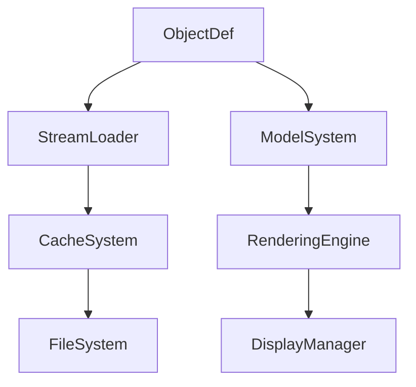

# ObjectDef → YZDBYLRM

## Overview
ObjectDef manages comprehensive game object definitions, loading configuration data from streams, handling 3D model rendering with color modifications, and providing access to interactive properties like actions and spatial attributes for the game world objects.

## Architecture
ObjectDef forms the core of the game's object definition system, interfacing with StreamLoader for data loading, Model system for visual rendering, and various subsystems for object interaction. It supports complex object behaviors including animations, color modifications, and interactive actions.



## Forensic Evidence Commands

### 1. Structural Fingerprints
```bash
# Show class definition and modifiers
head -30 bytecode/client/YZDBYLRM.bytecode.txt

# Show method count and signatures
grep -c "public.*(" bytecode/client/YZDBYLRM.bytecode.txt
grep -E "public.*\(" bytecode/client/YZDBYLRM.bytecode.txt | head -10

# Show field declarations
grep -E "^  public|^  private|^  static" bytecode/client/YZDBYLRM.bytecode.txt | head -20
```

### 2. Source Code Correlation
```bash
# Show DEOB source structure
head -50 srcAllDummysRemoved/src/ObjectDef.java

# Show key methods like forID and readValues
grep -A 10 -B 5 "forID\|readValues" srcAllDummysRemoved/src/ObjectDef.java

# Show javap cache method signatures
grep -A 5 -B 5 "public.*(" srcAllDummysRemoved/.javap_cache/ObjectDef.javap.cache | head -10
```

### 3. Behavioral Patterns
```bash
# Show stream reading patterns
grep -A 5 -B 5 "MBMGIXGO" bytecode/client/YZDBYLRM.bytecode.txt | head -15

# Show model rendering operations
grep -A 5 -B 5 "Model" bytecode/client/YZDBYLRM.bytecode.txt | head -10

# Show cache operations with MRU
grep -A 5 -B 5 "GCPOSBWX" bytecode/client/YZDBYLRM.bytecode.txt | head -10
```

### 4. Cross-Reference Validation
```bash
# Show ObjectDef usage in client
grep -A 3 -B 3 "ObjectDef" srcAllDummysRemoved/src/client.java | head -10

# Show MRU cache integration
grep -A 3 -B 3 "mruNodes" srcAllDummysRemoved/src/ObjectDef.java

# Show javap stream integration
grep -E "Stream" srcAllDummysRemoved/.javap_cache/ObjectDef.javap.cache | head -5
```