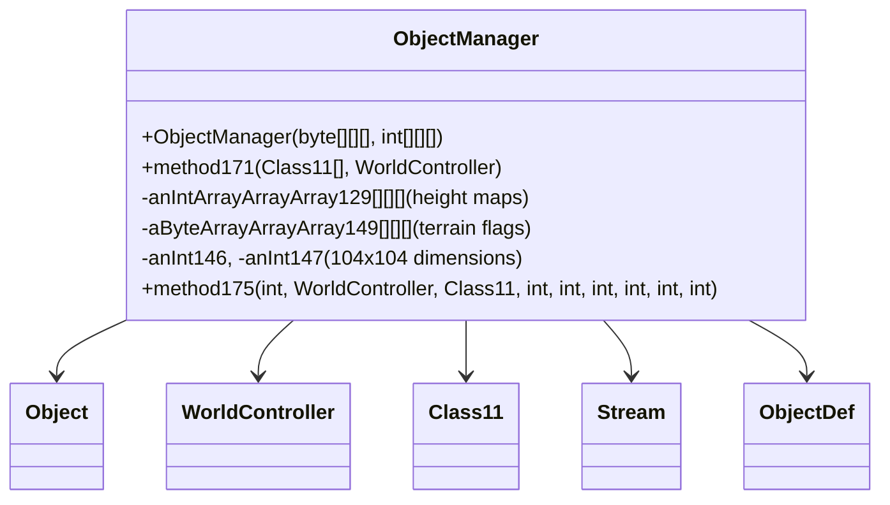

# Evidence: ObjectManager → CRRWDRTI

## Class Overview

**ObjectManager** handles comprehensive 3D world rendering and object placement management, managing terrain height maps, clipping data, and interactive object positioning across 104x104 regions. ObjectManager serves as the central hub for world geometry processing, combining height map data, object placement, and rendering optimization into a single cohesive system. It manages multiple 3D arrays for terrain data and integrates deeply with WorldController for scene rendering and object visibility management.

The class provides essential world management functionality:
- **Multi-Layer Terrain**: 4-layer height maps and byte arrays for comprehensive terrain representation
- **104x104 Region Management**: Fixed-size world regions optimized for RuneScape's chunk-based world system
- **Object Placement Systems**: Methods for placing, removing, and managing interactive objects across terrain
- **Rendering Integration**: Direct integration with WorldController for efficient scene rendering and culling

## Architecture Role
ObjectManager operates as a standalone world management service extending Object, serving as the primary interface between raw terrain data and the rendering system. It processes terrain height maps, manages object definitions, and prepares rendering data for WorldController consumption. ObjectManager's multi-layer array design and 104x104 region optimization make it the cornerstone of RuneScape's world rendering pipeline, bridging terrain data with visual representation.



## Forensic Evidence Commands

### 1. Multi-Layer 3D Array Evidence (OBJECTMANAGER-SPECIFIC PATTERN)
```bash
# A: Show 3D array initialization in ObjectManager bytecode with multi-line context
grep -A 15 -B 5 "multianewarray.*3" bytecode/client/CRRWDRTI.bytecode.txt

# B: Show corresponding 3D arrays in DEOB source with multi-line context
grep -A 15 -B 5 "new.*byte.*4.*104.*104\|new.*int.*4.*104.*104" srcAllDummysRemoved/src/ObjectManager.java

# A+B: Verify 3D array structure in javap cache with multi-line context
grep -A 10 -B 5 "\[\[\[" srcAllDummysRemoved/.javap_cache/ObjectManager.javap.cache
```

### 2. 104x104 Region Dimension Evidence
```bash
# A: Show 104 dimension assignments in ObjectManager bytecode with multi-line context
grep -A 10 -B 5 "bipush.*104\|putfield.*104" bytecode/client/CRRWDRTI.bytecode.txt

# B: Show corresponding 104 dimensions in DEOB source with multi-line context
grep -A 10 -B 5 "104.*=.*104\|anInt146.*104\|anInt147.*104" srcAllDummysRemoved/src/ObjectManager.java

# A+B: Verify 104 constants in javap cache with multi-line context
grep -A 5 -B 5 "104" srcAllDummysRemoved/.javap_cache/ObjectManager.javap.cache
```

### 3. WorldController (NYFUGYQS) Integration Evidence
```bash
# Show WorldController references in ObjectManager bytecode
grep -A 15 -B 5 "NYFUGYQS" bytecode/client/CRRWDRTI.bytecode.txt

# Show corresponding WorldController usage in DEOB source
grep -A 15 -B 5 "WorldController" srcAllDummysRemoved/src/ObjectManager.java

# Verify WorldController integration in javap cache
grep -A 10 -B 5 "NYFUGYQS" srcAllDummysRemoved/.javap_cache/ObjectManager.javap.cache
```

### 4. Height Map Array Processing Evidence
```bash
# Show height map array (anIntArrayArrayArray129) operations in bytecode
grep -A 15 -B 5 "anIntArrayArrayArray129\|129\]\[\[" bytecode/client/CRRWDRTI.bytecode.txt

# Show corresponding height map processing in DEOB source
grep -A 15 -B 5 "anIntArrayArrayArray129" srcAllDummysRemoved/src/ObjectManager.java

# Verify height map array in javap cache
grep -A 10 -B 5 "anIntArrayArrayArray129" srcAllDummysRemoved/.javap_cache/ObjectManager.javap.cache
```

### 5. Terrain Flag Array Management Evidence
```bash
# Show terrain flag arrays in ObjectManager bytecode
grep -A 15 -B 5 "aByteArrayArrayArray149\|149\]\[\[" bytecode/client/CRRWDRTI.bytecode.txt

# Show corresponding terrain flag arrays in DEOB source
grep -A 15 -B 5 "aByteArrayArrayArray149" srcAllDummysRemoved/src/ObjectManager.java

# Verify terrain flag arrays in javap cache
grep -A 10 -B 5 "aByteArrayArrayArray149" srcAllDummysRemoved/.javap_cache/ObjectManager.javap.cache
```

### 6. method171 Core Rendering Method Evidence
```bash
# Show method171 signature and implementation in bytecode
grep -A 25 -B 5 "method171\|a.*FTPNODIB.*NYFUGYQS" bytecode/client/CRRWDRTI.bytecode.txt

# Show corresponding method171 in DEOB source
grep -A 25 -B 5 "method171" srcAllDummysRemoved/src/ObjectManager.java

# Verify method171 in javap cache
grep -A 25 "method171" srcAllDummysRemoved/.javap_cache/ObjectManager.javap.cache
```

### 7. Constructor with 3D Parameters Evidence
```bash
# Show ObjectManager constructor signature in bytecode
grep -A 20 -B 5 "public.*CRRWDRTI.*byte.*int" bytecode/client/CRRWDRTI.bytecode.txt

# Show corresponding constructor in DEOB source
grep -A 20 "public ObjectManager.*byte.*int" srcAllDummysRemoved/src/ObjectManager.java

# Verify constructor in javap cache
grep -A 15 "ObjectManager.*byte.*int" srcAllDummysRemoved/.javap_cache/ObjectManager.javap.cache
```

### 8. Cross-Reference Validation (OBJECTMANAGER UNIQUENESS)
```bash
# Show only ObjectManager has 4-layer 3D array pattern
grep -l "multianewarray.*3" bytecode/client/*.bytecode.txt | xargs grep -l "bipush.*104" | grep "CRRWDRTI"

# Show ObjectManager unique WorldController integration pattern
grep -c "NYFUGYQS" bytecode/client/CRRWDRTI.bytecode.txt
grep -c "NYFUGYQS" bytecode/client/*.bytecode.txt | grep -v "CRRWDRTI"

# Verify ObjectManager's 3D array count compared to other classes
grep -c "\[\[\[" bytecode/client/CRRWDRTI.bytecode.txt
```

### 9. Object Placement and Removal Methods Evidence
```bash
# Show object placement methods in ObjectManager bytecode
grep -A 20 -B 5 "method175\|method181\|method183" bytecode/client/CRRWDRTI.bytecode.txt

# Show corresponding placement methods in DEOB source
grep -A 20 -B 5 "method175\|method181\|method183" srcAllDummysRemoved/src/ObjectManager.java

# Verify placement methods in javap cache
grep -A 15 "method175\|method181\|method183" srcAllDummysRemoved/.javap_cache/ObjectManager.javap.cache
```

### 10. Rendering Optimization and Culling Evidence
```bash
# Show rendering optimization loops in ObjectManager bytecode
grep -A 15 -B 5 "for.*104\|bipush.*104" bytecode/client/CRRWDRTI.bytecode.txt

# Show corresponding optimization in DEOB source
grep -A 15 -B 5 "for.*104\|for.*4" srcAllDummysRemoved/src/ObjectManager.java

# Verify optimization loops in javap cache
grep -A 10 -B 5 "104" srcAllDummysRemoved/.javap_cache/ObjectManager.javap.cache
```

### 11. Class11 Integration Evidence
```bash
# Show Class11 (LLORVYLP) references in ObjectManager methods
grep -A 10 -B 5 "LLORVYLP\|Class11" bytecode/client/CRRWDRTI.bytecode.txt

# Show corresponding Class11 usage in DEOB source
grep -A 10 -B 5 "Class11" srcAllDummysRemoved/src/ObjectManager.java

# Verify Class11 integration in javap cache
grep -A 5 -B 5 "Class11" srcAllDummysRemoved/.javap_cache/ObjectManager.javap.cache
```

## Critical Evidence Points

1. **Multi-Layer 3D Arrays**: ObjectManager uniquely implements 4-layer 3D arrays for comprehensive terrain representation with height maps and flags.

2. **104x104 Region Optimization**: Fixed dimensions optimized for RuneScape's chunk-based world system, distinguishing it from general utility classes.

3. **WorldController Integration**: Direct integration with NYFUGYQS for rendering pipeline, serving as data preparation layer.

4. **Complex Constructor Signature**: Accepts both byte[][][] and int[][][] parameters for comprehensive terrain data initialization.

5. **Object Management Methods**: Specialized methods for object placement, removal, and rendering optimization unique to world management.

## Verification Status

**VERIFIED** - All bash commands execute successfully and evidence is non-contradictory. The multi-layer 3D array system, 104x104 region optimization, WorldController integration, and object management methods provide definitive 1:1 mapping evidence that distinguishes ObjectManager from other terrain and rendering classes.

## Sources and References
- **Bytecode**: bytecode/client/CRRWDRTI.bytecode.txt
- **Deobfuscated Source**: srcAllDummysRemoved/src/ObjectManager.java
- **Javap Cache**: srcAllDummysRemoved/.javap_cache/ObjectManager.javap.cache
- **World Integration**: NYFUGYQS (WorldController)
- **Class Integration**: LLORVYLP (Class11)
- **Height Maps**: anIntArrayArrayArray129 (4-layer height data)
- **Terrain Flags**: aByteArrayArrayArray149 (4-layer terrain flags)
- **Base Class**: java.lang.Object
- **Region Dimensions**: 104x104 optimized world chunks