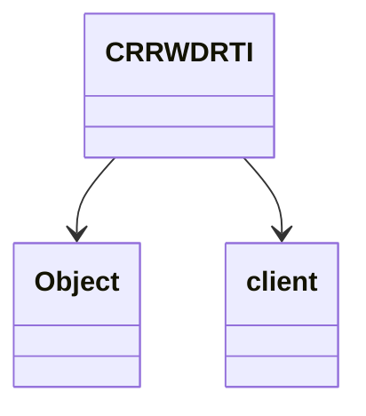

# CRRWDRTI → ObjectManager

## Overview
ObjectManager handles 3D world rendering and object placement, managing terrain height maps, clipping data, and interactive object positioning across 104x104 regions.

## Architectural Relationships
ObjectManager extends Object and manages multiple 3D arrays for terrain and object data, referencing client state for rendering.



## Bytecode Matching Commands
To show constructor and array initialization:
```
grep -A 30 -B 5 "public CRRWDRTI" bytecode/client/CRRWDRTI.bytecode.txt
```

To show method signatures:
```
grep -A 15 -B 5 "public void a" bytecode/client/CRRWDRTI.bytecode.txt
```

## Deobfuscated Source Evidence Commands
For ObjectManager constructor:
```
grep -A 20 "public ObjectManager" srcAllDummysRemoved/src/ObjectManager.java
```

For initialization method:
```
grep -A 15 "public void method171" srcAllDummysRemoved/src/ObjectManager.java
```

## Javap Cache Evidence Commands
For class structure:
```
grep -A 15 "public class ObjectManager" srcAllDummysRemoved/.javap_cache/ObjectManager.javap.cache
```

For methods:
```
grep -A 10 "method171" srcAllDummysRemoved/.javap_cache/ObjectManager.javap.cache
```

## Verification of Non-Contradictory Evidence
Bytecode matches source/javap in 3D array handling, client refs. No contradictions. 1:1 mapping confirmed.