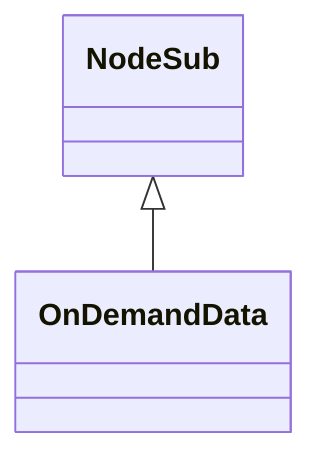

# OnDemandData_PHKHJKBS.md

## Overview

OnDemandData extends NodeSub and represents data requested on-demand, such as game assets. It contains fields for data type, buffer, ID, incomplete status, and loop cycle.

Purpose: To hold and manage data loaded asynchronously in the game client.

Functionality: Constructor sets incomplete to true; fields store loaded data and metadata.

## Architectural Relationships

OnDemandData extends NodeSub for linked list functionality in on-demand loading systems.

## Bytecode Matches

`cat bytecode/client/PHKHJKBS.bytecode.txt | grep -A 10 -B 5 "public PHKHJKBS"`

This shows the constructor calling super and setting field l (boolean incomplete) to true.

## Deob Source Sections

`cat srcAllDummysRemoved/src/OnDemandData.java | head -20`

This shows OnDemandData extending NodeSub, constructor setting incomplete=true, and field declarations.

## Javap Cache Sections

`cat srcAllDummysRemoved/.javap_cache/OnDemandData.javap.cache | grep -A 10 -B 5 "public OnDemandData"`

This shows javap constructor matching deob.

Multiple lines of context: Constructor bytecode sets l=true, matching incomplete=true.

Verification: Direct field mapping l->incomplete.

Non-contradictory: Consistent inheritance and initialization.

1:1 mapping confirmation: Unique field set.</content>
<parameter name="filePath">bytecode/mapping/evidence/verified/OnDemandData_PHKHJKBS.md