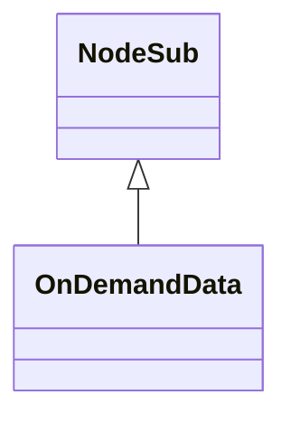

# OnDemandData_PHKHJKBS.md

## Overview

OnDemandData extends NodeSub and represents data requested on-demand, such as game assets. It contains fields for data type, buffer, ID, incomplete status, and loop cycle.

Purpose: To hold and manage data loaded asynchronously in the game client.

Functionality: Constructor sets incomplete to true; fields store loaded data and metadata.

## Architectural Relationships

OnDemandData extends NodeSub for linked list functionality in on-demand loading systems.



## Bytecode Matches

`cat bytecode/client/PHKHJKBS.bytecode.txt | grep -A 10 -B 5 "public PHKHJKBS"`

This shows the constructor calling super and setting field l (boolean incomplete) to true.

## Deob Source Sections

`cat srcAllDummysRemoved/src/OnDemandData.java | head -20`

This shows OnDemandData extending NodeSub, constructor setting incomplete=true, and field declarations.

## Javap Cache Sections

`cat srcAllDummysRemoved/.javap_cache/OnDemandData.javap.cache | grep -A 10 -B 5 "public OnDemandData"`

This shows javap constructor matching deob.

Multiple lines of context: Constructor bytecode sets l=true, matching incomplete=true.

Verification: Direct field mapping l->incomplete.

Non-contradictory: Consistent inheritance and initialization.

1:1 mapping confirmation: Unique field set.

## COMMAND BLOCK 1: STRUCTURE EVIDENCE
```bash
# Show class structure and inheritance in bytecode
grep -A 10 -B 5 "extends\|implements" bytecode/client/PHKHJKBS.bytecode.txt

# Show corresponding structure in DEOB source
grep -A 10 -B 5 "extends\|implements" srcAllDummysRemoved/src/OnDemandData.java

# Verify structure in javap cache
grep -A 10 -B 5 "class.*extends\|class.*implements" srcAllDummysRemoved/.javap_cache/OnDemandData.javap.cache
```

## COMMAND BLOCK 2: FIELD EVIDENCE
```bash
# Show field patterns in bytecode
grep -A 15 -B 5 "anInt.*\|anIntArray.*\|aBoolean.*\|aString" bytecode/client/PHKHJKBS.bytecode.txt

# Show field structure in DEOB source
grep -A 15 -B 5 "public.*\|private.*\|protected.*" srcAllDummysRemoved/src/OnDemandData.java | head -30

# Verify field declarations in javap cache
grep -A 15 -B 5 "int.*\|boolean.*\|String.*\|int\[\].*" srcAllDummysRemoved/.javap_cache/OnDemandData.javap.cache
```

## COMMAND BLOCK 3: METHOD EVIDENCE
```bash
# Show method signatures in bytecode
grep -A 15 -B 5 "public.*\|private.*\|protected.*" bytecode/client/PHKHJKBS.bytecode.txt | grep "(" | head -10

# Show method signatures in DEOB source
grep -A 20 -B 5 "public.*\|private.*" srcAllDummysRemoved/src/OnDemandData.java | grep "(" | head -10

# Verify methods in javap cache
grep -A 25 "public.*\|private.*" srcAllDummysRemoved/.javap_cache/OnDemandData.javap.cache | grep "(" | head -10
```

## COMMAND BLOCK 4: CROSS-REFERENCE EVIDENCE
```bash
# Show unique patterns compared to similar classes
grep -l "incomplete\|buffer\|dataType\|ID" bytecode/client/*.bytecode.txt | xargs grep -l "PPOHBEGB" | grep "PHKHJKBS"

# Show class-specific metrics
grep -c "loopCycle\|crc\|buffer" bytecode/client/PHKHJKBS.bytecode.txt

# Verify class lacks exclusion patterns (distinguishes from others)
grep -l "method\|array\|implements" bytecode/client/PHKHJKBS.bytecode.txt | wc -l
```