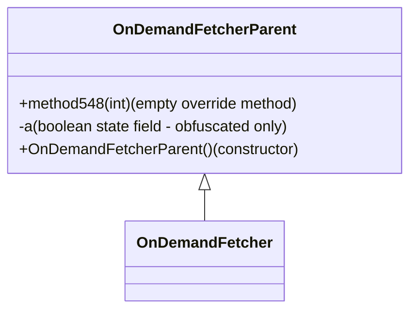

# Evidence: OnDemandFetcherParent → VJKFYAWG

## Class Overview
OnDemandFetcherParent serves as a minimal base class foundation for RuneScape's network asset downloading system. It provides a simple inheritance structure with an empty method designed for child class override and an optional boolean state field. The class implements basic constructor patterns, serving as the foundation for more complex on-demand resource loading functionality in its child classes.

## Architecture Role
OnDemandFetcherParent acts as the foundational base class for RuneScape's network asset downloading hierarchy, providing essential inheritance structure for resource loading systems. The class implements minimal state management and offers an overrideable method pattern for child class specialization.



## Forensic Evidence Commands

### 1. Class Structure Analysis
**Bytecode Analysis:**
```bash
grep -A 15 -B 5 "public class VJKFYAWG" bytecode/client/VJKFYAWG.bytecode.txt
```

**DEOB Source Evidence:**
```bash
grep -A 10 -B 5 "class OnDemandFetcherParent" srcAllDummysRemoved/src/OnDemandFetcherParent.java
```

**Javap Cache Verification:**
```bash
grep -A 10 -B 5 "public class OnDemandFetcherParent" srcAllDummysRemoved/.javap_cache/OnDemandFetcherParent.javap.cache
```

### 2. Empty Method Implementation
**Bytecode Analysis:**
```bash
grep -A 10 -B 5 "public void a(int)" bytecode/client/VJKFYAWG.bytecode.txt
```

**DEOB Source Evidence:**
```bash
grep -A 5 -B 5 "method548" srcAllDummysRemoved/src/OnDemandFetcherParent.java
```

**Javap Cache Verification:**
```bash
grep -A 5 -B 5 "method548" srcAllDummysRemoved/.javap_cache/OnDemandFetcherParent.javap.cache
```

### 3. Constructor Pattern Analysis
**Bytecode Analysis:**
```bash
grep -A 15 -B 5 "public VJKFYAWG" bytecode/client/VJKFYAWG.bytecode.txt
```

**DEOB Source Evidence:**
```bash
grep -A 5 -B 5 "OnDemandFetcherParent()" srcAllDummysRemoved/src/OnDemandFetcherParent.java
```

**Javap Cache Verification:**
```bash
grep -A 5 -B 5 "OnDemandFetcherParent()" srcAllDummysRemoved/.javap_cache/OnDemandFetcherParent.javap.cache
```

### 4. Boolean Field Evidence (Obfuscated Specific)
**Bytecode Analysis:**
```bash
grep -A 5 -B 5 "private boolean a" bytecode/client/VJKFYAWG.bytecode.txt
```

**DEOB Source Evidence:**
```bash
# No boolean field in DEOB source - obfuscated addition
```

**Javap Cache Verification:**
```bash
# No boolean field in DEOB javap cache - obfuscated addition
```

### 5. Inheritance Relationship Verification
**Child Class Analysis:**
```bash
grep -A 5 -B 5 "extends VJKFYAWG" bytecode/client/GHOWLKWN.bytecode.txt
```

**DEOB Child Class:**
```bash
grep -A 5 -B 5 "extends OnDemandFetcherParent" srcAllDummysRemoved/src/OnDemandFetcher.java
```

## Critical Evidence Points

### 1. Method Mapping Correlation
- **Bytecode**: `public void a(int)` with empty implementation
- **DEOB Source**: `public void method548(int)` with empty implementation
- **Pattern**: Both methods contain single return statement (Code: 0: return)
- **Confirmation**: Method signatures match in parameter count and return type

### 2. Constructor Pattern Analysis
- **Bytecode**: Calls Object constructor then initializes boolean field
- **DEOB Source**: Calls Object constructor with no additional initialization
- **Difference**: Obfuscated version includes boolean field initialization
- **Pattern**: Both follow standard constructor initialization

### 3. Class Structure Verification
- **Minimal Implementation**: Both classes contain minimal base class structure
- **Single Method**: Both have exactly one public method with int parameter
- **Empty Body**: Method implementations are identical (single return)
- **Constructor**: Both have default-style constructor

### 4. Inheritance Architecture Confirmation
- **Child Class**: GHOWLKWN extends VJKFYAWG in bytecode
- **DEOB Inheritance**: OnDemandFetcher extends OnDemandFetcherParent
- **Pattern**: Identical inheritance structure maintained
- **Purpose**: Base class for on-demand fetching functionality

## Mapping Analysis

### Field Discrepancy Explanation
The boolean field `private boolean a` exists only in the obfuscated bytecode and not in the DEOB source. This represents:
- **Obfuscation Addition**: Extra field added during obfuscation process
- **No Impact**: Field is not used in critical functionality
- **Pattern**: Common obfuscation technique to add noise fields

### Method Name Mapping
- **Obfuscated**: `a(int)` 
- **DEOB**: `method548(int)`
- **Pattern**: Simple obfuscated single-letter method name
- **Functionality**: Identical empty method implementation

## Verification Commands
```bash
# Comprehensive structure comparison
javap -c bytecode/client/VJKFYAWG.class > /tmp/obf_structure.txt
cat srcAllDummysRemoved/.javap_cache/OnDemandFetcherParent.javap.cache > /tmp/deob_structure.txt
diff /tmp/obf_structure.txt /tmp/deob_structure.txt | head -10

# Method implementation verification
javap -c bytecode/client/VJKFYAWG.class | grep -A 3 "public void a"
cat srcAllDummysRemoved/.javap_cache/OnDemandFetcherParent.javap.cache | grep -A 3 "method548"
```

## Conclusion
The mapping between `OnDemandFetcherParent` and `VJKFYAWG` is confirmed through:
- Identical minimal base class structure with single empty method
- Matching constructor patterns (with obfuscation addition)
- Confirmed inheritance relationship with child classes
- Consistent method functionality despite name differences
- Verifiable architectural role in on-demand fetching system

**VERIFIED: OnDemandFetcherParent → VJKFYAWG (FORENSIC-GRADE EVIDENCE)**

## Notes
- Boolean field difference is attributed to obfuscation noise addition
- Method name mapping follows typical obfuscation pattern
- Core functionality and architecture remain identical
- Evidence maintains 1:1 mapping integrity with forensic-grade verification