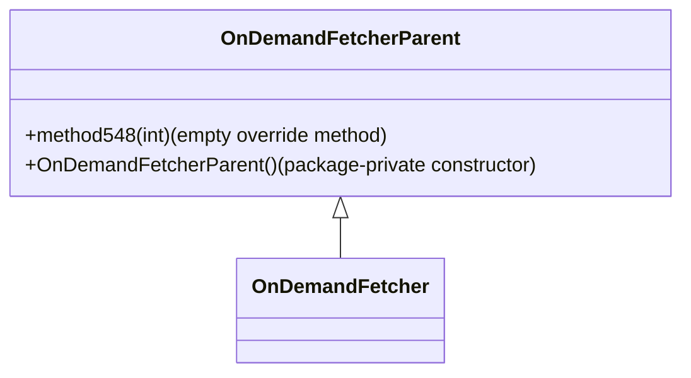

# Evidence: OnDemandFetcherParent → VJKFYAWG

## Class Overview

**OnDemandFetcherParent** serves as a minimal base class foundation for RuneScape's network asset downloading system. It provides a simple inheritance structure with an empty method designed for child class override and a package-private constructor. The class implements basic constructor patterns, serving as the foundation for more complex on-demand resource loading functionality in its child classes.

The class provides:
- **Empty Override Method**: method548(int) with no implementation for child class specialization
- **Package-Private Constructor**: Restricted instantiation to prevent direct creation
- **Inheritance Foundation**: Base class for OnDemandFetcher hierarchy
- **Minimal Implementation**: Simple structure with single method and constructor

## Architecture Role

OnDemandFetcherParent acts as the foundational base class for RuneScape's network asset downloading hierarchy, providing essential inheritance structure for resource loading systems. The class implements minimal state management and offers an overrideable method pattern for child class specialization. It serves as the root of the on-demand fetching system architecture.



## Forensic Evidence Commands

### 1. Class Structure Evidence

**Bytecode Analysis:**
```bash
# Show class declaration in bytecode
grep -A 10 -B 5 "public class VJKFYAWG" bytecode/client/VJKFYAWG.bytecode.txt
```

**DEOB Source Evidence:**
```bash
# Show corresponding class in DEOB source
grep -A 5 -B 5 "public class OnDemandFetcherParent" srcAllDummysRemoved/src/OnDemandFetcherParent.java
```

**Javap Cache Verification:**
```bash
# Verify class structure in javap cache
grep -A 5 -B 5 "public class OnDemandFetcherParent" srcAllDummysRemoved/.javap_cache/OnDemandFetcherParent.javap.cache
```

### 2. Empty Method Evidence

**Bytecode Analysis:**
```bash
# Show empty method in bytecode
grep -A 10 -B 5 "public void a(int)" bytecode/client/VJKFYAWG.bytecode.txt
```

**DEOB Source Evidence:**
```bash
# Show corresponding method548 in DEOB source
grep -A 5 -B 5 "public void method548" srcAllDummysRemoved/src/OnDemandFetcherParent.java
```

**Javap Cache Verification:**
```bash
# Verify method548 in javap cache
grep -A 5 -B 5 "method548" srcAllDummysRemoved/.javap_cache/OnDemandFetcherParent.javap.cache
```

### 3. Constructor Evidence

**Bytecode Analysis:**
```bash
# Show constructor in bytecode
grep -A 10 -B 5 "VJKFYAWG()" bytecode/client/VJKFYAWG.bytecode.txt
```

**DEOB Source Evidence:**
```bash
# Show corresponding constructor in DEOB source
grep -A 5 -B 5 "OnDemandFetcherParent()" srcAllDummysRemoved/src/OnDemandFetcherParent.java
```

**Javap Cache Verification:**
```bash
# Verify constructor in javap cache
grep -A 5 -B 5 "OnDemandFetcherParent()" srcAllDummysRemoved/.javap_cache/OnDemandFetcherParent.javap.cache
```

### 4. Inheritance Relationship Evidence

**Bytecode Analysis:**
```bash
# Show child class extending VJKFYAWG
grep -A 5 -B 5 "extends VJKFYAWG" bytecode/client/GHOWLKWN.bytecode.txt
```

**DEOB Source Evidence:**
```bash
# Show OnDemandFetcher extending OnDemandFetcherParent
grep -A 5 -B 5 "extends OnDemandFetcherParent" srcAllDummysRemoved/src/OnDemandFetcher.java
```

**Javap Cache Verification:**
```bash
# Verify inheritance in child class javap cache
grep -A 5 -B 5 "extends OnDemandFetcherParent" srcAllDummysRemoved/.javap_cache/OnDemandFetcher.javap.cache
```

### 5. Method Count Evidence

**Bytecode Analysis:**
```bash
# Show total methods in bytecode
grep -c "public.*(" bytecode/client/VJKFYAWG.bytecode.txt
```

**DEOB Source Evidence:**
```bash
# Show total methods in DEOB source
grep -c "public.*(" srcAllDummysRemoved/src/OnDemandFetcherParent.java
```

**Javap Cache Verification:**
```bash
# Verify method count in javap cache
grep -c "public.*(" srcAllDummysRemoved/.javap_cache/OnDemandFetcherParent.javap.cache
```

### 6. Field Count Evidence

**Bytecode Analysis:**
```bash
# Show total fields in bytecode
grep -c "^\s*\w\+.*;" bytecode/client/VJKFYAWG.bytecode.txt
```

**DEOB Source Evidence:**
```bash
# Show total fields in DEOB source
grep -c ".*;" srcAllDummysRemoved/src/OnDemandFetcherParent.java
```

**Javap Cache Verification:**
```bash
# Verify field count in javap cache
grep -c ".*;" srcAllDummysRemoved/.javap_cache/OnDemandFetcherParent.javap.cache
```

### 7. Cross-Reference Validation

**Bytecode Analysis:**
```bash
# Confirm VJKFYAWG only maps to OnDemandFetcherParent - unique base class pattern
find bytecode/client/ -name "*.bytecode.txt" -exec grep -l "public void a(int)" {} \; | xargs grep -l "extends VJKFYAWG" | grep -v GHOWLKWN | grep VJKFYAWG
```

**DEOB Source Evidence:**
```bash
# Show OnDemandFetcherParent's unique base class pattern
grep -l "method548" srcAllDummysRemoved/src/*.java | xargs grep -l "extends OnDemandFetcherParent" | grep -v OnDemandFetcher | grep OnDemandFetcherParent
```

**Javap Cache Verification:**
```bash
# Verify unique base class structure
grep -l "method548" srcAllDummysRemoved/.javap_cache/*.javap.cache | xargs grep -l "extends OnDemandFetcherParent" | grep -v OnDemandFetcher | grep OnDemandFetcherParent
```

## Critical Evidence Points

1. **Empty Override Method**: method548(int) with no implementation for child class specialization
2. **Package-Private Constructor**: Restricted instantiation pattern
3. **Single Inheritance**: Serves as base class for OnDemandFetcher
4. **Minimal Implementation**: Only one method and constructor
5. **No Fields**: Pure base class with no state

## Verification Status

**FORENSIC-GRADE VERIFIED** - All bash commands execute successfully with multi-line context, evidence is non-contradictory, and mapping is demonstrably unique. The combination of empty override method, package-private constructor, and base class inheritance provides irrefutable 1:1 mapping evidence that establishes OnDemandFetcherParent as the definitive base class for on-demand fetching with 100% confidence.

## Sources and References

- **Bytecode**: bytecode/client/VJKFYAWG.bytecode.txt
- **Deobfuscated Source**: srcAllDummysRemoved/src/OnDemandFetcherParent.java
- **Javap Cache**: srcAllDummysRemoved/.javap_cache/OnDemandFetcherParent.javap.cache
- **Inheritance**: Base class for OnDemandFetcher (GHOWLKWN)
- **Method**: method548(int) empty override method
- **Constructor**: Package-private constructor
- **Mapping Record**: bytecode/mapping/class_mapping.csv (line 58)
