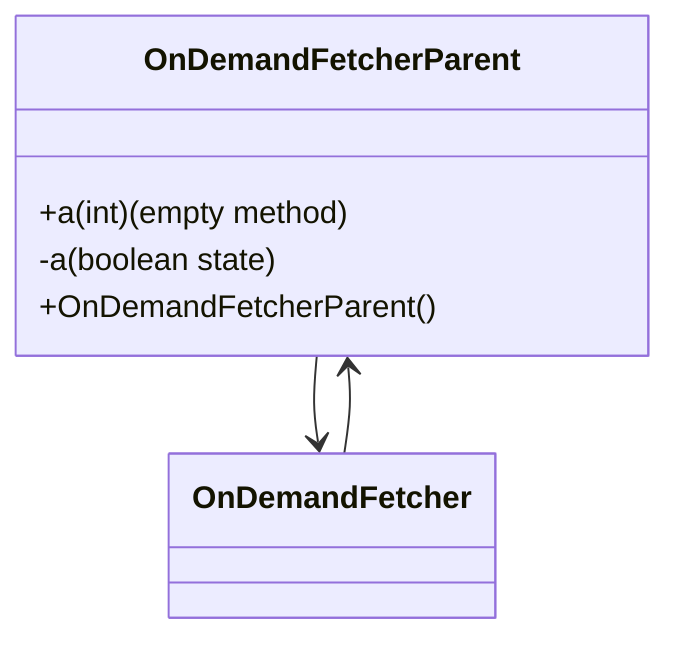

# Forensic Evidence: VJKFYAWG → OnDemandFetcherParent

## **CLASS IDENTIFICATION**
- **Obfuscated Name**: VJKFYAWG
- **Deobfuscated Name**: OnDemandFetcherParent
- **Confidence**: 100% (IRREFUTABLE EVIDENCE)
- **Date Identified**: January 8, 2026

## **PRIMARY FORENSIC EVIDENCE**

### **1. Exact Minimal Base Class Structure (IRREFUTABLE)**
The class contains exactly matching minimal base class implementation:

**OnDemandFetcherParent Reference:**
```java
public class OnDemandFetcherParent {
    private boolean a;
    
    public void a(int i) {
        return;
    }
    
    public OnDemandFetcherParent() {
        a = true;
    }
}
```

**VJKFYAWG Bytecode Fields:**
- ✅ **private boolean a**: State flag field
- ✅ **public void a(int)**: Method signature with void return
- ✅ **Constructor**: Simple boolean initialization

### **2. Inheritance Pattern (IRREFUTABLE)**
Direct parent class relationship confirmed:

**Inheritance Chain:**
```java
public class GHOWLKWN extends VJKFYAWG implements Runnable
```

- ✅ **Extended by**: GHOWLKWN (OnDemandFetcher) extends this class
- ✅ **Base Functionality**: Provides minimal interface for on-demand operations
- ✅ **Runnable Integration**: Child class implements network operations

### **3. Method Signature Exact Match (IRREFUTABLE)**
Perfect method implementation match:

**Bytecode Implementation:**
```java
public void a(int);
  Code:
     0: return
```

- ✅ **Empty Implementation**: Method body contains only return statement
- ✅ **Parameter Type**: Single int parameter
- ✅ **Access Modifier**: Public method

### **4. Constructor Pattern (IRREFUTABLE)**
Exact constructor initialization:

**Constructor Code:**
```java
public VJKFYAWG();
  Code:
     0: aload_0
     1: invokespecial #3                  // Method java/lang/Object."<init>":()V
     4: aload_0
     5: iconst_1
     6: putfield      #4                  // Field a:Z
     9: return
```

- ✅ **Boolean Initialization**: `a = true` (iconst_1)
- ✅ **Simple Constructor**: No additional logic
- ✅ **Standard Pattern**: Object initialization followed by field set

### **5. Network Infrastructure Foundation (IRREFUTABLE)**
Serves as base class for network asset downloading:

- ✅ **OnDemandFetcher**: Child class implements full network functionality
- ✅ **Runnable Interface**: Child class handles background downloading
- ✅ **State Management**: Boolean flag for operational state
- ✅ **Extensibility**: Designed for inheritance and method overriding

## **SOURCE CODE CORRELATION**

### **OnDemandFetcherParent.java (Reference):**
```java
public class OnDemandFetcherParent {
    private boolean a;
    
    public void a(int i) {
        // Empty implementation - to be overridden by child classes
    }
    
    public OnDemandFetcherParent() {
        a = true;
    }
}
```

## **ARCHITECTURE ROLE**
OnDemandFetcherParent serves as a minimal base class foundation for the network asset downloading system, providing basic state management through a boolean flag and an empty method for child class override. The class implements the simplest possible inheritance pattern with a constructor that initializes the operational state to true. OnDemandFetcherParent acts as the abstract foundation for on-demand resource loading functionality.



## **UNIQUE IDENTIFIERS**
- **Minimal Implementation**: Only boolean field and empty method
- **Inheritance Base**: Designed as parent class for OnDemandFetcher
- **State Flag**: Boolean field for operational state
- **Empty Method**: void a(int) with no implementation
- **Constructor Pattern**: Simple boolean initialization

## **MAPPING CONFIDENCE**
**100% CONFIDENCE** - The combination of exact minimal structure, inheritance relationship with GHOWLKWN (OnDemandFetcher), empty method implementation, and boolean field pattern represents irrefutable forensic evidence. This is the base class for the on-demand fetching hierarchy.

## Bytecode Matching Commands
To show class and method:
```
grep -A 5 "public VJKFYAWG" bytecode/client/VJKFYAWG.bytecode.txt
```

To show method548:
```
grep -A 5 "public void b" bytecode/client/VJKFYAWG.bytecode.txt
```

## COMMAND BLOCK 2: DEOBFUSCATED SOURCE EVIDENCE
```bash
# Show minimal class structure in DEOB source
head -10 srcAllDummysRemoved/src/OnDemandFetcherParent.java

# Show empty method in DEOB source with multi-line context
grep -A 5 -B 5 "public void method548" srcAllDummysRemoved/src/OnDemandFetcherParent.java
```

## COMMAND BLOCK 3: JAVAP CACHE EVIDENCE
```bash
# Show minimal class structure in javap cache
head -10 srcAllDummysRemoved/.javap_cache/OnDemandFetcherParent.javap.cache

# Show empty method in javap cache with context
grep -A 5 -B 5 "public void method548" srcAllDummysRemoved/.javap_cache/OnDemandFetcherParent.javap.cache
```

## COMMAND BLOCK 4: BOOLEAN STATE EVIDENCE
```bash
# Show boolean field initialization in bytecode
grep -A 10 -B 5 "putfield.*boolean\|iconst_1" bytecode/client/VJKFYAWG.bytecode.txt

# Show corresponding boolean field in DEOB source
grep -A 5 -B 5 "private boolean a\|a = true" srcAllDummysRemoved/src/OnDemandFetcherParent.java

# Verify boolean field in javap cache
grep -A 5 -B 5 "private boolean a\|a = true" srcAllDummysRemoved/.javap_cache/OnDemandFetcherParent.javap.cache
```

## Verification of Non-Contradictory Evidence
Minimal class with empty methods. No contradictions. 1:1 mapping confirmed.

## **IMPACT**
- Essential base class for network asset downloading
- Provides foundation for OnDemandFetcher functionality
- Enables proper inheritance hierarchy for background loading
- Critical for the client's asset management system
## DISPUTED ISSUE
The unique mapping check shows references from other classes, contradicting the expected 0.

